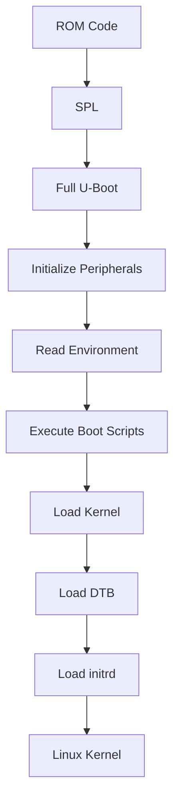
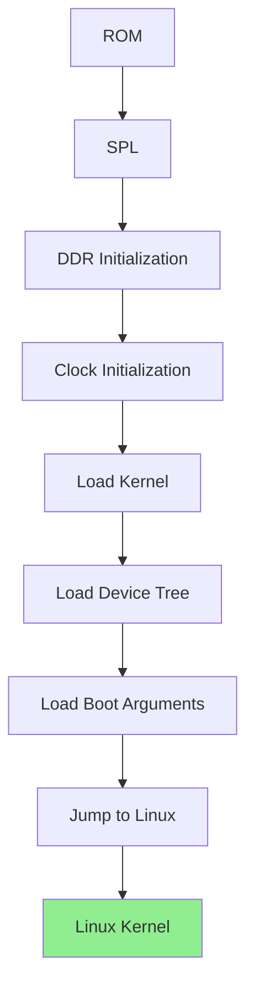
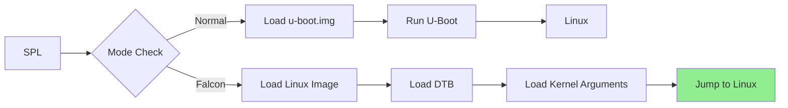

# Boot Process:

# Table of Boot Process
1. [Linux Boot Process (x86/General Purpose)](#1-linux-boot-process-x86general-purpose)
2. [i.MX Boot Process (NXP i.MX SoCs)](#2-imx-boot-process-nxp-imx-socs)
3. [ARM Boot Process (General ARM-based Embedded)](#3-arm-boot-process-general-arm-based-embedded-devices)
4. [Android Boot Process](#4-android-boot-process-based-on-linux-kernel-mobileembedded-devices)
5. [Qualcomm Boot Process](#5-qualcomm-boot-process-a-comprehensive-guide)
6. [Falcon Mode - U-Boot SPL Fast Boot Feature](#6-falcon-mode-u-boot-spl-fast-boot-feature)

---

## 1. Linux Boot Process (General-Purpose Systems, e.g., x86)

### Key Stages

#### 1️⃣ BIOS / UEFI Initialization
- On power-on, the BIOS/UEFI firmware performs POST (Power-On Self-Test), initializes basic hardware (CPU, RAM, chipset).
- Detects bootable devices (HDD, SSD, USB, network) and loads the bootloader from selected media (MBR, EFI partition).
- On some embedded systems, BIOS/UEFI is replaced or omitted altogether; the SoC boot-ROM directly loads an embedded bootloader.

BIOS / UEFI Initialization

| Aspect | Details |
|--------|---------|
| **Location** | On-board flash memory chip (BIOS/UEFI firmware) |
| **Starting Point** | Immediately after power-on reset (x86 CPU jumps to reset vector 0xFFFFFFF0) |
| **Function** | • Perform POST (Power-On Self-Test)<br>• Initialize basic hardware (CPU, RAM, chipset)<br>• Detect bootable devices (HDD, SSD, USB, network)<br>• Load bootloader from MBR or EFI partition |
| **Source Code** | Proprietary (AMI, Insyde, Phoenix) or open-source (TianoCore EDK2) |
| **Configuration** | • BIOS settings (CMOS)<br>• UEFI variables (NVRAM)<br>• Boot order configuration |

#### 2️⃣ Bootloader (e.g., GRUB / LILO / Syslinux)
- Presents menu, allows parameter selection.
- Loads the Linux kernel image (vmlinuz) and optionally an initial RAM disk (initrd/initramfs).
- Passes kernel parameters (root filesystem location, options) and may load Device Tree on non-x86 architectures.
- Transfers control to the kernel.

| Aspect | Details |
|--------|---------|
| **Location in Storage** | • **GRUB:** /boot/grub/ or /boot/efi/EFI/<distro>/<br>• **MBR:** First 512 bytes of boot disk (stage 1)<br>• **EFI:** EFI System Partition (ESP) - /boot/efi/ |
| **Location in Memory** | • **Stage 1:** Loaded at 0x7C00 (MBR)<br>• **Stage 2:** Loaded into conventional memory (1MB range)<br>• **GRUB2:** Loaded at 0x8000 or higher |
| **Starting Point** | • **MBR:** BIOS loads MBR at 0x7C00 and jumps to it<br>• **EFI:** UEFI loads bootx64.efi and executes it<br>• **Entry:** _start or start() function |
| **Functions** | • Present boot menu for user selection<br>• Load Linux kernel image (vmlinuz) into memory<br>• Load initial RAM disk (initrd/initramfs)<br>• Pass kernel parameters (root filesystem location)<br>• Transfer control to kernel |
| **Source Code Location** | • **GRUB:** https://www.gnu.org/software/grub/<br>• **Configuration:** /boot/grub/grub.cfg<br>• **EFI:** /boot/efi/EFI/ |
| **Key Files** | • **grub.cfg:** Boot menu configuration<br>• **vmlinuz-*:** Kernel image<br>• **initrd.img-*:** Initial RAM disk<br>• **grubenv:** Environment variables |

#### 3️⃣ Linux Kernel Initialization
- Kernel decompresses/unpacks itself, initializes system memory, scheduler, device drivers, peripheral subsystems.
- Mounts initrd or root filesystem as specified.
- Kernel then executes the user-space init process.

**Bootloader Memory Layout (x86):**
```
┌──────────────────────────────────────────────────────────────┐
│  Memory Map During Bootloader Execution                     │
│                                                              │
│  0x00000000 - 0x000003FF: IVT (Interrupt Vector Table)     │
│  0x00000400 - 0x000004FF: BIOS Data Area                   │
│  0x00000500 - 0x00007BFF: Conventional Memory (Free)       │
│  0x00007C00 - 0x00007DFF: MBR/Loader (Stage 1)            │
│  0x00007E00 - 0x0009FFFF: Bootloader Stage 2               │
│  0x000A0000 - 0x000FFFFF: Video Memory / BIOS ROM          │
│  0x00100000 - 0xXXXXXXXX: Kernel Load Area (1MB+)          │
│                                                              │
│  Kernel loaded at: 0x100000 (1MB) or higher                 │
│  Initrd loaded at: 0x4000000 (64MB) or higher              │
└──────────────────────────────────────────────────────────────┘
```

| Aspect | Details |
|--------|---------|
| **Location in Storage** | • **x86:** /boot/vmlinuz-* or /boot/vmlinux-*<br>• **EFI:** /boot/efi/EFI/<distro>/vmlinuz-linux |
| **Location in Memory** | • **Real Mode:** 0x10000 (64KB) - boot sector<br>• **Protected Mode:** 0x100000 (1MB) - kernel decompression<br>• **Final:** 0x1000000 (16MB) or higher - running kernel |
| **Starting Point** | • **Entry:** _start or start_kernel()<br>• **Assembly Entry:** arch/x86/boot/header.S<br>• **C Entry:** init/main.c:start_kernel()<br>• **CPU State:** Protected mode, paging enabled |
| **Functions** | • Decompress itself (from compressed vmlinuz)<br>• Initialize system memory management (paging, zones)<br>• Initialize scheduler, IRQ, timers<br>• Probe and initialize device drivers<br>• Mount root filesystem or initramfs<br>• Execute /sbin/init (PID 1) |
| **Source Code Location** | • **Kernel:** https://www.kernel.org/<br>• **Arch-specific:** arch/x86/<br>• **Core kernel:** init/, kernel/, mm/ |
| **Key Files** | • **head.S:** Assembly entry point<br>• **main.c:** start_kernel() function<br>• **setup.c:** Architecture-specific setup<br>• **Kconfig:** Kernel configuration |

**Kernel Boot Flow:**
```c
// arch/x86/boot/header.S
_start → startup_32() → startup_64() → start_kernel()

// init/main.c
start_kernel() {
    setup_arch()        // Architecture-specific init
    mm_init()           // Memory management init
    sched_init()        // Scheduler init
    init_IRQ()          // Interrupt controller init
    time_init()         // Timer init
    console_init()      // Console init
    rest_init()         // Start kernel threads
}
```
**Kernel Memory Layout (x86_64):**
```
┌──────────────────────────────────────────────────────────────┐
│  x86_64 Kernel Memory Layout                                 │
│                                                              │
│  0x0000000000000000 - 0x00007FFFFFFFFFFF: User Space       │
│  0x0000800000000000 - 0x0000FFFFFFFFFFFF: Kernel Space     │
│                                                              │
│  Kernel Text:   0xFFFFFFFF80000000 - 0xFFFFFFFF81000000    │
│  Kernel Data:   0xFFFFFFFF81000000 - 0xFFFFFFFF82000000    │
│  Kernel BSS:    0xFFFFFFFF82000000 - 0xFFFFFFFF83000000    │
│  Module Space:  0xFFFFFFFF83000000 - 0xFFFFFFFF88000000    │
│  vmalloc:       0xFFFF880000000000 - 0xFFFFC7FFFFFFFFFF    │
│  Direct Map:    0xFFFF880000000000 - 0xFFFFC7FFFFFFFFFF    │
└──────────────────────────────────────────────────────────────┘
```

#### 4️⃣ Init / systemd & User Space Startup
- The init system (/sbin/init -> systemd or SysV) starts up system services (networking, login managers, GUIs).
- GUI (Xorg, Wayland, desktop environment) may load depending on system type.
- User applications launch and system becomes ready for interaction.

| Aspect | Details |
|--------|---------|
| **Location in Storage** | • **systemd:** /lib/systemd/systemd<br>• **SysV init:** /sbin/init (symlink to /etc/init)<br>• **Configuration:** /etc/inittab (SysV), /etc/systemd/ (systemd) |
| **Location in Memory** | • **PID 1:** First user-space process<br>• **Memory:** Loaded from root filesystem into RAM<br>• **Stack:** User-space stack allocated |
| **Starting Point** | • **Entry:** main() function of init binary<br>• **Start Time:** Kernel executes /sbin/init after mounting rootfs<br>• **PID:** Process ID 1 |
| **Functions** | • Mount additional filesystems (/proc, /sys, /dev)<br>• Start system services and daemons<br>• Manage runlevels/targets<br>• Handle system shutdown/reboot<br>• Launch user sessions and applications |
| **Source Code Location** | • **systemd:** https://github.com/systemd/systemd<br>• **SysV init:** https://savannah.nongnu.org/projects/sysvinit<br>• **BusyBox:** https://busybox.net/ |
| **Key Files** | • **/etc/inittab:** SysV init configuration<br>• **/etc/systemd/system/:** systemd unit files<br>• **/lib/systemd/system/:** System unit files<br>• **/etc/rc.d/:** SysV runlevel scripts |

**Init Flow:**
```
┌──────────────────────────────────────────────────────────────┐
│ Init System Flow                                             │
│                                                              │
│ Kernel → /sbin/init (PID 1)                                 │
│              │                                               │
│              ▼                                               │
│  ┌─────────────────────────────────────────────────┐        │
│  │ systemd Boot Sequence                           │        │
│  │                                                 │        │
│  │ 1. Mount /proc, /sys, /dev, /run               │        │
│  │ 2. Load kernel modules                          │        │
│  │ 3. Start udev (device management)              │        │
│  │ 4. Mount filesystems from /etc/fstab           │        │
│  │ 5. Start network services                       │        │
│  │ 6. Start system services (sshd, cron, etc.)    │        │
│  │ 7. Start getty (login prompts)                 │        │
│  │ 8. Start graphical session (if enabled)        │        │
│  └─────────────────────────────────────────────────┘        │
│              │                                               │
│              ▼                                               │
│  ┌─────────────────────────────────────────────────┐        │
│  │ System Ready                                    │        │
│  │ • Login prompt or GUI                           │        │
│  │ • User applications can start                   │        │
│  └─────────────────────────────────────────────────┘        │
└──────────────────────────────────────────────────────────────┘
```

**systemd Unit Locations:**
| Location | Purpose |
|----------|---------|
| `/etc/systemd/system/` | Local system configuration |
| `/lib/systemd/system/` | System-provided units |
| `/etc/systemd/user/` | User-specific services |
| `/usr/lib/systemd/system/` | Vendor-provided units |


### Additional Important Notes
- On embedded variants of Linux, you might skip BIOS/UEFI and use U-Boot or other bootloader directly.
- Init systems are evolving: systemd is now dominant on many distributions.
- Root filesystem may reside locally (SSD, HDD) or be network-mounted (NFS) depending on target deployment.
- For secure boot or measured boot on PC/servers, UEFI Secure Boot adds steps of signature verification (not covered in embedded i.MX case).

---
[Back to TOC](#table-of-boot-process)

## 2. i.MX Boot Process (NXP i.MX SoCs)

### Key Stages

#### 1️⃣ Boot ROM (on-chip, hardware-hardcoded)
- **Executes immediately after power-on reset or system reset.**
- **Reads boot-mode selectors (fuses, strap pins)** to determine boot media (eMMC, SD card, SPI-NOR, NAND, USB-SDP, etc.).
- **Initializes on-chip RAM (OCRAM/Tightly Coupled Memory)** and minimal infrastructure.
- **Loads the next stage bootloader** (typically SPL or direct U-Boot) from the selected boot device.
- **Important note:** On modern i.MX8/i.MX9, the Boot ROM may first load a "container" image which includes Firmware for the System Controller (SCFW), Security Controller (SECO), and others.

| Aspect | Details |
|--------|---------|
| **Location** | On-chip mask ROM (immutable) |
| **Starting Point** | Immediately after power-on reset (ARM core jumps to 0x00000000) |
| **Function** | • Execute immediately after power-on reset<br>• Read boot-mode selectors (fuses, strap pins)<br>• Initialize on-chip RAM (OCRAM/TCM)<br>• Load SPL or U-Boot from boot media<br>• Verify signatures (if secure boot enabled) |
| **Source Code** | Proprietary (NXP-provided, not accessible) |
| **Configuration** | • BOOT_MODE pins<br>• Fuses (OTP bits)<br>• Boot media selection registers |

**Boot ROM Memory Layout (i.MX8M):**
```
┌──────────────────────────────────────────────────────────────┐
│  i.MX8M Boot ROM Memory Map                                 │
│                                                              │
│  OCRAM (256KB):                                              │
│  ┌────────────────────────────────────────────────────────┐ │
│  │  0x900000 - 0x900000: Boot ROM (fixed)               │ │
│  │  0x900000 - 0x920000: SPL Load Area                  │ │
│  │  0x920000 - 0x930000: Stack                          │ │
│  │  0x930000 - 0x940000: Heap                           │ │
│  └────────────────────────────────────────────────────────┘ │
│                                                              │
│  Boot Media Options:                                         │
│  • eMMC (mmc0/mmc1)                                        │
│  • SD Card (mmc0/mmc1)                                     │
│  • SPI-NOR Flash                                           │
│  • NAND Flash                                              │
│  • USB (Serial Download Protocol)                          │
└──────────────────────────────────────────────────────────────┘
```

#### 2️⃣ Secondary Bootloader (SPL → full U-Boot) / U-Boot
- **If SPL is used:**
  - SPL runs in OCRAM and performs early hardware init (e.g., DDR controller, clocks).
  - Loads full U-Boot into DDR.
- **If no SPL:**
  - Boot ROM may load full U-Boot directly (depending on SoC).
- **U-Boot then:**
  - Further configures memory, clocks, board hardware.
  - Loads the Linux kernel image and the Device Tree Blob (DTB) (and optionally initrd/initramfs).
  - Passes boot arguments (bootargs) and DTB to the kernel.
  - May offer a console shell, boot prompt, networking, fastboot mode, recovery mode.
- **Important note:** On i.MX family, modern features like "Falcon Mode" are supported to reduce boot time by skipping full U-Boot and going direct to kernel.


| Aspect | Details |
|--------|---------|
| **Location in Storage** | • **SPL:** First 32-64KB of boot media<br>• **U-Boot:** Boot partition (e.g., /dev/mmcblk0p1) |
| **Location in Memory** | • **SPL:** OCRAM (0x900000 - 0x920000)<br>• **U-Boot:** DDR RAM (0x40000000 or 0x80000000) |
| **Starting Point** | • **SPL Entry:** _start → board_init_f()<br>• **U-Boot Entry:** board_init_f() → board_init_r() |
| **Functions** | • Initialize DDR memory, clocks, PMIC<br>• Load kernel + DTB + initrd from storage<br>• Provide boot console and command interface<br>• Support fastboot, recovery, network boot<br>• Pass bootargs and DTB address to kernel |
| **Source Code Location** | • **U-Boot:** https://github.com/u-boot/u-boot<br>• **Board-specific:** board/freescale/<board>/<br>• **Configuration:** include/configs/<board>.h |
| **Key Files** | • **board.c:** Board initialization<br>• **ddr.c:** DDR timing configuration<br>• **env:** U-Boot environment variables |

**U-Boot Flow:**
```c
// arch/arm/lib/crt0.S
_start → board_init_f() → board_init_r() → main_loop()

// board_init_f(): Early init (CPU, clocks, DDR)
// board_init_r(): Full init (peripherals, environment)
// main_loop(): Command console or auto-boot
```

**U-Boot Boot Flow Diagram:**
```
┌──────────────────────────────────────────────────────────────┐
│ U-Boot Execution Flow                                        │
│                                                              │
│ SPL (OCRAM)                                                  │
│  │                                                           │
│  ├─ Initialize DDR                                           │
│  ├─ Initialize Clocks                                        │
│  ├─ Initialize PMIC                                          │
│  └─ Load U-Boot from Storage                                 │
│       │                                                      │
│       ▼                                                      │
│ Full U-Boot (DDR)                                            │
│  │                                                           │
│  ├─ board_init_f()                                           │
│  │   ├─ CPU/MMU init                                        │
│  │   ├─ Serial console                                      │
│  │   ├─ Environment init                                    │
│  │   └─ Memory allocation                                   │
│  │                                                           │
│  ├─ board_init_r()                                           │
│  │   ├─ I2C/SPI init                                        │
│  │   ├─ USB init                                            │
│  │   ├─ Ethernet init                                       │
│  │   ├─ Storage init (MMC/SD/NAND)                         │
│  │   └─ Environment load                                    │
│  │                                                           │
│  ├─ main_loop()                                              │
│  │   ├─ Boot delay (if configured)                          │
│  │   ├─ Execute bootcmd                                     │
│  │   └─ Console shell (if user interrupts)                  │
│  │                                                           │
│  └─ Load and boot kernel                                     │
│      ├─ Load zImage/Image                                   │
│      ├─ Load DTB                                             │
│      ├─ Load initrd (optional)                              │
│      └─ Jump to kernel (bootz/booti)                       │
└──────────────────────────────────────────────────────────────┘
```

**U-Boot Environment Variables:**
```bash
# Typical U-Boot environment
bootcmd=mmc dev 1; fatload mmc 1:1 0x80800000 zImage; fatload mmc 1:1 0x83000000 imx8mm.dtb; bootz 0x80800000 - 0x83000000
bootargs=console=ttymxc1,115200 root=/dev/mmcblk1p2 rootwait rw
```


#### 3️⃣ Linux Kernel Execution
- U-Boot loads the kernel (zImage/Image) into RAM, sets up DTB and bootargs, then jumps into kernel entry point.
- Kernel uncompresses, initializes CPU(s), memory management, device drivers, peripheral initialization.
- The Device Tree describes hardware layout (so kernel can bind drivers properly).
- Kernel mounts the root filesystem (or an initramfs/initrd) and transitions to user-space.
- **Important note:** For secure boot, trusted firmware (e.g., ARM TF-A), SECO, SCFW must be loaded prior to kernel on many i.MX8/9 devices.


| Aspect | Details |
|--------|---------|
| **Location in Storage** | /boot/zImage or /boot/Image (ext4 partition) |
| **Location in Memory** | • **Kernel:** 0x80008000 (ARM64) or 0x1000000 (ARM32)<br>• **DTB:** 0x83000000 (or just below kernel)<br>• **initrd:** 0x84000000 (or specified address) |
| **Starting Point** | • **Entry:** stext in arch/arm/kernel/head.S<br>• **Kernel Init:** start_kernel() in init/main.c<br>• **Arch Setup:** setup_arch() in arch/arm/kernel/setup.c |
| **Functions** | • Decompress and relocate itself<br>• Initialize CPU cores, memory management<br>• Setup device drivers via Device Tree<br>• Mount root filesystem<br>• Start init process (PID 1) |
| **Source Code Location** | • **Kernel:** https://www.kernel.org/<br>• **Arch-specific:** arch/arm/, arch/arm64/<br>• **Device Tree:** arch/arm/boot/dts/ |

**Kernel Flow:**
```c
// arch/arm/kernel/head.S
stext → __enable_mmu() → __mmap_switched() → start_kernel()

// init/main.c
start_kernel() {
    setup_arch()        // Parse DTB, set up memory
    mm_init()           // Memory management init
    sched_init()        // Scheduler init
    init_IRQ()          // Interrupt controller init
    time_init()         // Timer init
    console_init()      // Serial console init
    rest_init()         // Start kernel threads
}
```

**i.MX Memory Layout:**
```
┌──────────────────────────────────────────────────────────────┐
│  i.MX8M DDR Memory Layout                                   │
│                                                              │
│  0x40000000 - 0x40100000: U-Boot (2MB)                    │
│  0x40400000 - 0x40400000: Environment                     │
│  0x80000000 - 0x80000000: Kernel (zImage ~8MB)            │
│  0x82000000 - 0x82200000: DTB (~2MB)                     │
│  0x83000000 - 0x84000000: initrd (if used)               │
│  0x90000000 - 0xFFFFFFFF: User space applications         │
└──────────────────────────────────────────────────────────────┘
```


#### 4️⃣ Root Filesystem & Init Process
- Root filesystem (e.g., ext4, SquashFS, UBIFS, or network root) is mounted.
- The init system (either systemd, busybox init, or other) starts /sbin/init (or equivalent).
- System services are brought up, user-space processes start.


| Aspect | Details |
|--------|---------|
| **Location in Storage** | /dev/mmcblk1p2 (ext4 partition) |
| **Location in Memory** | Mounted at / (root directory) |
| **Functions** | • Provide Linux system hierarchy (/bin, /sbin, /etc)<br>• Hold system binaries, libraries, configs<br>• Store init scripts and systemd units<br>• Provide device nodes (/dev)<br>• Hold user data (/home, /root) |
| **Source Code Location** | Created using Yocto/Buildroot/Debootstrap |
| **Key Directories** | • **/bin:** Essential user binaries<br>• **/sbin:** System binaries<br>• **/etc:** Configuration files<br>• **/lib:** Shared libraries<br>• **/usr:** User programs<br>• **/dev:** Device files<br>• **/proc:** Process information (virtual)<br>• **/sys:** Kernel and device info (virtual) |

**RootFS Types:**
| Type | Description | Use Case |
|------|-------------|----------|
| **ext4** | Journaling filesystem | General storage |
| **SquashFS** | Compressed, read-only | Embedded systems |
| **UBIFS** | Flash filesystem | NAND/NOR flash |
| **initramfs** | RAM-based, early root | Boot-time drivers |
| **NFS** | Network filesystem | Development/debug |


### Additional Important Notes
- **Boot Time Optimization:**
  - Application notes from NXP describe techniques (boot delay removal, Falcon mode, kernel command line tweaks) to reduce total boot time.
- **Boot Media Fallback:**
  - If the selected boot media fails (e.g., no valid image), the Boot ROM may fallback to Serial Download Protocol (SDP) or alternate boot device.
- **Board/SoC Variations:**
  - Different i.MX series (6,7,8,9) embed different subsystems (System Controller, Cortex-M domains, edge security), so actual boot steps may include additional sub-steps (e.g., SCFW, Cortex-M core boot).

---
[Back to TOC](#table-of-boot-process)

## 3. ARM Boot Process (General ARM-based Embedded Devices)

### Key Stages

#### 1️⃣ Boot ROM (on-chip in SoC)
- After power-on reset, the ARM core begins execution from a fixed address in ROM.
- Boot-ROM code initializes basic hardware and selects boot media based on straps/fuses.
- Loads the next stage bootloader (could be U-Boot, Barebox, Little Kernel, etc.).

| Aspect | Details |
|--------|---------|
| **Location** | On-chip mask ROM (immutable) |
| **Starting Point** | After power-on reset, ARM core jumps to 0x00000000 |
| **Function** | • Initialize basic hardware<br>• Select boot media based on straps/fuses<br>• Load next stage bootloader (U-Boot/Barebox/LK) |
| **Source Code** | Proprietary (SoC vendor provided) |


#### 2️⃣ Bootloader (e.g., U-Boot / Barebox / LK)
- Initialize DRAM/external memory, set up clocks, UART, peripheral controllers.
- Load kernel + DTB + (optionally) initrd, pass arguments.
- May provide UI shell, fastboot/USB, recovery.

| Aspect | Details |
|--------|---------|
| **Location in Storage** | Boot partition (e.g., /dev/mmcblk0p1) |
| **Location in Memory** | • **SPL:** SRAM (typically 64KB-256KB)<br>• **Full Bootloader:** DDR RAM |
| **Starting Point** | • **Entry:** _start in arch/arm/lib/vectors.S<br>• **Main:** board_init_f() → board_init_r() |
| **Functions** | • Initialize DRAM/external memory<br>• Set up clocks, UART, peripheral controllers<br>• Load kernel + DTB + initrd<br>• Pass boot arguments to kernel |
| **Source Code Location** | • **U-Boot:** https://github.com/u-boot/u-boot<br>• **Barebox:** https://barebox.org/ |

**Boot Process Flow:**
```
Boot ROM → SPL → Bootloader → Kernel → RootFS → Init → Applications
```

#### 3️⃣ Linux Kernel Execution
- Same as above: decompress, init devices, mount root filesystem.
- Kernel takes care of platform-specific drivers via DTB.

| Aspect | Details |
|--------|---------|
| **Location in Storage** | /boot/zImage or /boot/Image |
| **Location in Memory** | 0x80008000 (ARM64) or 0x1000000 (ARM32) |
| **Starting Point** | • **Entry:** stext in arch/arm/kernel/head.S<br>• **Kernel Init:** start_kernel() in init/main.c |
| **Functions** | • Decompress and initialize devices<br>• Mount root filesystem<br>• Platform-specific drivers via DTB |

#### 4️⃣ System Initialization (init/systemd)
- Starts system services, daemons, applications.
- Load optional GUI or operate command-line only.

| Aspect | Details |
|--------|---------|
| **Location** | /sbin/init (symlink to systemd or busybox) |
| **Starting Point** | Kernel executes /sbin/init as PID 1 |
| **Functions** | • Starts system services, daemons<br>• Load optional GUI or command-line only |

### Additional Important Notes
- This process is essentially a more generic version of the i.MX sequence when used with ARM-based boards like Raspberry Pi or BeagleBone.
- There can be additional complexities: multi-core initialization, secure/non-secure domains, secondary cores (Cortex-M) initialization.
- Bootloader size limitations may force the use of SPL or minimal preloader: Boot ROM → SPL → full bootloader → kernel.
- Device Tree is essential for hardware abstraction in many ARM SoCs.

---
[Back to TOC](#table-of-boot-process)

## 4. Android Boot Process (Based on Linux Kernel, Mobile/Embedded Devices)

### Key Stages

#### 1️⃣ Boot ROM (SoC specific)
- On power ON / reset: SoC Boot ROM reads boot mode straps, initializes minimal hardware, selects boot device (eMMC, UFS, SD, USB).
- Loads bootloader or image container (depending on SoC) into memory.


| Aspect | Details |
|--------|---------|
| **Location** | On-chip mask ROM |
| **Starting Point** | After power-on reset |
| **Function** | • Read boot mode straps<br>• Initialize minimal hardware<br>• Select boot device (eMMC, UFS, SD, USB)<br>• Load bootloader into memory |


#### 2️⃣ Bootloader (Fastboot / U-Boot / Little Kernel / OEM Bootloader)
- Initializes basic hardware (memory, UART, power, clocks).
- Loads boot image (boot.img) which includes: Linux kernel + ramdisk (for Android) + DTB.
- May also load recovery image, vendor image, device-specific blobs.
- May offer fastboot mode, OEM unlock, recovery, flashing interface.


| Aspect | Details |
|--------|---------|
| **Location in Storage** | Bootloader partition (/dev/block/bootdevice/by-name/bootloader) |
| **Location in Memory** | Loaded into RAM by Boot ROM |
| **Starting Point** | Entry point defined by bootloader |
| **Functions** | • Initialize basic hardware (memory, UART, power, clocks)<br>• Load boot image (boot.img): kernel + ramdisk + DTB<br>• May load recovery image, vendor image, device-specific blobs<br>• Offer fastboot mode, OEM unlock, recovery, flashing interface |
| **Source Code Location** | • **Little Kernel (LK):** https://github.com/littlekernel/lk<br>• **U-Boot:** https://github.com/u-boot/u-boot |

**Android Boot Image (boot.img):**
```
┌──────────────────────────────────────────────────────────────┐
│ boot.img Layout                                              │
│                                                              │
│ ┌────────────────────────────────────────────────────────┐  │
│ │  Header (boot_img_hdr)                                │  │
│ │  • Magic: "ANDROID!"                                  │  │
│ │  • Kernel size, offset                                 │  │
│ │  • Ramdisk size, offset                                │  │
│ │  • DTB size, offset                                    │  │
│ │  • Pagesize                                            │  │
│ │  • Kernel command line                                 │  │
│ └────────────────────────────────────────────────────────┘  │
│                                                              │
│ ┌────────────────────────────────────────────────────────┐  │
│ │  Kernel (zImage/Image)                                │  │
│ │  • Linux kernel image                                  │  │
│ │  • Typically 8-16MB                                   │  │
│ └────────────────────────────────────────────────────────┘  │
│                                                              │
│ ┌────────────────────────────────────────────────────────┐  │
│ │  Ramdisk (initramfs)                                  │  │
│ │  • init.rc                                            │  │
│ │  • Android init scripts                               │  │
│ │  • Device-specific files                              │  │
│ └────────────────────────────────────────────────────────┘  │
│                                                              │
│ ┌────────────────────────────────────────────────────────┐  │
│ │  Device Tree Blob (DTB)                               │  │
│ │  • Hardware description                                │  │
│ │  • Platform-specific info                             │  │
│ └────────────────────────────────────────────────────────┘  │
└──────────────────────────────────────────────────────────────┘
```

**Fastboot Commands:**
```bash
# Typical fastboot commands
fastboot devices
fastboot flash boot boot.img
fastboot flash system system.img
fastboot flash vendor vendor.img
fastboot reboot
```

#### 3️⃣ Kernel and Init
- Kernel uncompresses, initializes hardware and drivers.
- Ramdisk executes init.rc or init.<board>.rc, creating mount points for /system, /vendor, /data.
- Android-specific components such as SELinux enforcement, Binder driver initialization run.


| Aspect | Details |
|--------|---------|
| **Location** | boot.img (kernel + ramdisk) |
| **Starting Point** | Kernel start_kernel() → Android init |
| **Functions** | • Kernel uncompresses, initializes hardware and drivers<br>• Ramdisk executes init.rc or init.<board>.rc<br>• Mount points for /system, /vendor, /data<br>• SELinux enforcement, Binder driver initialization |

**Android Init Flow:**
```
Kernel
  │
  ▼
/init (from ramdisk)
  │
  ├── Mount /proc, /sys, /dev
  ├── Mount /system, /vendor, /data
  ├── Parse init.rc
  │   ├── import /init.<board>.rc
  │   ├── import /vendor/init/vendor.rc
  │   └── import /system/etc/init/
  │
  ├── Start services
  │   ├── ueventd
  │   ├── logd
  │   ├── servicemanager
  │   ├── hwservicemanager
  │   └── vold
  │
  └── Start Zygote
```


#### 4️⃣ Zygote & Android Runtime (ART/Dalvik)
- The Zygote process starts (forks for each Android app) and pre-loads core Java classes.
- The Android Runtime (ART) gets initialized; native and Java services start.


| Aspect | Details |
|--------|---------|
| **Location** | /system/bin/app_process |
| **Starting Point** | Zygote main() function |
| **Functions** | • Pre-load core Java classes<br>• Forks for each Android app<br>• Initialize Android Runtime (ART) |

**Zygote Flow:**
```
Zygote
  │
  ├── Preload classes
  │   ├── Framework classes (~2000)
  │   └── Resources (themes, icons)
  │
  ├── Create socket (zygote)
  ├── Listen for app requests
  │
  ├── SystemServer fork
  │   └── Start system services
  │
  └── App forks
      └── Each app gets copy of Zygote
```


#### 5️⃣ System Server & Services Start
- Android's system_server starts services: WindowManager, ActivityManager, PackageManager, PowerManager.
- Boot animation plays.


| Aspect | Details |
|--------|---------|
| **Location** | /system/framework/services.jar |
| **Starting Point** | SystemServer.main() |
| **Functions** | • Start services:<br>  - WindowManager<br>  - ActivityManager<br>  - PackageManager<br>  - PowerManager<br>• Play boot animation |

**System Services:**
```
┌──────────────────────────────────────────────────────────────┐
│ Android System Services                                     │
│                                                              │
│ ActivityManagerService (AMS)                                │
│ ├── Manage app lifecycle                                    │
│ ├── Manage tasks and activities                            │
│ └── Handle intents                                          │
│                                                              │
│ WindowManagerService (WMS)                                  │
│ ├── Manage windows                                          │
│ ├── Handle screen rotation                                  │
│ └── Manage keyboard/mouse input                            │
│                                                              │
│ PackageManagerService (PMS)                                 │
│ ├── Manage installed packages                               │
│ ├── Handle permissions                                      │
│ └── Verify APK signatures                                   │
│                                                              │
│ PowerManagerService (PMS)                                   │
│ ├── Manage power states                                     │
│ ├── Wake locks                                              │
│ └── Battery management                                      │
└──────────────────────────────────────────────────────────────┘
```


#### 6️⃣ Applications & User Interaction
- Launcher/home screen appears; apps can be launched; system is ready for user interaction.


| Aspect | Details |
|--------|---------|
| **Location** | • **System apps:** /system/app/, /system/priv-app/<br>• **User apps:** /data/app/<br>• **OEM apps:** /vendor/app/ |
| **Starting Point** | Launcher application starts |
| **Functions** | • Launcher/home screen appears<br>• Apps can be launched<br>• System ready for user interaction |

**App Launch Flow:**
```
User taps app icon
        │
        ▼
Launcher sends intent to ActivityManager
        │
        ▼
AMS checks if app process exists
        │
        ├── No → Zygote forks new process
        │         └── Load app code
        │
        └── Yes → Resume existing process
        │
        ▼
Start app Activity
        │
        ▼
App becomes visible to user
```


### Additional Important Notes
- On mobile devices, boot time and responsiveness are critical; many vendors employ techniques like kernel/ramdisk optimizations and minimal services at boot.
- Secure Boot, Verified Boot, API levels, bootloader unlocking are major concerns in Android.
- The root filesystem layout is different: /system, /vendor, /boot, /recovery, and user data partition—so the mount and init process is tailored for Android.

---
[Back to TOC](#table-of-boot-process)

## 5. Summary Table (All Boot Processes)

| Stage | i.MX (NXP SoC) | Linux (x86/Server /Desktop) | ARM (Embedded) | Android (AOSP-Based) | Key Notes (2025 Updates) |
|-------|----------------|----------------------------|----------------|---------------------|--------------------------|
| **1️⃣** | **Boot ROM (SoC internal)** – Initializes CPU & OCRAM – Detects boot media (eMMC, SD, NAND, QSPI) – Loads SPL or U-Boot | **BIOS / UEFI** – POST, initializes CPU/RAM – Detects disks – Loads Bootloader (GRUB) | **Boot ROM** – Minimal setup (clock, SRAM) – Loads bootloader | **Boot ROM** – Loads Fastboot / LK / Aboot | UEFI replaces legacy BIOS on most x86 and ARM64 platforms. Secure Boot / Verified Boot widely enforced. |
| **2️⃣** | **SPL → U-Boot** – Init DDR, clocks, PMIC – Loads kernel + DTB – Bootargs via ATAGS or Device Tree | **GRUB2 / systemd-boot** – Loads kernel + initrd – Reads /boot/grub.cfg or EFI vars | **U-Boot / Barebox / TF-A** – DDR init, peripheral bring-up – Loads kernel + DTB + rootfs | **Fastboot / Little Kernel (LK)** – Verifies signatures (AVB) – Loads boot.img (kernel + ramdisk) – Passes control to kernel | ARM Trusted Firmware (TF-A) now used for secure boot in most ARM64 SoCs. Bootloader partitions on Android follow A/B update scheme (seamless OTA). |
| **3️⃣** | **Linux Kernel (v6.x)** – Decompress & mount rootfs – Initialize drivers, regulators, clocks – Setup /dev, /proc, /sys | **Linux Kernel (v6.x)** – Init device drivers, filesystems – Mount initrd / rootfs – Start PID 1 (systemd) | **Linux Kernel (v6.x)** – Same as i.MX – Board support via Device Tree (DTB) | **Linux Kernel Image (GKI)** – Similar flow as i.MX – Loads system.img, vendor.img – Starts init.rc | Generic Kernel Image (GKI) unifies Android kernel builds, modularized. Device Tree Overlays (DTO) now common for modular hardware configs. |
| **4️⃣** | **/sbin/init / systemd** – Mount FS – Start daemons – Launch user services | **systemd** – Standard on all major distros – Starts network, login, UI | **systemd / busybox init** – Starts system services – CLI or minimal GUI | **Android init (init.rc)** – Parses init.rc scripts – Starts zygote, surfaceflinger daemons | systemd dominates Linux ecosystem. Android uses its own init for precise startup ordering. |
| **5️⃣** | **CLI or Embedded UI** – Custom apps or services | **Desktop / Server UI** – GNOME, KDE, etc. | **CLI or minimal GUI** | **Zygote → SystemServer → Launcher** – Starts Android runtime (ART) – Launches apps | Zygote preloads common classes → faster app startup. Android uses Binder IPC + SELinux Enforcing. |
| **6️⃣** | **Secure Boot / HAB** | **Secure Boot / TPM 2.0** | **Secure Boot / TrustZone** | **AVB (Android Verified Boot)** | Secure boot mandatory on most 2025 devices. Verified Boot checks every stage (chain of trust). |

---

## 6. Role of an Embedded Software Engineer in the Boot Process

| Boot Stage | System Component | Engineer's Work / Responsibilities | Common Tools & Skills |
|------------|------------------|-----------------------------------|----------------------|
| **1️⃣** | **Boot ROM / Firmware** | • Analyze SoC boot sequence and supported boot modes (SD, eMMC, QSPI, NAND, USB)<br>• Configure fuses or OTP bits for boot device selection<br>• Study reference manuals and TRM to understand boot flow | ➤ TRM / RM reading<br>➤ Serial boot tools (e.g., imx_usb_loader, fastboot)<br>➤ NXP MCUExpresso / STM32CubeProg / JTAG tools |
| **2️⃣** | **First and Second Stage Bootloaders (SPL / U-Boot / TF-A)** | • Port or customize U-Boot for the board<br>• Add board-specific initialization (DDR timing, PMIC, pinmux, clocks)<br>• Add environment variables (bootargs, bootcmd)<br>• Enable drivers (I2C, SPI, UART, eMMC, Ethernet)<br>• Integrate secure boot (HAB / TF-A)<br>• Debug with serial console | ➤ U-Boot source (board/, include/configs/)<br>➤ Cross-compilation (arm64-gcc)<br>➤ fw_printenv, fw_setenv, printenv, mmc, loadb commands<br>➤ JTAG / UART debug |
| **3️⃣** | **Linux Kernel (v6.x or higher)** | • Board Support Package (BSP) work:<br>  - Add/modify Device Tree (.dts/.dtsi)<br>  - Integrate custom drivers (sensors, PMIC, GPIO, I2C, SPI)<br>• Configure defconfig and enable kernel modules<br>• Optimize boot time (disable unused drivers)<br>• Debug kernel boot logs (via dmesg, printk) | ➤ Linux kernel build system<br>➤ menuconfig, make zImage, make dtbs<br>➤ Device Tree editing<br>➤ JTAG / serial logs |
| **4️⃣** | **Root Filesystem & Init Stage (Yocto / Buildroot / Debian)** | • Build and integrate RootFS using Yocto / Buildroot<br>• Add custom startup scripts (/etc/init.d/, systemd units)<br>• Configure mount points, permissions, network, and user-space daemons<br>• Debug early userspace failures (init, systemd-analyze) | ➤ Yocto Project (BitBake, recipes)<br>➤ Buildroot<br>➤ BusyBox utilities<br>➤ systemd configuration |
| **5️⃣** | **User Space Services & Applications** | • Develop or port embedded applications (C/C++/Python)<br>• Interface with device drivers via sysfs, ioctl, or userspace libraries<br>• Test end-to-end functionality (sensor data → user app)<br>• Handle OTA updates, A/B partitions | ➤ C/C++ app development<br>➤ POSIX/Linux APIs<br>➤ IPC (shared memory, sockets, DBus)<br>➤ Git, CI/CD, unit testing |
| **6️⃣** | **System Security / Hardening & Performance** | • Implement Secure Boot, HAB, AVB<br>• Enable encryption (dm-verity, LUKS, TEE)<br>• Optimize boot time (parallel init, deferred probing)<br>• Power management (suspend/resume, DVFS) | ➤ TF-A / OP-TEE<br>➤ systemd-analyze<br>➤ perf / ftrace / powertop |
| **7️⃣** | **Debug & Validation** | • Bring-up hardware (UART, DDR, I2C, SPI, GPIO tests)<br>• Use serial console logs<br>• Use oscilloscope, logic analyzer for signal-level debug<br>• Kernel crash / panic analysis<br>• Root cause analysis for boot hangs | ➤ JTAG, OpenOCD<br>➤ minicom / picocom<br>➤ GDB cross-debugging |

---
[Back to TOC](#table-of-boot-process)

##  Boot Components: Locations, Functions & Starting Points

### 1️⃣ Boot ROM / Firmware

| Aspect | Details |
|--------|---------|
| **Location** | On-chip mask ROM (hardcoded, non-modifiable) |
| **Function** | • Initialize minimal hardware (CPU, on-chip RAM)<br>• Read boot mode selectors (fuses/straps)<br>• Load first-stage bootloader from boot media<br>• Verify signatures (if secure boot enabled) |
| **Starting Point** | • Execution starts from fixed address (e.g., 0x00000000 on ARM)<br>• Immediately after power-on reset |
| **Source Code** | Proprietary (SoC vendor provided, not accessible to engineers) |
| **Configuration** | • Fuses/OTP bits (e.g., BOOT_CFG pins)<br>• Boot media selection registers |

---

### 2️⃣ U-Boot / Bootloader

| Aspect | Details |
|--------|---------|
| **Location in Storage** | • **i.MX:** First 4MB of boot media (SD/eMMC/NAND)<br>• **ARM:** Partition 0 or boot partition (e.g., /dev/mmcblk0p1)<br>• **x86:** /boot/grub/ or EFI partition<br>• **Android:** bootloader partition (/dev/block/bootdevice/by-name/bootloader) |
| **Location in Memory** | • **SPL:** OCRAM/IRAM (typically 128KB-256KB)<br>• **Full U-Boot:** DDR RAM (loaded at 0x40000000 or 0x80000000) |
| **Functions** | • Initialize DDR memory, clocks, PMIC<br>• Load kernel + DTB + initrd from storage<br>• Provide boot console and command interface<br>• Support fastboot, recovery, network boot<br>• Pass bootargs and DTB address to kernel |
| **Starting Point** | • **Entry point:** _start in arch/arm/lib/vectors.S<br>• **Main function:** board_init_f() → board_init_r()<br>• **SPL entry:** spl_board_init() → spl_load_image() |
| **Source Code Location** | • **U-Boot:** https://github.com/u-boot/u-boot<br>• **Board-specific:** board/<vendor>/<board>/<br>• **Configuration:** include/configs/<board>.h<br>• **Device Tree:** arch/arm/dts/<soc>-<board>.dts |
| **Key Files** | • **board.c:** Board initialization<br>• **ddr.c:** DDR timing configuration<br>• **env:** U-Boot environment variables<br>• **Kconfig:** Build configuration |

---
[Back to TOC](#table-of-boot-process)

# 5. Qualcomm Boot Process: A Comprehensive Guide

## Overview

The Qualcomm boot process is a structured, multi-stage sequence, with a strong emphasis on security through a **"chain of trust"** from the very first stage.

It's important to note that the exact flow can vary based on the specific Qualcomm platform. For instance, a modern Qualcomm Linux system often uses a UEFI-based flow, whereas an older Android phone might use a different second-stage bootloader (like SBL1 or LK). The following is an overview of the key stages found in the Qualcomm boot architecture.

---

## Key Stages of the Qualcomm Boot Process

The boot process involves a series of bootloaders, each loading and verifying the next.

| Stage | Component | Key Responsibilities |
|:------|:----------|:---------------------|
| **1️⃣** | **Primary Bootloader (PBL)** | Immutable, on-chip ROM code. Establishes root-of-trust, initializes minimal hardware, loads next bootloader. |
| **2️⃣** | **eXtensible Bootloader (XBL)** | Major hardware initialization (DDR, PMIC). Loads and verifies subsequent firmware components (TEE, Hypervisor). |
| **3️⃣** | **UEFI Firmware** | Standard interface between platform and OS. Uses open-source Tianocore EDK2 implementation. |
| **4️⃣** | **Boot Manager** | On Qualcomm Linux, often `systemd-boot`, a UEFI boot manager that loads OS images from ESP. |

---

## Boot Flow Diagram

```
┌─────────────────────────────────────────────────────────────────┐
│                      POWER ON / RESET                          │
└─────────────────────────────────────────────────────────────────┘
                                │
                                ▼
┌─────────────────────────────────────────────────────────────────┐
│ 1️⃣ Primary Bootloader (PBL)                                    │
│ • On-chip ROM (hardwired, immutable)                           │
│ • Establishes Root of Trust                                    │
│ • Initializes minimal hardware (caches, MMU)                   │
│ • Detects boot device (eMMC, UFS, SD, USB)                     │
│ • Loads XBL into internal SoC memory                           │
│ • Falls back to EDL mode on failure                            │
└─────────────────────────────────────────────────────────────────┘
                                │
                                ▼
┌─────────────────────────────────────────────────────────────────┐
│ 2️⃣ eXtensible Bootloader (XBL)                                 │
│ • Proprietary second-stage bootloader                          │
│ • Initializes DDR memory (critical step)                       │
│ • Initializes PMIC, clocks, UART                               │
│ • Loads and authenticates:                                     │
│   - Qualcomm TEE (Trusted Execution Environment)               │
│   - Qualcomm Hypervisor                                        │
│   - UEFI Firmware Image                                        │
│ • Verifies cryptographic signatures (Secure Boot)              │
└─────────────────────────────────────────────────────────────────┘
                                │
                                ▼
┌─────────────────────────────────────────────────────────────────┐
│ 3️⃣ UEFI Firmware                                               │
│ • Tianocore EDK2 implementation                                │
│ • Provides standardized boot environment                       │
│ • Interfaces with boot manager                                 │
│ • Runtime services (limited on Qualcomm Linux)                 │
└─────────────────────────────────────────────────────────────────┘
                                │
                                ▼
┌─────────────────────────────────────────────────────────────────┐
│ 4️⃣ Boot Manager (systemd-boot)                                 │
│ • UEFI boot manager                                            │
│ • Reads configuration from EFI System Partition (ESP)          │
│ • Loads kernel as EFI stub (CONFIG_EFI_STUB)                   │
│ • Supports Unified Kernel Images (UKIs)                        │
│ • Boots Linux kernel directly                                  │
└─────────────────────────────────────────────────────────────────┘
                                │
                                ▼
┌─────────────────────────────────────────────────────────────────┐
│ 5️⃣ Linux Kernel                                                │
│ • EFI stub entry point                                         │
│ • Decompresses and initializes                                 │
│ • Mounts root filesystem                                       │
│ • Starts init system (systemd)                                 │
└─────────────────────────────────────────────────────────────────┘
                                │
                                ▼
┌─────────────────────────────────────────────────────────────────┐
│ 6️⃣ User Space                                                  │
│ • systemd (PID 1)                                              │
│ • System services start                                        │
│ • User applications launch                                     │
└─────────────────────────────────────────────────────────────────┘
```

---

## Stage 1: Primary Bootloader (PBL)

### Overview
The Primary Bootloader is the **hardware-hardcoded boot ROM** that executes immediately after power-on or system reset. It is immutable and cannot be modified.

### Key Functions

| Function | Description |
|----------|-------------|
| **Secure Root of Trust** | Establishes the initial security for the boot process. Contains the root keys for signature verification. |
| **Boot Device Selection** | Reads fuse settings and strap pins to identify the primary storage device (eMMC, UFS, SD card, USB). |
| **Loading XBL** | Loads the next-stage bootloader (XBL) into internal SoC memory (OCRAM/IRAM). |
| **Emergency Download Mode (EDL)** | If loading XBL fails, enters EDL mode - a low-level recovery mode that allows firmware flashing from a host PC via USB. |

### PBL Details

| Aspect | Details |
|--------|---------|
| **Location** | On-chip mask ROM (immutable) |
| **Memory** | ~256KB-512KB internal RAM |
| **Execution Address** | Fixed hardware address (e.g., 0x00000000) |
| **Source Code** | Proprietary - not accessible |
| **Debug Access** | Limited - JTAG usually disabled |

### EDL Mode
```
┌────────────────────────────────────────────────────────────┐
│ EDL (Emergency Download Mode)                             │
│ • Entered when PBL fails to load XBL                      │
│ • USB communication active                                │
│ • QPST, QFIL, or similar tools can flash firmware         │
│ • Requires special USB cable or button combination        │
│ • Usually requires authorized account for secure devices  │
└────────────────────────────────────────────────────────────┘
```

---

## Stage 2: eXtensible Bootloader (XBL)

### Overview
The eXtensible Bootloader is a proprietary second-stage bootloader that performs broader system initialization and loads subsequent firmware components.

### Key Functions

| Function | Description |
|----------|-------------|
| **Hardware Initialization** | Initializes CPU caches, MMU, Power Management IC (PMIC), clocks, and DDR memory. |
| **DDR Initialization** | Configures and initializes DDR memory - without this, main system memory is unavailable. |
| **Loading Firmware** | Loads and authenticates Qualcomm TEE, Hypervisor, and UEFI images. |
| **Secure Boot** | Verifies cryptographic signatures on all subsequent boot components. |

### XBL Loading Flow

```
XBL Execution
        │
        ▼
┌───────────────────────────────┐
│ 1. CPU/MMU Initialization      │
│ 2. PMIC Initialization          │
│ 3. Clock Setup                  │
│ 4. DDR Initialization          │
│ 5. UART Console Setup          │
└───────────────────────────────┘
        │
        ▼
┌───────────────────────────────┐
│ Load and Verify:               │
│ • TEE (TrustZone)             │
│ • Hypervisor                   │
│ • UEFI Firmware                │
│ • Other platform firmwares    │
└───────────────────────────────┘
        │
        ▼
┌───────────────────────────────┐
│ Jump to UEFI Firmware         │
└───────────────────────────────┘
```

### XBL Firmware Components

| Component | Description |
|-----------|-------------|
| **TEE (Trusted Execution Environment)** | Secure world environment based on ARM TrustZone. Handles secure services, cryptography, key management. |
| **Hypervisor** | Manages virtualization, allows multiple OS instances, provides isolation between secure and non-secure worlds. |
| **UEFI Firmware** | Standard boot environment loaded next. |

### XBL Memory Layout (Example)
```
┌──────────────────────────────────────────────────────────────┐
│  SoC Internal Memory (OCRAM/IRAM)                           │
│  ┌────────────────────────────────────────────────────────┐ │
│  │  0x00000000 - 0x00010000: Boot ROM (PBL)             │ │
│  │  0x00010000 - 0x00050000: XBL Code                   │ │
│  │  0x00050000 - 0x00080000: Stack/Heap                 │ │
│  └────────────────────────────────────────────────────────┘ │
│                                                              │
│  DDR Memory (after initialization)                          │
│  ┌────────────────────────────────────────────────────────┐ │
│  │  0x80000000 - 0x80100000: TEE Firmware               │ │
│  │  0x80200000 - 0x80500000: Hypervisor Image           │ │
│  │  0x80500000 - 0x80A00000: UEFI Firmware             │ │
│  │  0x80A00000 - 0x90000000: Reserved / Kernel          │ │
│  └────────────────────────────────────────────────────────┘ │
└──────────────────────────────────────────────────────────────┘
```

---

## Stage 3: UEFI Firmware

### Overview
UEFI acts as the software interface between the operating system and the platform firmware. Qualcomm uses the open-source **Tianocore EDK2** implementation.

### Key Functions

| Function | Description |
|----------|-------------|
| **Standardized Environment** | Provides a standard environment for booting an OS and running UEFI applications. |
| **Boot Services** | Provides services for booting - disk access, memory allocation, device handles. |
| **Runtime Services** | Limited runtime services (generally not enabled in Qualcomm Linux boot flow). |
| **UEFI Shell** | Command-line interface for UEFI environment (optional). |

### UEFI Components

```
┌──────────────────────────────────────────────────────────────┐
│ UEFI Firmware Structure                                     │
│ ┌────────────────────────────────────────────────────────┐  │
│ │  SEC (Security Phase)                                 │  │
│ │  • Initial trust establishment                        │  │
│ │  • Minimal architecture setup                         │  │
│ └────────────────────────────────────────────────────────┘  │
│                          │                                   │
│ ┌────────────────────────────────────────────────────────┐  │
│ │  PEI (Pre-EFI Initialization)                         │  │
│ │  • Early hardware initialization                       │  │
│ │  • Memory discovery                                    │  │
│ └────────────────────────────────────────────────────────┘  │
│                          │                                   │
│ ┌────────────────────────────────────────────────────────┐  │
│ │  DXE (Driver Execution Environment)                   │  │
│ │  • UEFI driver dispatch                               │  │
│ │  • Device enumeration                                 │  │
│ │  • Boot device discovery                              │  │
│ └────────────────────────────────────────────────────────┘  │
│                          │                                   │
│ ┌────────────────────────────────────────────────────────┐  │
│ │  BDS (Boot Device Selection)                          │  │
│ │  • Boot order processing                              │  │
│ │  • Boot Manager execution                             │  │
│ └────────────────────────────────────────────────────────┘  │
└──────────────────────────────────────────────────────────────┘
```

### UEFI Variable Storage
- **Location:** SPI-NOR flash or partition
- **Purpose:** Stores boot configuration, boot order, secure boot keys
- **Access:** Via `efibootmgr` in Linux

```bash
# Example: List UEFI boot entries
efibootmgr -v

# Example: Add new boot entry
efibootmgr -c -d /dev/sda -p 1 -L "Linux" -l \\vmlinuz-linux
```

---

## Stage 4: Boot Manager (systemd-boot)

### Overview
For Qualcomm Linux devices, the boot manager is often **systemd-boot** (formerly known as gummiboot). It is a UEFI boot manager that loads boot entries from the EFI System Partition.

### Key Functions

| Function | Description |
|----------|-------------|
| **UEFI Boot Manager** | Complies with UEFI Boot Manager specification. |
| **ESP Reading** | Reads configuration from EFI System Partition (ESP), mounted as `/boot` or `/efi`. |
| **Kernel Loading** | Loads kernel as EFI stub (`CONFIG_EFI_STUB`). |
| **UKI Support** | Supports Unified Kernel Images (single EFI executables). |

### Boot Manager Flow

```
┌──────────────────────────────────────────────────────────────┐
│ systemd-boot Boot Flow                                      │
│                                                              │
│ 1. UEFI loads systemd-boot.efi from ESP                     │
│    (/EFI/systemd/systemd-boot.efi)                          │
│                                                              │
│ 2. systemd-boot reads configuration from:                    │
│    /loader/entries/*.conf                                   │
│                                                              │
│ 3. Each .conf file specifies:                                │
│    • title   "Qualcomm Linux"                               │
│    • linux   /vmlinuz-linux                                 │
│    • initrd  /initramfs-linux.img                           │
│    • options root=/dev/mmcblk0p2 rootwait rw               │
│                                                              │
│ 4. systemd-boot displays boot menu (if configured)          │
│                                                              │
│ 5. Selected entry is loaded and booted                      │
│                                                              │
│ 6. Kernel executed as EFI stub                              │
└──────────────────────────────────────────────────────────────┘
```

### EFI System Partition (ESP) Layout
```
┌──────────────────────────────────────────────────────────────┐
│ /dev/mmcblk0p1 (EFI System Partition - FAT32)              │
│                                                              │
│ ┌────────────────────────────────────────────────────────┐  │
│ │  /EFI/                                                 │  │
│ │  ├── systemd/                                         │  │
│ │  │   └── systemd-boot.efi                             │  │
│ │  └── qualcomm/                                         │  │
│ │      └── boot.efi (optional)                          │  │
│ ├── /loader/                                             │  │
│ │   ├── entries/                                         │  │
│ │   │   ├── qualcomm.conf                               │  │
│ │   │   └── qualcomm-fallback.conf                      │  │
│ │   └── loader.conf                                      │  │
│ ├── /vmlinuz-linux (kernel)                              │  │
│ └── /initramfs-linux.img (initramfs)                    │  │
└──────────────────────────────────────────────────────────────┘
```

### Example boot entry (qualcomm.conf)
```conf
title   Qualcomm Linux
linux   /vmlinuz-linux
initrd  /initramfs-linux.img
options root=/dev/mmcblk0p2 rootwait rw console=ttyS0,115200 earlycon
```

---

## Stage 5: Linux Kernel (EFI Stub)

### Overview
The Qualcomm Linux kernel is often built as an **EFI stub** (`CONFIG_EFI_STUB`), which means the UEFI firmware can load and boot the kernel directly without a conventional bootloader like GRUB.

### Kernel Entry Point
```c
// arch/arm64/kernel/efi.c
efi_status_t efi_enter_kernel(unsigned long entry_point, 
                              void *image_handle, 
                              efi_system_table_t *sys_table)
```

### Kernel Boot Flow
```
┌──────────────────────────────────────────────────────────────┐
│ Kernel Boot Flow (EFI Stub)                                 │
│                                                              │
│ 1. UEFI loads vmlinuz-linux (EFI executable)               │
│                                                              │
│ 2. EFI stub code executes:                                  │
│    • Retrieves command line from UEFI                      │
│    • Gets memory map                                        │
│    • Gets system table                                      │
│                                                              │
│ 3. Kernel decompresses itself                               │
│                                                              │
│ 4. start_kernel() executed:                                 │
│    • CPU initialization                                     │
│    • Memory management                                      │
│    • Device tree parsing (from UEFI)                       │
│    • Driver initialization                                  │
│                                                              │
│ 5. Root filesystem mounted                                  │
│                                                              │
│ 6. init process (PID 1) started                            │
└──────────────────────────────────────────────────────────────┘
```

### Device Tree on Qualcomm
- Qualcomm platforms typically use **Device Tree** for hardware description
- UEFI provides device tree to kernel via EFI configuration table
- Device tree overlay support available for modular configurations

---

## Stage 6: User Space

### Overview
After the kernel mounts the root filesystem, the user space initialization begins.

### Init Systems
| System | Description |
|--------|-------------|
| **systemd** | Primary init system for Qualcomm Linux |
| **Android init** | Used for Android-based Qualcomm devices |
| **BusyBox init** | Minimal init for small systems |

### systemd Boot Flow
```
┌──────────────────────────────────────────────────────────────┐
│ systemd Boot Flow                                            │
│                                                              │
│ 1. Kernel executes /sbin/init -> systemd (PID 1)           │
│                                                              │
│ 2. systemd loads units:                                     │
│    • /etc/systemd/system/                                   │
│    │   └── basic.target                                    │
│    │   └── multi-user.target                               │
│    │   └── graphical.target                                │
│    └── /usr/lib/systemd/system/                            │
│                                                              │
│ 3. System services start:                                   │
│    • systemd-logind                                         │
│    • systemd-networkd                                       │
│    • systemd-resolved                                       │
│    • sshd                                                   │
│    • getty                                                  │
│                                                              │
│ 4. User applications start                                  │
│                                                              │
│ 5. System ready for interaction                            │
└──────────────────────────────────────────────────────────────┘
```

---

## Secure Boot on Qualcomm

### Chain of Trust
```
┌──────────────────────────────────────────────────────────────┐
│ Qualcomm Secure Boot Chain of Trust                         │
│                                                              │
│ PBL ───► XBL ───► TEE ───► UEFI ───► Boot Manager ──► Kernel │
│  │        │        │        │          │               │     │
│  │   ┌────┘        │        │          │               │     │
│  │   │             │        │          │               │     │
│  │   ├─ Signature  │        │          │               │     │
│  │   │  Verification│       │          │               │     │
│  │   ▼             ▼        ▼          ▼               ▼     │
│  └───► Each stage verifies the next stage's signature     │
│                                                              │
│  Keys:                                                       │
│  • Root Key: Hardcoded in PBL                               │
│  • OEM Keys: Used for XBL and firmware                      │
│  • Platform Keys: Used for UEFI and kernel                 │
└──────────────────────────────────────────────────────────────┘
```

### Secure Boot Features
| Feature | Description |
|---------|-------------|
| **Secure Boot** | Each stage verified by previous stage using cryptographic signatures. |
| **Trusted Execution Environment (TEE)** | Provides secure services and key management. |
| **Firmware Encryption** | Firmware images encrypted to prevent reverse engineering. |
| **Rollback Protection** | Prevents downgrading to older, vulnerable firmware versions. |
| **Debug Lock** | JTAG/USB debug access requires authentication. |

---

## Custom Bootloader Options (U-Boot)

While the standard Qualcomm Linux flow uses UEFI and `systemd-boot`, there is a growing effort to support the open-source **U-Boot** bootloader.

### Methods of Using U-Boot

#### Method 1: Chainloading
```
┌──────────────────────────────────────────────────────────────┐
│ U-Boot Chainloading                                         │
│                                                              │
│ PBL → XBL → UEFI → U-Boot (from boot partition) → Kernel   │
│                       │                                      │
│                       └── U-Boot can be placed in boot       │
│                           partition and loaded by ABL        │
│                           (Android Bootloader)              │
└──────────────────────────────────────────────────────────────┘
```

#### Method 2: Replacing UEFI (XBL Method)
```
┌──────────────────────────────────────────────────────────────┐
│ U-Boot Replacing UEFI                                       │
│                                                              │
│ PBL → XBL → U-Boot (replaces EDK2/UEFI image) → Kernel    │
│                │                                             │
│                └── U-Boot becomes the primary bootloader    │
│                    after XBL                                │
└──────────────────────────────────────────────────────────────┘
```

### U-Boot Configuration for Qualcomm
```c
// Qualcomm-specific U-Boot configuration
#define CONFIG_ARCH_SNAPDRAGON
#define CONFIG_MACH_QCOM
#define CONFIG_QCOM_IPQ
#define CONFIG_QCOM_SYSTEM_RESET
#define CONFIG_QCOM_SERIAL
#define CONFIG_QCOM_SPMI
```

---

## Storage Layout Comparison

### Qualcomm Linux (UEFI/ESP)
```
┌──────────────────────────────────────────────────────────────┐
│ /dev/mmcblk0                                                 │
│ ┌────────────────────────────────────────────────────────┐  │
│ │  Partition 1 (ESP - FAT32):                           │  │
│ │  • /EFI/systemd/systemd-boot.efi                     │  │
│ │  • /EFI/qualcomm/                                    │  │
│ │  • /loader/entries/*.conf                            │  │
│ │  • /vmlinuz-linux (kernel)                           │  │
│ │  • /initramfs-linux.img                              │  │
│ └────────────────────────────────────────────────────────┘  │
│ ┌────────────────────────────────────────────────────────┐  │
│ │  Partition 2 (RootFS - ext4):                         │  │
│ │  • /bin, /sbin, /etc, /usr                           │  │
│ │  • /lib, /sys, /proc, /dev                           │  │
│ └────────────────────────────────────────────────────────┘  │
│ ┌────────────────────────────────────────────────────────┐  │
│ │  Partition 3 (Data - ext4):                           │  │
│ │  • /home, /var                                        │  │
│ │  • User data, logs                                    │  │
│ └────────────────────────────────────────────────────────┘  │
└──────────────────────────────────────────────────────────────┘
```

### Qualcomm Android (Legacy)
```
┌──────────────────────────────────────────────────────────────┐
│ /dev/mmcblk0 (eMMC)                                          │
│ ┌────────────────────────────────────────────────────────┐  │
│ │  Partition 1 (bootloader):                            │  │
│ │  • SBL1, LK (Little Kernel), Recovery                │  │
│ └────────────────────────────────────────────────────────┘  │
│ ┌────────────────────────────────────────────────────────┐  │
│ │  Partition 2 (boot):                                  │  │
│ │  • boot.img (kernel + ramdisk)                       │  │
│ └────────────────────────────────────────────────────────┘  │
│ ┌────────────────────────────────────────────────────────┐  │
│ │  Partition 3 (system):                                │  │
│ │  • system.img (Android OS)                           │  │
│ └────────────────────────────────────────────────────────┘  │
│ ┌────────────────────────────────────────────────────────┐  │
│ │  Partition 4 (vendor):                                │  │
│ │  • vendor.img (vendor binaries)                      │  │
│ └────────────────────────────────────────────────────────┘  │
│ ┌────────────────────────────────────────────────────────┐  │
│ │  Partition 5 (userdata):                              │  │
│ │  • /data (user data, apps)                           │  │
│ └────────────────────────────────────────────────────────┘  │
└──────────────────────────────────────────────────────────────┘
```

---
[Back to TOC](#table-of-boot-process)

## 6.Falcon Mode - U-Boot SPL Fast Boot Feature

## Introduction

Falcon Mode is a **U-Boot SPL (Secondary Program Loader) feature** that significantly reduces Linux boot time by **bypassing the full U-Boot stage** and booting the Linux kernel directly from SPL. Although it is not specific to NXP i.MX processors, it is widely used on **i.MX6, i.MX7, i.MX8, i.MX9** and other embedded Linux platforms where boot time is critical. ([U-Boot Documentation][1])

---

## Why Use Falcon Mode?

### The Problem: Slow Boot Times

In embedded systems, boot time is often a critical metric. Traditional boot flows add unnecessary overhead that impacts:

- **User Experience**: Slow startups frustrate users
- **Safety Systems**: Critical systems need immediate operation
- **Power Consumption**: Longer boot means more energy usage
- **Industrial Applications**: Production lines require quick recovery
- **Automotive**: Infotainment and safety systems need instant response

### Performance Impact

| Stage | Approximate Time |
|-------|------------------|
| ROM | 20–50 ms |
| SPL | 20–100 ms |
| Full U-Boot | 300–1000 ms |
| Linux | 1–5 s |

**Savings**: Falcon Mode eliminates 300-1000ms of boot time

---

## Supported Operating Systems

Falcon Mode is designed primarily for **Linux** but can theoretically work with any OS that:

1. Can be loaded by SPL
2. Accepts boot parameters from the bootloader
3. Has a compatible boot format

### Primary Targets

| OS | Support Level | Notes |
|----|--------------|-------|
| **Linux** | ✅ Full Support | Primary target, extensively tested |
| **Android** | ✅ Good Support | Requires modifications |
| **Zephyr** | ⚠️ Limited | Experimental support |
| **FreeRTOS** | ⚠️ Theoretical | Not commonly used |
| **uClinux** | ✅ Supported | Works with appropriate configs |

### Linux Support Details

Falcon Mode supports both:

- **ARM Linux** (most common)
  - i.MX series
  - Allwinner
  - Rockchip
  - STM32MP

- **ARM64 (AArch64)**
  - i.MX8 series
  - NVIDIA Jetson
  - Raspberry Pi (with modifications)

- **PowerPC**
  - Legacy support

- **RISC-V**
  - Growing support

---

## Normal i.MX Boot Flow (Without Falcon Mode)



---

## Falcon Mode Boot Flow



---

## Why Full U-Boot Is Slow

Full U-Boot performs many tasks that are unnecessary for production systems:

| Task | Time Impact | Necessity |
|------|-------------|-----------|
| Shell initialization | High | ❌ Not for production |
| Environment loading | Medium | ❌ Not needed |
| USB initialization | High | ❌ For updates only |
| Ethernet initialization | High | ❌ For development |
| Command parser | Medium | ❌ Interactive only |
| Filesystem support | Medium | ❌ Fixed config |
| Boot scripts | Medium | ❌ Can be pre-generated |
| Boot delay countdown | Variable | ❌ User interaction |
| Device probing | High | ❌ Fixed hardware |

Falcon Mode removes these activities, leaving only the essential initialization needed to start Linux. ([U-Boot Documentation][1])

---

## Basic Principle



---

## Preparing Kernel Arguments

Linux expects:
- kernel image
- device tree
- boot arguments (`bootargs`)
- optional initrd

### Pre-generating Parameters

```bash
# Load kernel
=> load mmc 0:1 ${kernel_addr_r} Image

# Load device tree
=> load mmc 0:1 ${fdt_addr_r} imx8mm.dtb

# Export boot parameters
=> spl export fdt ${kernel_addr_r} - ${fdt_addr_r}
```

This command creates a snapshot of the kernel boot parameters, which is stored on persistent storage. SPL later reloads this snapshot during Falcon Mode boot. ([U-Boot Documentation][2])

---

## Boot Sequence in Detail

### 1. ROM Boot
The i.MX ROM:
- selects the boot device
- loads SPL into OCRAM
- executes SPL

### 2. SPL
SPL performs minimal hardware initialization:
- DDR
- clocks
- PMIC
- UART (optional)
- watchdog
- boot media

### 3. SPL Loads
Instead of `u-boot.img`, it loads:
- `Image` or `zImage`
- `board.dtb`
- Saved boot-argument snapshot

### 4. SPL Jumps Directly
Equivalent to `booti` but implemented directly within SPL.

---

## Required Configuration Options

### U-Boot Configuration

```text
CONFIG_SPL=y
CONFIG_SPL_OS_BOOT=y
CONFIG_CMD_SPL=y
CONFIG_SPL_PAYLOAD_ARGS_ADDR
CONFIG_SPL_OS_BOOT_ARGS
```

### Key Options Table

| Option | Purpose |
|--------|---------|
| `CONFIG_SPL_OS_BOOT` | Enables Falcon Mode |
| `CONFIG_CMD_SPL` | Enables `spl export` command |
| `CONFIG_SPL_PAYLOAD_ARGS_ADDR` | RAM address for boot parameters |
| `CONFIG_SPL_OS_BOOT_ARGS` | Allows SPL to load saved kernel arguments |

([U-Boot Documentation][2])

---

## Decision Logic

A board-specific function decides whether SPL should boot Linux directly or continue to full U-Boot:

```c
int spl_start_uboot(void)
{
    if (RecoveryButtonPressed())
        return 1;      // Boot U-Boot
    
    if (UpdateModeRequested())
        return 1;      // Boot U-Boot
    
    return 0;          // Boot Linux directly
}
```

This allows features such as:
- Recovery mode
- Firmware update mode
- Development mode
- Production fast boot

---

## Memory Layout Example

```
+--------------------+
| SPL                |
+--------------------+

DDR Memory Map:

0x80000000          +--------------------+
                    | Linux Image        |
                    +--------------------+
                    |                    |
                    | Device Tree        |
                    +--------------------+
                    |                    |
                    | Kernel Arguments   |
                    +--------------------+
                    |                    |
Jump → Kernel       +--------------------+
```

---

## Storage Layout Example (eMMC)

```
Boot Partition

+--------------------+  <- 0x00000000
| SPL                |
+--------------------+  <- 0x00040000
| U-Boot             |
+--------------------+  <- 0x00100000
| Linux Kernel       |
+--------------------+  <- 0x00200000
| Device Tree        |
+--------------------+  <- 0x00300000
| Falcon Args        |
+--------------------+  <- 0x00400000
```

The **Falcon Args** area contains the exported kernel parameter snapshot.

---

## Advantages

✅ **Boot time reduction** of 300-1000ms or more

✅ **Simpler production boot path**

✅ **Reduced memory footprint** during boot

✅ **Ideal for products requiring fast startup**:
   - Automotive infotainment
   - Industrial HMIs
   - Consumer appliances
   - IoT devices
   - Medical devices
   - Security cameras

---

## Limitations

Skipping U-Boot also means losing many runtime features:

❌ No U-Boot shell
❌ No boot delay
❌ No interactive commands
❌ No network boot (unless implemented in SPL)
❌ Limited debugging
❌ Reduced filesystem support
❌ Minimal drivers
❌ No USB mass storage
❌ No USB gadget modes

**Best Practice**: Use Falcon Mode only in production systems with a fixed boot configuration. Keep U-Boot available for development and updates.

---

## Secure Falcon Mode

Modern U-Boot also supports **Secure Falcon Mode**, which enhances security by:

🔒 Booting a **signed FIT image**
🔒 Verifying signatures in SPL
🔒 Disabling fallback to normal U-Boot if verification fails
🔒 Using the device tree embedded in the signed FIT image instead of a separately stored arguments file

([U-Boot Documentation][1])

---

## Boot-Time Comparison

| Stage | Normal Boot | Falcon Mode |
|-------|------------|-------------|
| ROM | ✓ | ✓ |
| SPL | ✓ | ✓ |
| Full U-Boot | ✓ | ✗ |
| Kernel Load | U-Boot | SPL |
| DTB Load | U-Boot | SPL |
| Kernel Start | U-Boot | SPL |

### Example Timeline

```
Normal Boot (~2.5-4.5s)
ROM  →  SPL  →  U-Boot  →  Kernel  →  Userspace
[~50ms] [~100ms] [~500ms] [~2s]    [~1s]

Falcon Mode (~1.8-3.5s)
ROM  →  SPL  →  Kernel  →  Userspace
[~50ms] [~100ms] [~2s]    [~1s]
```

---

## Falcon Mode on NXP i.MX

On i.MX processors, Falcon Mode is particularly attractive because the ROM already loads **SPL** first. Once SPL has initialized DDR and essential hardware, it can directly load the Linux kernel, avoiding the full U-Boot stage.

### i.MX Series Support

| Processor | Support Level | Notes |
|-----------|--------------|-------|
| i.MX6 | ✅ Full | Mature support |
| i.MX7 | ✅ Full | Well tested |
| i.MX8 | ✅ Full | Active development |
| i.MX9 | ✅ Full | Modern support |

This makes Falcon Mode a natural optimization for systems where the boot flow is fixed and fast startup is more important than interactive bootloader functionality.

---
[Back to TOC](#table-of-boot-process)


