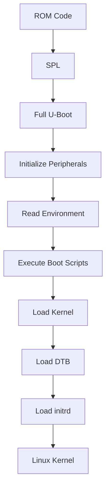
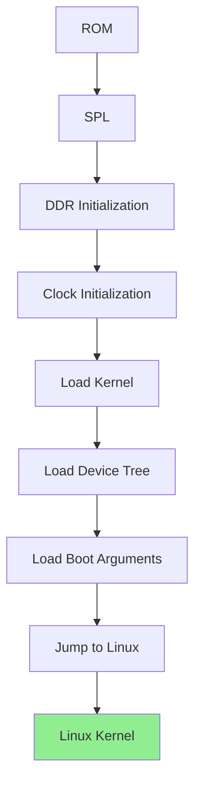
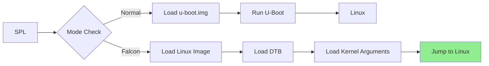

## 4. Embedded Systems & Linux

4.1. [Microcontroller vs Microprocessor](#41-microcontroller-vs-microprocessor)
4.2. [Harvard vs Von Neumann](#42-harvard-vs-von-neumann)
4.3. [Boot Process](#43-boot-process)
4.4. [SOC vs SOM-1](#44-soc-vs-som-1)
4.5. [Linux Architecture](#45-linux-architecture)
4.6. [System Calls](#46-system-calls)
4.7. [Process-Thread Management](#47-process-thread-management)
4.8. [Scheduler](#48-scheduler)
4.9. [Signals](#49-signals)
4.10. [File Systems](#410-file-systems)
4.11. [IPC](#411-ipc)
4.12. [Linux Device Drivers](#412-linux-device-drivers)
4.13. [Interrupts](#413-interrupts)
4.14. [ISR](#414-isr)
4.15. [Concurrency](#415-concurrency)

[🔝 Back to Table of Contents](#table-of-contents)

#### 4.1 Microcontroller vs Microprocessor

### What is a Microcontroller (MCU)?

A **Microcontroller** is a compact, self-contained computer on a single chip that includes a processor core, memory (RAM and ROM/Flash), and programmable input/output peripherals.

**Key Characteristics:**
- Complete computer system on a single chip
- Designed for dedicated, specific tasks
- Optimized for low power consumption
- Typically runs at lower clock speeds (MHz range)
- Includes built-in peripherals (ADC, PWM, Timers, etc.)

---

### What is a Microprocessor (MPU)?

A **Microprocessor** is the central processing unit (CPU) of a computer system, containing only the processor core and requiring external components for memory and I/O.

**Key Characteristics:**
- Only contains the CPU core
- Requires external RAM, ROM, and I/O devices
- Designed for general-purpose computing
- Higher power consumption
- Runs at higher clock speeds (GHz range)

---
### Detailed Comparison Table

| Feature | Microcontroller (MCU) | Microprocessor (MPU) |
|---------|----------------------|----------------------|
| **Definition** | Complete computer on a single chip | CPU only, requires external components |
| **Components** | CPU + RAM + ROM/Flash + Peripherals | CPU only |
| **Memory** | Built-in (internal) | External (RAM, ROM) |
| **Peripherals** | Built-in (GPIO, ADC, PWM, I2C, SPI, UART, etc.) | External, added through chipset |
| **Power Consumption** | Low (mW range) | High (W range) |
| **Clock Speed** | Slower (MHz range: 8 MHz - 400 MHz) | Faster (GHz range: 1 GHz - 5 GHz) |
| **Cost** | Lower ($0.10 - $10) | Higher ($10 - $1000+) |
| **Applications** | Dedicated, real-time control | General-purpose computing |
| **Examples** | ARM Cortex-M, AVR, PIC, ESP32 | Intel Core i9, AMD Ryzen, ARM Cortex-A |
| **Operating System** | Bare-metal or RTOS (FreeRTOS, Zephyr) | Full OS (Linux, Windows, Android) |
| **Development** | Single toolchain, simpler | Complex toolchain, multiple components |
| **Boot Time** | Fast (milliseconds) | Slower (seconds) |
| **Security Features** | Limited (hardware security modules) | Advanced (Secure Enclave, TPM) |
| **Error Handling** | Simple (Watchdog, Reset) | Complex (Exception handling, MMU) |
| **Parallelism** | Limited | High (multi-core, hyperthreading) |

--- 

### Architectural Differences

```
Microcontroller Architecture:
┌─────────────────────────────────────────┐
│           Microcontroller               │
│  ┌─────────────────────────────────┐   │
│  │      CPU Core                   │   │
│  │  ┌───────────────────────────┐ │   │
│  │  │  ALU    │  Registers      │ │   │
│  │  └───────────────────────────┘ │   │
│  ├─────────────────────────────────┤   │
│  │      Memory                    │   │
│  │  ┌───────────┐ ┌───────────┐  │   │
│  │  │  SRAM     │ │  Flash    │  │   │
│  │  └───────────┘ └───────────┘  │   │
│  ├─────────────────────────────────┤   │
│  │      Peripherals               │   │
│  │  ┌───┐ ┌───┐ ┌───┐ ┌───┐    │   │
│  │  │GPIO│ │ADC│ │PWM│ │UART│   │   │
│  │  └───┘ └───┘ └───┘ └───┘    │   │
│  └─────────────────────────────────┘   │
└─────────────────────────────────────────┘

Microprocessor Architecture:
┌─────────────────────────────────────────┐
│           Microprocessor                │
│  ┌─────────────────────────────────┐   │
│  │      CPU Core                   │   │
│  │  ┌───────────────────────────┐ │   │
│  │  │  ALU    │  Registers      │ │   │
│  │  └───────────────────────────┘ │   │
│  │  ┌───────────────────────────┐ │   │
│  │  │  MMU    │  Cache          │ │   │
│  │  └───────────────────────────┘ │   │
│  ├─────────────────────────────────┤   │
│  │      External Connections       │   │
│  │  ┌───┐ ┌───┐ ┌───┐ ┌───┐    │   │
│  │  │RAM │ │ROM │ │I/O │ │PCIe│   │   │
│  │  └───┘ └───┘ └───┘ └───┘    │   │
│  └─────────────────────────────────┘   │
└─────────────────────────────────────────┘
```

---

### Real-World Examples

#### Microcontroller Applications:
1. **Home Appliances**: Washing machines, microwaves, refrigerators
2. **Automotive**: Engine control units (ECU), ABS, airbag systems
3. **Consumer Electronics**: Remote controls, keyboards, mice
4. **Medical Devices**: Pacemakers, blood pressure monitors
5. **Industrial**: PLC controllers, motor drives, process control
6. **IoT Devices**: Smart sensors, environmental monitors, smart home devices

#### Microprocessor Applications:
1. **Personal Computers**: Laptops, desktops, workstations
2. **Smartphones**: Mobile phones, tablets
3. **Servers**: Data centers, cloud computing
4. **Networking**: Routers, switches, firewalls
5. **Gaming**: Consoles, gaming PCs
6. **Multimedia**: Set-top boxes, smart TVs, media players

---

[Back to Section 4](#4-embedded-systems--linux)

[🔝 Back to Table of Contents](#table-of-contents)

---
#### 4.2 Harvard vs Von Neumann

#### What is Von Neumann Architecture?

The Von Neumann architecture, named after mathematician and physicist John von Neumann, is a computer architecture where program instructions and data are stored in the same memory space and share a single bus for both instruction and data transfer.

#### Key Characteristics

| Characteristic | Description |
|----------------|-------------|
| **Single Memory** | One shared memory space for both data and instructions |
| **Single Bus** | One bus for both data and instructions (von Neumann bottleneck) |
| **Sequential Execution** | Instructions are fetched and executed one at a time |
| **Stored Program Concept** | Programs and data are stored in the same memory |

#### Architecture Diagram

```
Von Neumann Architecture:
┌─────────────────────────────────────────────────────────────┐
│                                                             │
│  ┌──────────────┐                  ┌───────────────────┐   │
│  │              │                  │                   │   │
│  │    CPU       │  Single Bus     │   Shared Memory   │   │
│  │              │◄────────────────►│   ┌─────────┐    │   │
│  │              │                  │   │Program  │    │   │
│  │  ┌────────┐  │                  │   │Instructions│   │   │
│  │  │  ALU   │  │                  │   ├─────────┤    │   │
│  │  ├────────┤  │                  │   │  Data   │    │   │
│  │  │Control │  │                  │   │         │    │   │
│  │  └────────┘  │                  │   └─────────┘    │   │
│  └──────────────┘                  └───────────────────┘   │
│                                                             │
└─────────────────────────────────────────────────────────────┘
```

#### Advantages

| Advantage | Description |
|-----------|-------------|
| **Simpler Design** | Single memory and bus make the architecture easier to implement |
| **Lower Cost** | Less hardware required, reducing manufacturing costs |
| **Flexible Memory Usage** | Memory can be dynamically allocated between data and instructions |
| **Easier to Program** | No special handling needed for different memory types |

#### Disadvantages

| Disadvantage | Description |
|--------------|-------------|
| **Von Neumann Bottleneck** | The single bus becomes a performance bottleneck |
| **Limited Parallelism** | Cannot fetch instructions and data simultaneously |
| **Slower Performance** | The CPU often waits for memory access |
| **Security Risks** | Data and instructions share the same space (vulnerable to attacks) |

---

### Harvard Architecture

#### What is Harvard Architecture?

The Harvard architecture, named after the Harvard Mark I computer, is a computer architecture where program instructions and data are stored in separate memory spaces with separate buses for each.

#### Key Characteristics

| Characteristic | Description |
|----------------|-------------|
| **Separate Memories** | Distinct memory spaces for instructions and data |
| **Dual Buses** | Two buses: one for instructions, one for data |
| **Parallel Access** | Can fetch instructions and data simultaneously |
| **Higher Performance** | Eliminates the von Neumann bottleneck |

#### Architecture Diagram

```
Harvard Architecture:
┌─────────────────────────────────────────────────────────────┐
│                                                             │
│  ┌──────────────┐        ┌─────────────────────────────┐  │
│  │              │        │                             │  │
│  │    CPU       │        │   Instruction Memory        │  │
│  │              │────────►│   (Program)                │  │
│  │              │        │                             │  │
│  │  ┌────────┐  │        └─────────────────────────────┘  │
│  │  │  ALU   │  │                                         │
│  │  ├────────┤  │        ┌─────────────────────────────┐  │
│  │  │Control │  │        │                             │  │
│  │  └────────┘  │────────►│   Data Memory              │  │
│  │              │        │   (Variables, Stack)        │  │
│  │              │        │                             │  │
│  └──────────────┘        └─────────────────────────────┘  │
│                                                             │
└─────────────────────────────────────────────────────────────┘
```

#### Advantages

| Advantage | Description |
|-----------|-------------|
| **Parallel Execution** | Can fetch instructions and data simultaneously |
| **Higher Performance** | No bus bottleneck, faster execution |
| **Better Security** | Separate memory spaces prevent data/instruction corruption |
| **Deterministic Timing** | Predictable execution time (important for real-time systems) |

#### Disadvantages

| Disadvantage | Description |
|--------------|-------------|
| **Complex Design** | Requires separate memory management and dual buses |
| **Higher Cost** | More hardware components increase cost |
| **Less Flexible** | Fixed memory allocation between instruction and data |
| **More Complex Programming** | Requires separate handling for different memory types |

---

### Detailed Comparison

#### Comparison Table

| Feature | Von Neumann | Harvard |
|---------|-------------|---------|
| **Memory** | Shared memory for instructions and data | Separate memory for instructions and data |
| **Buses** | Single bus | Two buses (instruction and data) |
| **Parallelism** | No (sequential access) | Yes (parallel access) |
| **Performance** | Lower (bottleneck) | Higher (no bottleneck) |
| **Complexity** | Simpler | More complex |
| **Cost** | Lower | Higher |
| **Security** | Less secure | More secure |
| **Flexibility** | More flexible | Less flexible |
| **Real-time** | Less deterministic | More deterministic |
| **Development** | Easier | More complex |

#### Performance Comparison

```
Performance Comparison:
┌─────────────────────────────────────────────────────────────┐
│                                                             │
│  Von Neumann Architecture:                                 │
│  ┌────────────────────────────────────────────────────┐   │
│  │  Fetch Instruction  ──►  Fetch Data  ──► Execute  │   │
│  └────────────────────────────────────────────────────┘   │
│            ↓         ↓         ↓                         │
│  Time:     T1        T2        T3                        │
│                                                          │
│  Harvard Architecture:                                   │
│  ┌────────────────────────────────────────────────────┐   │
│  │  Fetch Instruction ──────────────────────────┐    │   │
│  │                              ↓                ↓    │   │
│  │  Fetch Data      ──────────────────────────┐    │   │
│  │                                             │    │   │
│  │  Parallel Execution         ───► Execute    │    │   │
│  └────────────────────────────────────────────────────┘   │
│            ↓                                             │
│  Time:     T1 (Faster)                                    │
│                                                          │
└─────────────────────────────────────────────────────────────┘
```
---

[Back to Section 4](#4-embedded-systems--linux)

[🔝 Back to Table of Contents](#table-of-contents)

#### 4.3 Boot Process

# Table of Boot Process
1. [Linux Boot Process (x86/General Purpose)](#1-linux-boot-process-x86general-purpose)
2. [i.MX Boot Process (NXP i.MX SoCs)](#2-imx-boot-process-nxp-imx-socs)
3. [ARM Boot Process (General ARM-based Embedded)](#3-arm-boot-process-general-arm-based-embedded-devices)
4. [Android Boot Process](#4-android-boot-process-based-on-linux-kernel-mobileembedded-devices)
5. [Qualcomm Boot Process](#5-qualcomm-boot-process-a-comprehensive-guide)
6. [Falcon Mode](#6-falcon-mode)

---

## 1. Linux Boot Process (General-Purpose Systems, e.g., x86)

### Key Stages

#### 1️⃣ BIOS / UEFI Initialization
- On power-on, the BIOS/UEFI firmware performs POST (Power-On Self-Test), initializes basic hardware (CPU, RAM, chipset).
- Detects bootable devices (HDD, SSD, USB, network) and loads the bootloader from selected media (MBR, EFI partition).
- On some embedded systems, BIOS/UEFI is replaced or omitted altogether; the SoC boot-ROM directly loads an embedded bootloader.

BIOS / UEFI Initialization

| Aspect | Details |
|--------|---------|
| **Location** | On-board flash memory chip (BIOS/UEFI firmware) |
| **Starting Point** | Immediately after power-on reset (x86 CPU jumps to reset vector 0xFFFFFFF0) |
| **Function** | • Perform POST (Power-On Self-Test)<br>• Initialize basic hardware (CPU, RAM, chipset)<br>• Detect bootable devices (HDD, SSD, USB, network)<br>• Load bootloader from MBR or EFI partition |
| **Source Code** | Proprietary (AMI, Insyde, Phoenix) or open-source (TianoCore EDK2) |
| **Configuration** | • BIOS settings (CMOS)<br>• UEFI variables (NVRAM)<br>• Boot order configuration |

#### 2️⃣ Bootloader (e.g., GRUB / LILO / Syslinux)
- Presents menu, allows parameter selection.
- Loads the Linux kernel image (vmlinuz) and optionally an initial RAM disk (initrd/initramfs).
- Passes kernel parameters (root filesystem location, options) and may load Device Tree on non-x86 architectures.
- Transfers control to the kernel.

| Aspect | Details |
|--------|---------|
| **Location in Storage** | • **GRUB:** /boot/grub/ or /boot/efi/EFI/<distro>/<br>• **MBR:** First 512 bytes of boot disk (stage 1)<br>• **EFI:** EFI System Partition (ESP) - /boot/efi/ |
| **Location in Memory** | • **Stage 1:** Loaded at 0x7C00 (MBR)<br>• **Stage 2:** Loaded into conventional memory (1MB range)<br>• **GRUB2:** Loaded at 0x8000 or higher |
| **Starting Point** | • **MBR:** BIOS loads MBR at 0x7C00 and jumps to it<br>• **EFI:** UEFI loads bootx64.efi and executes it<br>• **Entry:** _start or start() function |
| **Functions** | • Present boot menu for user selection<br>• Load Linux kernel image (vmlinuz) into memory<br>• Load initial RAM disk (initrd/initramfs)<br>• Pass kernel parameters (root filesystem location)<br>• Transfer control to kernel |
| **Source Code Location** | • **GRUB:** https://www.gnu.org/software/grub/<br>• **Configuration:** /boot/grub/grub.cfg<br>• **EFI:** /boot/efi/EFI/ |
| **Key Files** | • **grub.cfg:** Boot menu configuration<br>• **vmlinuz-*:** Kernel image<br>• **initrd.img-*:** Initial RAM disk<br>• **grubenv:** Environment variables |

#### 3️⃣ Linux Kernel Initialization
- Kernel decompresses/unpacks itself, initializes system memory, scheduler, device drivers, peripheral subsystems.
- Mounts initrd or root filesystem as specified.
- Kernel then executes the user-space init process.

**Bootloader Memory Layout (x86):**
```
┌──────────────────────────────────────────────────────────────┐
│  Memory Map During Bootloader Execution                     │
│                                                              │
│  0x00000000 - 0x000003FF: IVT (Interrupt Vector Table)     │
│  0x00000400 - 0x000004FF: BIOS Data Area                   │
│  0x00000500 - 0x00007BFF: Conventional Memory (Free)       │
│  0x00007C00 - 0x00007DFF: MBR/Loader (Stage 1)            │
│  0x00007E00 - 0x0009FFFF: Bootloader Stage 2               │
│  0x000A0000 - 0x000FFFFF: Video Memory / BIOS ROM          │
│  0x00100000 - 0xXXXXXXXX: Kernel Load Area (1MB+)          │
│                                                              │
│  Kernel loaded at: 0x100000 (1MB) or higher                 │
│  Initrd loaded at: 0x4000000 (64MB) or higher              │
└──────────────────────────────────────────────────────────────┘
```

| Aspect | Details |
|--------|---------|
| **Location in Storage** | • **x86:** /boot/vmlinuz-* or /boot/vmlinux-*<br>• **EFI:** /boot/efi/EFI/<distro>/vmlinuz-linux |
| **Location in Memory** | • **Real Mode:** 0x10000 (64KB) - boot sector<br>• **Protected Mode:** 0x100000 (1MB) - kernel decompression<br>• **Final:** 0x1000000 (16MB) or higher - running kernel |
| **Starting Point** | • **Entry:** _start or start_kernel()<br>• **Assembly Entry:** arch/x86/boot/header.S<br>• **C Entry:** init/main.c:start_kernel()<br>• **CPU State:** Protected mode, paging enabled |
| **Functions** | • Decompress itself (from compressed vmlinuz)<br>• Initialize system memory management (paging, zones)<br>• Initialize scheduler, IRQ, timers<br>• Probe and initialize device drivers<br>• Mount root filesystem or initramfs<br>• Execute /sbin/init (PID 1) |
| **Source Code Location** | • **Kernel:** https://www.kernel.org/<br>• **Arch-specific:** arch/x86/<br>• **Core kernel:** init/, kernel/, mm/ |
| **Key Files** | • **head.S:** Assembly entry point<br>• **main.c:** start_kernel() function<br>• **setup.c:** Architecture-specific setup<br>• **Kconfig:** Kernel configuration |

**Kernel Boot Flow:**
```c
// arch/x86/boot/header.S
_start → startup_32() → startup_64() → start_kernel()

// init/main.c
start_kernel() {
    setup_arch()        // Architecture-specific init
    mm_init()           // Memory management init
    sched_init()        // Scheduler init
    init_IRQ()          // Interrupt controller init
    time_init()         // Timer init
    console_init()      // Console init
    rest_init()         // Start kernel threads
}
```
**Kernel Memory Layout (x86_64):**
```
┌──────────────────────────────────────────────────────────────┐
│  x86_64 Kernel Memory Layout                                 │
│                                                              │
│  0x0000000000000000 - 0x00007FFFFFFFFFFF: User Space       │
│  0x0000800000000000 - 0x0000FFFFFFFFFFFF: Kernel Space     │
│                                                              │
│  Kernel Text:   0xFFFFFFFF80000000 - 0xFFFFFFFF81000000    │
│  Kernel Data:   0xFFFFFFFF81000000 - 0xFFFFFFFF82000000    │
│  Kernel BSS:    0xFFFFFFFF82000000 - 0xFFFFFFFF83000000    │
│  Module Space:  0xFFFFFFFF83000000 - 0xFFFFFFFF88000000    │
│  vmalloc:       0xFFFF880000000000 - 0xFFFFC7FFFFFFFFFF    │
│  Direct Map:    0xFFFF880000000000 - 0xFFFFC7FFFFFFFFFF    │
└──────────────────────────────────────────────────────────────┘
```

#### 4️⃣ Init / systemd & User Space Startup
- The init system (/sbin/init -> systemd or SysV) starts up system services (networking, login managers, GUIs).
- GUI (Xorg, Wayland, desktop environment) may load depending on system type.
- User applications launch and system becomes ready for interaction.

| Aspect | Details |
|--------|---------|
| **Location in Storage** | • **systemd:** /lib/systemd/systemd<br>• **SysV init:** /sbin/init (symlink to /etc/init)<br>• **Configuration:** /etc/inittab (SysV), /etc/systemd/ (systemd) |
| **Location in Memory** | • **PID 1:** First user-space process<br>• **Memory:** Loaded from root filesystem into RAM<br>• **Stack:** User-space stack allocated |
| **Starting Point** | • **Entry:** main() function of init binary<br>• **Start Time:** Kernel executes /sbin/init after mounting rootfs<br>• **PID:** Process ID 1 |
| **Functions** | • Mount additional filesystems (/proc, /sys, /dev)<br>• Start system services and daemons<br>• Manage runlevels/targets<br>• Handle system shutdown/reboot<br>• Launch user sessions and applications |
| **Source Code Location** | • **systemd:** https://github.com/systemd/systemd<br>• **SysV init:** https://savannah.nongnu.org/projects/sysvinit<br>• **BusyBox:** https://busybox.net/ |
| **Key Files** | • **/etc/inittab:** SysV init configuration<br>• **/etc/systemd/system/:** systemd unit files<br>• **/lib/systemd/system/:** System unit files<br>• **/etc/rc.d/:** SysV runlevel scripts |

**Init Flow:**
```
┌──────────────────────────────────────────────────────────────┐
│ Init System Flow                                             │
│                                                              │
│ Kernel → /sbin/init (PID 1)                                 │
│              │                                               │
│              ▼                                               │
│  ┌─────────────────────────────────────────────────┐        │
│  │ systemd Boot Sequence                           │        │
│  │                                                 │        │
│  │ 1. Mount /proc, /sys, /dev, /run               │        │
│  │ 2. Load kernel modules                          │        │
│  │ 3. Start udev (device management)              │        │
│  │ 4. Mount filesystems from /etc/fstab           │        │
│  │ 5. Start network services                       │        │
│  │ 6. Start system services (sshd, cron, etc.)    │        │
│  │ 7. Start getty (login prompts)                 │        │
│  │ 8. Start graphical session (if enabled)        │        │
│  └─────────────────────────────────────────────────┘        │
│              │                                               │
│              ▼                                               │
│  ┌─────────────────────────────────────────────────┐        │
│  │ System Ready                                    │        │
│  │ • Login prompt or GUI                           │        │
│  │ • User applications can start                   │        │
│  └─────────────────────────────────────────────────┘        │
└──────────────────────────────────────────────────────────────┘
```

**systemd Unit Locations:**
| Location | Purpose |
|----------|---------|
| `/etc/systemd/system/` | Local system configuration |
| `/lib/systemd/system/` | System-provided units |
| `/etc/systemd/user/` | User-specific services |
| `/usr/lib/systemd/system/` | Vendor-provided units |


### Additional Important Notes
- On embedded variants of Linux, you might skip BIOS/UEFI and use U-Boot or other bootloader directly.
- Init systems are evolving: systemd is now dominant on many distributions.
- Root filesystem may reside locally (SSD, HDD) or be network-mounted (NFS) depending on target deployment.
- For secure boot or measured boot on PC/servers, UEFI Secure Boot adds steps of signature verification (not covered in embedded i.MX case).

---
[Back to TOC](#table-of-boot-process)

## 2. i.MX Boot Process (NXP i.MX SoCs)

### Key Stages

#### 1️⃣ Boot ROM (on-chip, hardware-hardcoded)
- **Executes immediately after power-on reset or system reset.**
- **Reads boot-mode selectors (fuses, strap pins)** to determine boot media (eMMC, SD card, SPI-NOR, NAND, USB-SDP, etc.).
- **Initializes on-chip RAM (OCRAM/Tightly Coupled Memory)** and minimal infrastructure.
- **Loads the next stage bootloader** (typically SPL or direct U-Boot) from the selected boot device.
- **Important note:** On modern i.MX8/i.MX9, the Boot ROM may first load a "container" image which includes Firmware for the System Controller (SCFW), Security Controller (SECO), and others.

| Aspect | Details |
|--------|---------|
| **Location** | On-chip mask ROM (immutable) |
| **Starting Point** | Immediately after power-on reset (ARM core jumps to 0x00000000) |
| **Function** | • Execute immediately after power-on reset<br>• Read boot-mode selectors (fuses, strap pins)<br>• Initialize on-chip RAM (OCRAM/TCM)<br>• Load SPL or U-Boot from boot media<br>• Verify signatures (if secure boot enabled) |
| **Source Code** | Proprietary (NXP-provided, not accessible) |
| **Configuration** | • BOOT_MODE pins<br>• Fuses (OTP bits)<br>• Boot media selection registers |

**Boot ROM Memory Layout (i.MX8M):**
```
┌──────────────────────────────────────────────────────────────┐
│  i.MX8M Boot ROM Memory Map                                 │
│                                                              │
│  OCRAM (256KB):                                              │
│  ┌────────────────────────────────────────────────────────┐ │
│  │  0x900000 - 0x900000: Boot ROM (fixed)               │ │
│  │  0x900000 - 0x920000: SPL Load Area                  │ │
│  │  0x920000 - 0x930000: Stack                          │ │
│  │  0x930000 - 0x940000: Heap                           │ │
│  └────────────────────────────────────────────────────────┘ │
│                                                              │
│  Boot Media Options:                                         │
│  • eMMC (mmc0/mmc1)                                        │
│  • SD Card (mmc0/mmc1)                                     │
│  • SPI-NOR Flash                                           │
│  • NAND Flash                                              │
│  • USB (Serial Download Protocol)                          │
└──────────────────────────────────────────────────────────────┘
```

#### 2️⃣ Secondary Bootloader (SPL → full U-Boot) / U-Boot
- **If SPL is used:**
  - SPL runs in OCRAM and performs early hardware init (e.g., DDR controller, clocks).
  - Loads full U-Boot into DDR.
- **If no SPL:**
  - Boot ROM may load full U-Boot directly (depending on SoC).
- **U-Boot then:**
  - Further configures memory, clocks, board hardware.
  - Loads the Linux kernel image and the Device Tree Blob (DTB) (and optionally initrd/initramfs).
  - Passes boot arguments (bootargs) and DTB to the kernel.
  - May offer a console shell, boot prompt, networking, fastboot mode, recovery mode.
- **Important note:** On i.MX family, modern features like "Falcon Mode" are supported to reduce boot time by skipping full U-Boot and going direct to kernel.


| Aspect | Details |
|--------|---------|
| **Location in Storage** | • **SPL:** First 32-64KB of boot media<br>• **U-Boot:** Boot partition (e.g., /dev/mmcblk0p1) |
| **Location in Memory** | • **SPL:** OCRAM (0x900000 - 0x920000)<br>• **U-Boot:** DDR RAM (0x40000000 or 0x80000000) |
| **Starting Point** | • **SPL Entry:** _start → board_init_f()<br>• **U-Boot Entry:** board_init_f() → board_init_r() |
| **Functions** | • Initialize DDR memory, clocks, PMIC<br>• Load kernel + DTB + initrd from storage<br>• Provide boot console and command interface<br>• Support fastboot, recovery, network boot<br>• Pass bootargs and DTB address to kernel |
| **Source Code Location** | • **U-Boot:** https://github.com/u-boot/u-boot<br>• **Board-specific:** board/freescale/<board>/<br>• **Configuration:** include/configs/<board>.h |
| **Key Files** | • **board.c:** Board initialization<br>• **ddr.c:** DDR timing configuration<br>• **env:** U-Boot environment variables |

**U-Boot Flow:**
```c
// arch/arm/lib/crt0.S
_start → board_init_f() → board_init_r() → main_loop()

// board_init_f(): Early init (CPU, clocks, DDR)
// board_init_r(): Full init (peripherals, environment)
// main_loop(): Command console or auto-boot
```

**U-Boot Boot Flow Diagram:**
```
┌──────────────────────────────────────────────────────────────┐
│ U-Boot Execution Flow                                        │
│                                                              │
│ SPL (OCRAM)                                                  │
│  │                                                           │
│  ├─ Initialize DDR                                           │
│  ├─ Initialize Clocks                                        │
│  ├─ Initialize PMIC                                          │
│  └─ Load U-Boot from Storage                                 │
│       │                                                      │
│       ▼                                                      │
│ Full U-Boot (DDR)                                            │
│  │                                                           │
│  ├─ board_init_f()                                           │
│  │   ├─ CPU/MMU init                                        │
│  │   ├─ Serial console                                      │
│  │   ├─ Environment init                                    │
│  │   └─ Memory allocation                                   │
│  │                                                           │
│  ├─ board_init_r()                                           │
│  │   ├─ I2C/SPI init                                        │
│  │   ├─ USB init                                            │
│  │   ├─ Ethernet init                                       │
│  │   ├─ Storage init (MMC/SD/NAND)                         │
│  │   └─ Environment load                                    │
│  │                                                           │
│  ├─ main_loop()                                              │
│  │   ├─ Boot delay (if configured)                          │
│  │   ├─ Execute bootcmd                                     │
│  │   └─ Console shell (if user interrupts)                  │
│  │                                                           │
│  └─ Load and boot kernel                                     │
│      ├─ Load zImage/Image                                   │
│      ├─ Load DTB                                             │
│      ├─ Load initrd (optional)                              │
│      └─ Jump to kernel (bootz/booti)                       │
└──────────────────────────────────────────────────────────────┘
```

**U-Boot Environment Variables:**
```bash
# Typical U-Boot environment
bootcmd=mmc dev 1; fatload mmc 1:1 0x80800000 zImage; fatload mmc 1:1 0x83000000 imx8mm.dtb; bootz 0x80800000 - 0x83000000
bootargs=console=ttymxc1,115200 root=/dev/mmcblk1p2 rootwait rw
```

#### 3️⃣ Linux Kernel Execution
- U-Boot loads the kernel (zImage/Image) into RAM, sets up DTB and bootargs, then jumps into kernel entry point.
- Kernel uncompresses, initializes CPU(s), memory management, device drivers, peripheral initialization.
- The Device Tree describes hardware layout (so kernel can bind drivers properly).
- Kernel mounts the root filesystem (or an initramfs/initrd) and transitions to user-space.
- **Important note:** For secure boot, trusted firmware (e.g., ARM TF-A), SECO, SCFW must be loaded prior to kernel on many i.MX8/9 devices.

| Aspect | Details |
|--------|---------|
| **Location in Storage** | /boot/zImage or /boot/Image (ext4 partition) |
| **Location in Memory** | • **Kernel:** 0x80008000 (ARM64) or 0x1000000 (ARM32)<br>• **DTB:** 0x83000000 (or just below kernel)<br>• **initrd:** 0x84000000 (or specified address) |
| **Starting Point** | • **Entry:** stext in arch/arm/kernel/head.S<br>• **Kernel Init:** start_kernel() in init/main.c<br>• **Arch Setup:** setup_arch() in arch/arm/kernel/setup.c |
| **Functions** | • Decompress and relocate itself<br>• Initialize CPU cores, memory management<br>• Setup device drivers via Device Tree<br>• Mount root filesystem<br>• Start init process (PID 1) |
| **Source Code Location** | • **Kernel:** https://www.kernel.org/<br>• **Arch-specific:** arch/arm/, arch/arm64/<br>• **Device Tree:** arch/arm/boot/dts/ |

**Kernel Flow:**
```c
// arch/arm/kernel/head.S
stext → __enable_mmu() → __mmap_switched() → start_kernel()

// init/main.c
start_kernel() {
    setup_arch()        // Parse DTB, set up memory
    mm_init()           // Memory management init
    sched_init()        // Scheduler init
    init_IRQ()          // Interrupt controller init
    time_init()         // Timer init
    console_init()      // Serial console init
    rest_init()         // Start kernel threads
}
```

**i.MX Memory Layout:**
```
┌──────────────────────────────────────────────────────────────┐
│  i.MX8M DDR Memory Layout                                   │
│                                                              │
│  0x40000000 - 0x40100000: U-Boot (2MB)                    │
│  0x40400000 - 0x40400000: Environment                     │
│  0x80000000 - 0x80000000: Kernel (zImage ~8MB)            │
│  0x82000000 - 0x82200000: DTB (~2MB)                     │
│  0x83000000 - 0x84000000: initrd (if used)               │
│  0x90000000 - 0xFFFFFFFF: User space applications         │
└──────────────────────────────────────────────────────────────┘
```

#### 4️⃣ Root Filesystem & Init Process
- Root filesystem (e.g., ext4, SquashFS, UBIFS, or network root) is mounted.
- The init system (either systemd, busybox init, or other) starts /sbin/init (or equivalent).
- System services are brought up, user-space processes start.

| Aspect | Details |
|--------|---------|
| **Location in Storage** | /dev/mmcblk1p2 (ext4 partition) |
| **Location in Memory** | Mounted at / (root directory) |
| **Functions** | • Provide Linux system hierarchy (/bin, /sbin, /etc)<br>• Hold system binaries, libraries, configs<br>• Store init scripts and systemd units<br>• Provide device nodes (/dev)<br>• Hold user data (/home, /root) |
| **Source Code Location** | Created using Yocto/Buildroot/Debootstrap |
| **Key Directories** | • **/bin:** Essential user binaries<br>• **/sbin:** System binaries<br>• **/etc:** Configuration files<br>• **/lib:** Shared libraries<br>• **/usr:** User programs<br>• **/dev:** Device files<br>• **/proc:** Process information (virtual)<br>• **/sys:** Kernel and device info (virtual) |

**RootFS Types:**
| Type | Description | Use Case |
|------|-------------|----------|
| **ext4** | Journaling filesystem | General storage |
| **SquashFS** | Compressed, read-only | Embedded systems |
| **UBIFS** | Flash filesystem | NAND/NOR flash |
| **initramfs** | RAM-based, early root | Boot-time drivers |
| **NFS** | Network filesystem | Development/debug |


### Additional Important Notes
- **Boot Time Optimization:**
  - Application notes from NXP describe techniques (boot delay removal, Falcon mode, kernel command line tweaks) to reduce total boot time.
- **Boot Media Fallback:**
  - If the selected boot media fails (e.g., no valid image), the Boot ROM may fallback to Serial Download Protocol (SDP) or alternate boot device.
- **Board/SoC Variations:**
  - Different i.MX series (6,7,8,9) embed different subsystems (System Controller, Cortex-M domains, edge security), so actual boot steps may include additional sub-steps (e.g., SCFW, Cortex-M core boot).

---
[Back to TOC](#table-of-boot-process)

[🔝 Back to Table of Contents](#table-of-contents)

## 3. ARM Boot Process (General ARM-based Embedded Devices)

### Key Stages

#### 1️⃣ Boot ROM (on-chip in SoC)
- After power-on reset, the ARM core begins execution from a fixed address in ROM.
- Boot-ROM code initializes basic hardware and selects boot media based on straps/fuses.
- Loads the next stage bootloader (could be U-Boot, Barebox, Little Kernel, etc.).

| Aspect | Details |
|--------|---------|
| **Location** | On-chip mask ROM (immutable) |
| **Starting Point** | After power-on reset, ARM core jumps to 0x00000000 |
| **Function** | • Initialize basic hardware<br>• Select boot media based on straps/fuses<br>• Load next stage bootloader (U-Boot/Barebox/LK) |
| **Source Code** | Proprietary (SoC vendor provided) |


#### 2️⃣ Bootloader (e.g., U-Boot / Barebox / LK)
- Initialize DRAM/external memory, set up clocks, UART, peripheral controllers.
- Load kernel + DTB + (optionally) initrd, pass arguments.
- May provide UI shell, fastboot/USB, recovery.

| Aspect | Details |
|--------|---------|
| **Location in Storage** | Boot partition (e.g., /dev/mmcblk0p1) |
| **Location in Memory** | • **SPL:** SRAM (typically 64KB-256KB)<br>• **Full Bootloader:** DDR RAM |
| **Starting Point** | • **Entry:** _start in arch/arm/lib/vectors.S<br>• **Main:** board_init_f() → board_init_r() |
| **Functions** | • Initialize DRAM/external memory<br>• Set up clocks, UART, peripheral controllers<br>• Load kernel + DTB + initrd<br>• Pass boot arguments to kernel |
| **Source Code Location** | • **U-Boot:** https://github.com/u-boot/u-boot<br>• **Barebox:** https://barebox.org/ |

**Boot Process Flow:**
```
Boot ROM → SPL → Bootloader → Kernel → RootFS → Init → Applications
```

#### 3️⃣ Linux Kernel Execution
- Same as above: decompress, init devices, mount root filesystem.
- Kernel takes care of platform-specific drivers via DTB.

| Aspect | Details |
|--------|---------|
| **Location in Storage** | /boot/zImage or /boot/Image |
| **Location in Memory** | 0x80008000 (ARM64) or 0x1000000 (ARM32) |
| **Starting Point** | • **Entry:** stext in arch/arm/kernel/head.S<br>• **Kernel Init:** start_kernel() in init/main.c |
| **Functions** | • Decompress and initialize devices<br>• Mount root filesystem<br>• Platform-specific drivers via DTB |

#### 4️⃣ System Initialization (init/systemd)
- Starts system services, daemons, applications.
- Load optional GUI or operate command-line only.

| Aspect | Details |
|--------|---------|
| **Location** | /sbin/init (symlink to systemd or busybox) |
| **Starting Point** | Kernel executes /sbin/init as PID 1 |
| **Functions** | • Starts system services, daemons<br>• Load optional GUI or command-line only |

### Additional Important Notes
- This process is essentially a more generic version of the i.MX sequence when used with ARM-based boards like Raspberry Pi or BeagleBone.
- There can be additional complexities: multi-core initialization, secure/non-secure domains, secondary cores (Cortex-M) initialization.
- Bootloader size limitations may force the use of SPL or minimal preloader: Boot ROM → SPL → full bootloader → kernel.
- Device Tree is essential for hardware abstraction in many ARM SoCs.

---
[Back to TOC](#table-of-boot-process)

[🔝 Back to Table of Contents](#table-of-contents)

## 4. Android Boot Process (Based on Linux Kernel, Mobile/Embedded Devices)

### Key Stages

#### 1️⃣ Boot ROM (SoC specific)
- On power ON / reset: SoC Boot ROM reads boot mode straps, initializes minimal hardware, selects boot device (eMMC, UFS, SD, USB).
- Loads bootloader or image container (depending on SoC) into memory.

| Aspect | Details |
|--------|---------|
| **Location** | On-chip mask ROM |
| **Starting Point** | After power-on reset |
| **Function** | • Read boot mode straps<br>• Initialize minimal hardware<br>• Select boot device (eMMC, UFS, SD, USB)<br>• Load bootloader into memory |

#### 2️⃣ Bootloader (Fastboot / U-Boot / Little Kernel / OEM Bootloader)
- Initializes basic hardware (memory, UART, power, clocks).
- Loads boot image (boot.img) which includes: Linux kernel + ramdisk (for Android) + DTB.
- May also load recovery image, vendor image, device-specific blobs.
- May offer fastboot mode, OEM unlock, recovery, flashing interface.

| Aspect | Details |
|--------|---------|
| **Location in Storage** | Bootloader partition (/dev/block/bootdevice/by-name/bootloader) |
| **Location in Memory** | Loaded into RAM by Boot ROM |
| **Starting Point** | Entry point defined by bootloader |
| **Functions** | • Initialize basic hardware (memory, UART, power, clocks)<br>• Load boot image (boot.img): kernel + ramdisk + DTB<br>• May load recovery image, vendor image, device-specific blobs<br>• Offer fastboot mode, OEM unlock, recovery, flashing interface |
| **Source Code Location** | • **Little Kernel (LK):** https://github.com/littlekernel/lk<br>• **U-Boot:** https://github.com/u-boot/u-boot |

**Android Boot Image (boot.img):**
```
┌──────────────────────────────────────────────────────────────┐
│ boot.img Layout                                              │
│                                                              │
│ ┌────────────────────────────────────────────────────────┐  │
│ │  Header (boot_img_hdr)                                │  │
│ │  • Magic: "ANDROID!"                                  │  │
│ │  • Kernel size, offset                                 │  │
│ │  • Ramdisk size, offset                                │  │
│ │  • DTB size, offset                                    │  │
│ │  • Pagesize                                            │  │
│ │  • Kernel command line                                 │  │
│ └────────────────────────────────────────────────────────┘  │
│                                                              │
│ ┌────────────────────────────────────────────────────────┐  │
│ │  Kernel (zImage/Image)                                │  │
│ │  • Linux kernel image                                  │  │
│ │  • Typically 8-16MB                                   │  │
│ └────────────────────────────────────────────────────────┘  │
│                                                              │
│ ┌────────────────────────────────────────────────────────┐  │
│ │  Ramdisk (initramfs)                                  │  │
│ │  • init.rc                                            │  │
│ │  • Android init scripts                               │  │
│ │  • Device-specific files                              │  │
│ └────────────────────────────────────────────────────────┘  │
│                                                              │
│ ┌────────────────────────────────────────────────────────┐  │
│ │  Device Tree Blob (DTB)                               │  │
│ │  • Hardware description                                │  │
│ │  • Platform-specific info                             │  │
│ └────────────────────────────────────────────────────────┘  │
└──────────────────────────────────────────────────────────────┘
```

**Fastboot Commands:**
```bash
# Typical fastboot commands
fastboot devices
fastboot flash boot boot.img
fastboot flash system system.img
fastboot flash vendor vendor.img
fastboot reboot
```

#### 3️⃣ Kernel and Init
- Kernel uncompresses, initializes hardware and drivers.
- Ramdisk executes init.rc or init.<board>.rc, creating mount points for /system, /vendor, /data.
- Android-specific components such as SELinux enforcement, Binder driver initialization run.


| Aspect | Details |
|--------|---------|
| **Location** | boot.img (kernel + ramdisk) |
| **Starting Point** | Kernel start_kernel() → Android init |
| **Functions** | • Kernel uncompresses, initializes hardware and drivers<br>• Ramdisk executes init.rc or init.<board>.rc<br>• Mount points for /system, /vendor, /data<br>• SELinux enforcement, Binder driver initialization |

**Android Init Flow:**
```
Kernel
  │
  ▼
/init (from ramdisk)
  │
  ├── Mount /proc, /sys, /dev
  ├── Mount /system, /vendor, /data
  ├── Parse init.rc
  │   ├── import /init.<board>.rc
  │   ├── import /vendor/init/vendor.rc
  │   └── import /system/etc/init/
  │
  ├── Start services
  │   ├── ueventd
  │   ├── logd
  │   ├── servicemanager
  │   ├── hwservicemanager
  │   └── vold
  │
  └── Start Zygote
```

#### 4️⃣ Zygote & Android Runtime (ART/Dalvik)
- The Zygote process starts (forks for each Android app) and pre-loads core Java classes.
- The Android Runtime (ART) gets initialized; native and Java services start.

| Aspect | Details |
|--------|---------|
| **Location** | /system/bin/app_process |
| **Starting Point** | Zygote main() function |
| **Functions** | • Pre-load core Java classes<br>• Forks for each Android app<br>• Initialize Android Runtime (ART) |

**Zygote Flow:**
```
Zygote
  │
  ├── Preload classes
  │   ├── Framework classes (~2000)
  │   └── Resources (themes, icons)
  │
  ├── Create socket (zygote)
  ├── Listen for app requests
  │
  ├── SystemServer fork
  │   └── Start system services
  │
  └── App forks
      └── Each app gets copy of Zygote
```

#### 5️⃣ System Server & Services Start
- Android's system_server starts services: WindowManager, ActivityManager, PackageManager, PowerManager.
- Boot animation plays.


| Aspect | Details |
|--------|---------|
| **Location** | /system/framework/services.jar |
| **Starting Point** | SystemServer.main() |
| **Functions** | • Start services:<br>  - WindowManager<br>  - ActivityManager<br>  - PackageManager<br>  - PowerManager<br>• Play boot animation |

**System Services:**
```
┌──────────────────────────────────────────────────────────────┐
│ Android System Services                                     │
│                                                              │
│ ActivityManagerService (AMS)                                │
│ ├── Manage app lifecycle                                    │
│ ├── Manage tasks and activities                            │
│ └── Handle intents                                          │
│                                                              │
│ WindowManagerService (WMS)                                  │
│ ├── Manage windows                                          │
│ ├── Handle screen rotation                                  │
│ └── Manage keyboard/mouse input                            │
│                                                              │
│ PackageManagerService (PMS)                                 │
│ ├── Manage installed packages                               │
│ ├── Handle permissions                                      │
│ └── Verify APK signatures                                   │
│                                                              │
│ PowerManagerService (PMS)                                   │
│ ├── Manage power states                                     │
│ ├── Wake locks                                              │
│ └── Battery management                                      │
└──────────────────────────────────────────────────────────────┘
```

#### 6️⃣ Applications & User Interaction
- Launcher/home screen appears; apps can be launched; system is ready for user interaction.

| Aspect | Details |
|--------|---------|
| **Location** | • **System apps:** /system/app/, /system/priv-app/<br>• **User apps:** /data/app/<br>• **OEM apps:** /vendor/app/ |
| **Starting Point** | Launcher application starts |
| **Functions** | • Launcher/home screen appears<br>• Apps can be launched<br>• System ready for user interaction |

**App Launch Flow:**
```
User taps app icon
        │
        ▼
Launcher sends intent to ActivityManager
        │
        ▼
AMS checks if app process exists
        │
        ├── No → Zygote forks new process
        │         └── Load app code
        │
        └── Yes → Resume existing process
        │
        ▼
Start app Activity
        │
        ▼
App becomes visible to user
```

### Additional Important Notes
- On mobile devices, boot time and responsiveness are critical; many vendors employ techniques like kernel/ramdisk optimizations and minimal services at boot.
- Secure Boot, Verified Boot, API levels, bootloader unlocking are major concerns in Android.
- The root filesystem layout is different: /system, /vendor, /boot, /recovery, and user data partition—so the mount and init process is tailored for Android.

---
[Back to TOC](#table-of-boot-process)

## 5. Summary Table (All Boot Processes)

| Stage | i.MX (NXP SoC) | Linux (x86/Server /Desktop) | ARM (Embedded) | Android (AOSP-Based) | Key Notes (2025 Updates) |
|-------|----------------|----------------------------|----------------|---------------------|--------------------------|
| **1️⃣** | **Boot ROM (SoC internal)** – Initializes CPU & OCRAM – Detects boot media (eMMC, SD, NAND, QSPI) – Loads SPL or U-Boot | **BIOS / UEFI** – POST, initializes CPU/RAM – Detects disks – Loads Bootloader (GRUB) | **Boot ROM** – Minimal setup (clock, SRAM) – Loads bootloader | **Boot ROM** – Loads Fastboot / LK / Aboot | UEFI replaces legacy BIOS on most x86 and ARM64 platforms. Secure Boot / Verified Boot widely enforced. |
| **2️⃣** | **SPL → U-Boot** – Init DDR, clocks, PMIC – Loads kernel + DTB – Bootargs via ATAGS or Device Tree | **GRUB2 / systemd-boot** – Loads kernel + initrd – Reads /boot/grub.cfg or EFI vars | **U-Boot / Barebox / TF-A** – DDR init, peripheral bring-up – Loads kernel + DTB + rootfs | **Fastboot / Little Kernel (LK)** – Verifies signatures (AVB) – Loads boot.img (kernel + ramdisk) – Passes control to kernel | ARM Trusted Firmware (TF-A) now used for secure boot in most ARM64 SoCs. Bootloader partitions on Android follow A/B update scheme (seamless OTA). |
| **3️⃣** | **Linux Kernel (v6.x)** – Decompress & mount rootfs – Initialize drivers, regulators, clocks – Setup /dev, /proc, /sys | **Linux Kernel (v6.x)** – Init device drivers, filesystems – Mount initrd / rootfs – Start PID 1 (systemd) | **Linux Kernel (v6.x)** – Same as i.MX – Board support via Device Tree (DTB) | **Linux Kernel Image (GKI)** – Similar flow as i.MX – Loads system.img, vendor.img – Starts init.rc | Generic Kernel Image (GKI) unifies Android kernel builds, modularized. Device Tree Overlays (DTO) now common for modular hardware configs. |
| **4️⃣** | **/sbin/init / systemd** – Mount FS – Start daemons – Launch user services | **systemd** – Standard on all major distros – Starts network, login, UI | **systemd / busybox init** – Starts system services – CLI or minimal GUI | **Android init (init.rc)** – Parses init.rc scripts – Starts zygote, surfaceflinger daemons | systemd dominates Linux ecosystem. Android uses its own init for precise startup ordering. |
| **5️⃣** | **CLI or Embedded UI** – Custom apps or services | **Desktop / Server UI** – GNOME, KDE, etc. | **CLI or minimal GUI** | **Zygote → SystemServer → Launcher** – Starts Android runtime (ART) – Launches apps | Zygote preloads common classes → faster app startup. Android uses Binder IPC + SELinux Enforcing. |
| **6️⃣** | **Secure Boot / HAB** | **Secure Boot / TPM 2.0** | **Secure Boot / TrustZone** | **AVB (Android Verified Boot)** | Secure boot mandatory on most 2025 devices. Verified Boot checks every stage (chain of trust). |

---

## 6. Role of an Embedded Software Engineer in the Boot Process

| Boot Stage | System Component | Engineer's Work / Responsibilities | Common Tools & Skills |
|------------|------------------|-----------------------------------|----------------------|
| **1️⃣** | **Boot ROM / Firmware** | • Analyze SoC boot sequence and supported boot modes (SD, eMMC, QSPI, NAND, USB)<br>• Configure fuses or OTP bits for boot device selection<br>• Study reference manuals and TRM to understand boot flow | ➤ TRM / RM reading<br>➤ Serial boot tools (e.g., imx_usb_loader, fastboot)<br>➤ NXP MCUExpresso / STM32CubeProg / JTAG tools |
| **2️⃣** | **First and Second Stage Bootloaders (SPL / U-Boot / TF-A)** | • Port or customize U-Boot for the board<br>• Add board-specific initialization (DDR timing, PMIC, pinmux, clocks)<br>• Add environment variables (bootargs, bootcmd)<br>• Enable drivers (I2C, SPI, UART, eMMC, Ethernet)<br>• Integrate secure boot (HAB / TF-A)<br>• Debug with serial console | ➤ U-Boot source (board/, include/configs/)<br>➤ Cross-compilation (arm64-gcc)<br>➤ fw_printenv, fw_setenv, printenv, mmc, loadb commands<br>➤ JTAG / UART debug |
| **3️⃣** | **Linux Kernel (v6.x or higher)** | • Board Support Package (BSP) work:<br>  - Add/modify Device Tree (.dts/.dtsi)<br>  - Integrate custom drivers (sensors, PMIC, GPIO, I2C, SPI)<br>• Configure defconfig and enable kernel modules<br>• Optimize boot time (disable unused drivers)<br>• Debug kernel boot logs (via dmesg, printk) | ➤ Linux kernel build system<br>➤ menuconfig, make zImage, make dtbs<br>➤ Device Tree editing<br>➤ JTAG / serial logs |
| **4️⃣** | **Root Filesystem & Init Stage (Yocto / Buildroot / Debian)** | • Build and integrate RootFS using Yocto / Buildroot<br>• Add custom startup scripts (/etc/init.d/, systemd units)<br>• Configure mount points, permissions, network, and user-space daemons<br>• Debug early userspace failures (init, systemd-analyze) | ➤ Yocto Project (BitBake, recipes)<br>➤ Buildroot<br>➤ BusyBox utilities<br>➤ systemd configuration |
| **5️⃣** | **User Space Services & Applications** | • Develop or port embedded applications (C/C++/Python)<br>• Interface with device drivers via sysfs, ioctl, or userspace libraries<br>• Test end-to-end functionality (sensor data → user app)<br>• Handle OTA updates, A/B partitions | ➤ C/C++ app development<br>➤ POSIX/Linux APIs<br>➤ IPC (shared memory, sockets, DBus)<br>➤ Git, CI/CD, unit testing |
| **6️⃣** | **System Security / Hardening & Performance** | • Implement Secure Boot, HAB, AVB<br>• Enable encryption (dm-verity, LUKS, TEE)<br>• Optimize boot time (parallel init, deferred probing)<br>• Power management (suspend/resume, DVFS) | ➤ TF-A / OP-TEE<br>➤ systemd-analyze<br>➤ perf / ftrace / powertop |
| **7️⃣** | **Debug & Validation** | • Bring-up hardware (UART, DDR, I2C, SPI, GPIO tests)<br>• Use serial console logs<br>• Use oscilloscope, logic analyzer for signal-level debug<br>• Kernel crash / panic analysis<br>• Root cause analysis for boot hangs | ➤ JTAG, OpenOCD<br>➤ minicom / picocom<br>➤ GDB cross-debugging |

---
[Back to TOC](#table-of-boot-process)

##  Boot Components: Locations, Functions & Starting Points

### 1️⃣ Boot ROM / Firmware

| Aspect | Details |
|--------|---------|
| **Location** | On-chip mask ROM (hardcoded, non-modifiable) |
| **Function** | • Initialize minimal hardware (CPU, on-chip RAM)<br>• Read boot mode selectors (fuses/straps)<br>• Load first-stage bootloader from boot media<br>• Verify signatures (if secure boot enabled) |
| **Starting Point** | • Execution starts from fixed address (e.g., 0x00000000 on ARM)<br>• Immediately after power-on reset |
| **Source Code** | Proprietary (SoC vendor provided, not accessible to engineers) |
| **Configuration** | • Fuses/OTP bits (e.g., BOOT_CFG pins)<br>• Boot media selection registers |

---

### 2️⃣ U-Boot / Bootloader

| Aspect | Details |
|--------|---------|
| **Location in Storage** | • **i.MX:** First 4MB of boot media (SD/eMMC/NAND)<br>• **ARM:** Partition 0 or boot partition (e.g., /dev/mmcblk0p1)<br>• **x86:** /boot/grub/ or EFI partition<br>• **Android:** bootloader partition (/dev/block/bootdevice/by-name/bootloader) |
| **Location in Memory** | • **SPL:** OCRAM/IRAM (typically 128KB-256KB)<br>• **Full U-Boot:** DDR RAM (loaded at 0x40000000 or 0x80000000) |
| **Functions** | • Initialize DDR memory, clocks, PMIC<br>• Load kernel + DTB + initrd from storage<br>• Provide boot console and command interface<br>• Support fastboot, recovery, network boot<br>• Pass bootargs and DTB address to kernel |
| **Starting Point** | • **Entry point:** _start in arch/arm/lib/vectors.S<br>• **Main function:** board_init_f() → board_init_r()<br>• **SPL entry:** spl_board_init() → spl_load_image() |
| **Source Code Location** | • **U-Boot:** https://github.com/u-boot/u-boot<br>• **Board-specific:** board/<vendor>/<board>/<br>• **Configuration:** include/configs/<board>.h<br>• **Device Tree:** arch/arm/dts/<soc>-<board>.dts |
| **Key Files** | • **board.c:** Board initialization<br>• **ddr.c:** DDR timing configuration<br>• **env:** U-Boot environment variables<br>• **Kconfig:** Build configuration |

---
[Back to TOC](#table-of-boot-process)

[🔝 Back to Table of Contents](#table-of-contents)

# 5. Qualcomm Boot Process: A Comprehensive Guide

## Overview

The Qualcomm boot process is a structured, multi-stage sequence, with a strong emphasis on security through a **"chain of trust"** from the very first stage.

It's important to note that the exact flow can vary based on the specific Qualcomm platform. For instance, a modern Qualcomm Linux system often uses a UEFI-based flow, whereas an older Android phone might use a different second-stage bootloader (like SBL1 or LK). The following is an overview of the key stages found in the Qualcomm boot architecture.

---

## Key Stages of the Qualcomm Boot Process

The boot process involves a series of bootloaders, each loading and verifying the next.

| Stage | Component | Key Responsibilities |
|:------|:----------|:---------------------|
| **1️⃣** | **Primary Bootloader (PBL)** | Immutable, on-chip ROM code. Establishes root-of-trust, initializes minimal hardware, loads next bootloader. |
| **2️⃣** | **eXtensible Bootloader (XBL)** | Major hardware initialization (DDR, PMIC). Loads and verifies subsequent firmware components (TEE, Hypervisor). |
| **3️⃣** | **UEFI Firmware** | Standard interface between platform and OS. Uses open-source Tianocore EDK2 implementation. |
| **4️⃣** | **Boot Manager** | On Qualcomm Linux, often `systemd-boot`, a UEFI boot manager that loads OS images from ESP. |

---

## Boot Flow Diagram

```
┌─────────────────────────────────────────────────────────────────┐
│                      POWER ON / RESET                          │
└─────────────────────────────────────────────────────────────────┘
                                │
                                ▼
┌─────────────────────────────────────────────────────────────────┐
│ 1️⃣ Primary Bootloader (PBL)                                    │
│ • On-chip ROM (hardwired, immutable)                           │
│ • Establishes Root of Trust                                    │
│ • Initializes minimal hardware (caches, MMU)                   │
│ • Detects boot device (eMMC, UFS, SD, USB)                     │
│ • Loads XBL into internal SoC memory                           │
│ • Falls back to EDL mode on failure                            │
└─────────────────────────────────────────────────────────────────┘
                                │
                                ▼
┌─────────────────────────────────────────────────────────────────┐
│ 2️⃣ eXtensible Bootloader (XBL)                                 │
│ • Proprietary second-stage bootloader                          │
│ • Initializes DDR memory (critical step)                       │
│ • Initializes PMIC, clocks, UART                               │
│ • Loads and authenticates:                                     │
│   - Qualcomm TEE (Trusted Execution Environment)               │
│   - Qualcomm Hypervisor                                        │
│   - UEFI Firmware Image                                        │
│ • Verifies cryptographic signatures (Secure Boot)              │
└─────────────────────────────────────────────────────────────────┘
                                │
                                ▼
┌─────────────────────────────────────────────────────────────────┐
│ 3️⃣ UEFI Firmware                                               │
│ • Tianocore EDK2 implementation                                │
│ • Provides standardized boot environment                       │
│ • Interfaces with boot manager                                 │
│ • Runtime services (limited on Qualcomm Linux)                 │
└─────────────────────────────────────────────────────────────────┘
                                │
                                ▼
┌─────────────────────────────────────────────────────────────────┐
│ 4️⃣ Boot Manager (systemd-boot)                                 │
│ • UEFI boot manager                                            │
│ • Reads configuration from EFI System Partition (ESP)          │
│ • Loads kernel as EFI stub (CONFIG_EFI_STUB)                   │
│ • Supports Unified Kernel Images (UKIs)                        │
│ • Boots Linux kernel directly                                  │
└─────────────────────────────────────────────────────────────────┘
                                │
                                ▼
┌─────────────────────────────────────────────────────────────────┐
│ 5️⃣ Linux Kernel                                                │
│ • EFI stub entry point                                         │
│ • Decompresses and initializes                                 │
│ • Mounts root filesystem                                       │
│ • Starts init system (systemd)                                 │
└─────────────────────────────────────────────────────────────────┘
                                │
                                ▼
┌─────────────────────────────────────────────────────────────────┐
│ 6️⃣ User Space                                                  │
│ • systemd (PID 1)                                              │
│ • System services start                                        │
│ • User applications launch                                     │
└─────────────────────────────────────────────────────────────────┘
```

---

## Stage 1: Primary Bootloader (PBL)

### Overview
The Primary Bootloader is the **hardware-hardcoded boot ROM** that executes immediately after power-on or system reset. It is immutable and cannot be modified.

### Key Functions

| Function | Description |
|----------|-------------|
| **Secure Root of Trust** | Establishes the initial security for the boot process. Contains the root keys for signature verification. |
| **Boot Device Selection** | Reads fuse settings and strap pins to identify the primary storage device (eMMC, UFS, SD card, USB). |
| **Loading XBL** | Loads the next-stage bootloader (XBL) into internal SoC memory (OCRAM/IRAM). |
| **Emergency Download Mode (EDL)** | If loading XBL fails, enters EDL mode - a low-level recovery mode that allows firmware flashing from a host PC via USB. |

### PBL Details

| Aspect | Details |
|--------|---------|
| **Location** | On-chip mask ROM (immutable) |
| **Memory** | ~256KB-512KB internal RAM |
| **Execution Address** | Fixed hardware address (e.g., 0x00000000) |
| **Source Code** | Proprietary - not accessible |
| **Debug Access** | Limited - JTAG usually disabled |

### EDL Mode
```
┌────────────────────────────────────────────────────────────┐
│ EDL (Emergency Download Mode)                             │
│ • Entered when PBL fails to load XBL                      │
│ • USB communication active                                │
│ • QPST, QFIL, or similar tools can flash firmware         │
│ • Requires special USB cable or button combination        │
│ • Usually requires authorized account for secure devices  │
└────────────────────────────────────────────────────────────┘
```

---

## Stage 2: eXtensible Bootloader (XBL)

### Overview
The eXtensible Bootloader is a proprietary second-stage bootloader that performs broader system initialization and loads subsequent firmware components.

### Key Functions

| Function | Description |
|----------|-------------|
| **Hardware Initialization** | Initializes CPU caches, MMU, Power Management IC (PMIC), clocks, and DDR memory. |
| **DDR Initialization** | Configures and initializes DDR memory - without this, main system memory is unavailable. |
| **Loading Firmware** | Loads and authenticates Qualcomm TEE, Hypervisor, and UEFI images. |
| **Secure Boot** | Verifies cryptographic signatures on all subsequent boot components. |

### XBL Loading Flow

```
XBL Execution
        │
        ▼
┌───────────────────────────────┐
│ 1. CPU/MMU Initialization      │
│ 2. PMIC Initialization          │
│ 3. Clock Setup                  │
│ 4. DDR Initialization          │
│ 5. UART Console Setup          │
└───────────────────────────────┘
        │
        ▼
┌───────────────────────────────┐
│ Load and Verify:               │
│ • TEE (TrustZone)             │
│ • Hypervisor                   │
│ • UEFI Firmware                │
│ • Other platform firmwares    │
└───────────────────────────────┘
        │
        ▼
┌───────────────────────────────┐
│ Jump to UEFI Firmware         │
└───────────────────────────────┘
```

### XBL Firmware Components

| Component | Description |
|-----------|-------------|
| **TEE (Trusted Execution Environment)** | Secure world environment based on ARM TrustZone. Handles secure services, cryptography, key management. |
| **Hypervisor** | Manages virtualization, allows multiple OS instances, provides isolation between secure and non-secure worlds. |
| **UEFI Firmware** | Standard boot environment loaded next. |

### XBL Memory Layout (Example)
```
┌──────────────────────────────────────────────────────────────┐
│  SoC Internal Memory (OCRAM/IRAM)                           │
│  ┌────────────────────────────────────────────────────────┐ │
│  │  0x00000000 - 0x00010000: Boot ROM (PBL)             │ │
│  │  0x00010000 - 0x00050000: XBL Code                   │ │
│  │  0x00050000 - 0x00080000: Stack/Heap                 │ │
│  └────────────────────────────────────────────────────────┘ │
│                                                              │
│  DDR Memory (after initialization)                          │
│  ┌────────────────────────────────────────────────────────┐ │
│  │  0x80000000 - 0x80100000: TEE Firmware               │ │
│  │  0x80200000 - 0x80500000: Hypervisor Image           │ │
│  │  0x80500000 - 0x80A00000: UEFI Firmware             │ │
│  │  0x80A00000 - 0x90000000: Reserved / Kernel          │ │
│  └────────────────────────────────────────────────────────┘ │
└──────────────────────────────────────────────────────────────┘
```

---

## Stage 3: UEFI Firmware

### Overview
UEFI acts as the software interface between the operating system and the platform firmware. Qualcomm uses the open-source **Tianocore EDK2** implementation.

### Key Functions

| Function | Description |
|----------|-------------|
| **Standardized Environment** | Provides a standard environment for booting an OS and running UEFI applications. |
| **Boot Services** | Provides services for booting - disk access, memory allocation, device handles. |
| **Runtime Services** | Limited runtime services (generally not enabled in Qualcomm Linux boot flow). |
| **UEFI Shell** | Command-line interface for UEFI environment (optional). |

### UEFI Components

```
┌──────────────────────────────────────────────────────────────┐
│ UEFI Firmware Structure                                     │
│ ┌────────────────────────────────────────────────────────┐  │
│ │  SEC (Security Phase)                                 │  │
│ │  • Initial trust establishment                        │  │
│ │  • Minimal architecture setup                         │  │
│ └────────────────────────────────────────────────────────┘  │
│                          │                                   │
│ ┌────────────────────────────────────────────────────────┐  │
│ │  PEI (Pre-EFI Initialization)                         │  │
│ │  • Early hardware initialization                       │  │
│ │  • Memory discovery                                    │  │
│ └────────────────────────────────────────────────────────┘  │
│                          │                                   │
│ ┌────────────────────────────────────────────────────────┐  │
│ │  DXE (Driver Execution Environment)                   │  │
│ │  • UEFI driver dispatch                               │  │
│ │  • Device enumeration                                 │  │
│ │  • Boot device discovery                              │  │
│ └────────────────────────────────────────────────────────┘  │
│                          │                                   │
│ ┌────────────────────────────────────────────────────────┐  │
│ │  BDS (Boot Device Selection)                          │  │
│ │  • Boot order processing                              │  │
│ │  • Boot Manager execution                             │  │
│ └────────────────────────────────────────────────────────┘  │
└──────────────────────────────────────────────────────────────┘
```

### UEFI Variable Storage
- **Location:** SPI-NOR flash or partition
- **Purpose:** Stores boot configuration, boot order, secure boot keys
- **Access:** Via `efibootmgr` in Linux

```bash
# Example: List UEFI boot entries
efibootmgr -v

# Example: Add new boot entry
efibootmgr -c -d /dev/sda -p 1 -L "Linux" -l \\vmlinuz-linux
```

---

## Stage 4: Boot Manager (systemd-boot)

### Overview
For Qualcomm Linux devices, the boot manager is often **systemd-boot** (formerly known as gummiboot). It is a UEFI boot manager that loads boot entries from the EFI System Partition.

### Key Functions

| Function | Description |
|----------|-------------|
| **UEFI Boot Manager** | Complies with UEFI Boot Manager specification. |
| **ESP Reading** | Reads configuration from EFI System Partition (ESP), mounted as `/boot` or `/efi`. |
| **Kernel Loading** | Loads kernel as EFI stub (`CONFIG_EFI_STUB`). |
| **UKI Support** | Supports Unified Kernel Images (single EFI executables). |

### Boot Manager Flow

```
┌──────────────────────────────────────────────────────────────┐
│ systemd-boot Boot Flow                                      │
│                                                              │
│ 1. UEFI loads systemd-boot.efi from ESP                     │
│    (/EFI/systemd/systemd-boot.efi)                          │
│                                                              │
│ 2. systemd-boot reads configuration from:                    │
│    /loader/entries/*.conf                                   │
│                                                              │
│ 3. Each .conf file specifies:                                │
│    • title   "Qualcomm Linux"                               │
│    • linux   /vmlinuz-linux                                 │
│    • initrd  /initramfs-linux.img                           │
│    • options root=/dev/mmcblk0p2 rootwait rw               │
│                                                              │
│ 4. systemd-boot displays boot menu (if configured)          │
│                                                              │
│ 5. Selected entry is loaded and booted                      │
│                                                              │
│ 6. Kernel executed as EFI stub                              │
└──────────────────────────────────────────────────────────────┘
```

### EFI System Partition (ESP) Layout
```
┌──────────────────────────────────────────────────────────────┐
│ /dev/mmcblk0p1 (EFI System Partition - FAT32)              │
│                                                              │
│ ┌────────────────────────────────────────────────────────┐  │
│ │  /EFI/                                                 │  │
│ │  ├── systemd/                                         │  │
│ │  │   └── systemd-boot.efi                             │  │
│ │  └── qualcomm/                                         │  │
│ │      └── boot.efi (optional)                          │  │
│ ├── /loader/                                             │  │
│ │   ├── entries/                                         │  │
│ │   │   ├── qualcomm.conf                               │  │
│ │   │   └── qualcomm-fallback.conf                      │  │
│ │   └── loader.conf                                      │  │
│ ├── /vmlinuz-linux (kernel)                              │  │
│ └── /initramfs-linux.img (initramfs)                    │  │
└──────────────────────────────────────────────────────────────┘
```

### Example boot entry (qualcomm.conf)
```conf
title   Qualcomm Linux
linux   /vmlinuz-linux
initrd  /initramfs-linux.img
options root=/dev/mmcblk0p2 rootwait rw console=ttyS0,115200 earlycon
```

---

## Stage 5: Linux Kernel (EFI Stub)

### Overview
The Qualcomm Linux kernel is often built as an **EFI stub** (`CONFIG_EFI_STUB`), which means the UEFI firmware can load and boot the kernel directly without a conventional bootloader like GRUB.

### Kernel Entry Point
```c
// arch/arm64/kernel/efi.c
efi_status_t efi_enter_kernel(unsigned long entry_point, 
                              void *image_handle, 
                              efi_system_table_t *sys_table)
```

### Kernel Boot Flow
```
┌──────────────────────────────────────────────────────────────┐
│ Kernel Boot Flow (EFI Stub)                                 │
│                                                              │
│ 1. UEFI loads vmlinuz-linux (EFI executable)               │
│                                                              │
│ 2. EFI stub code executes:                                  │
│    • Retrieves command line from UEFI                      │
│    • Gets memory map                                        │
│    • Gets system table                                      │
│                                                              │
│ 3. Kernel decompresses itself                               │
│                                                              │
│ 4. start_kernel() executed:                                 │
│    • CPU initialization                                     │
│    • Memory management                                      │
│    • Device tree parsing (from UEFI)                       │
│    • Driver initialization                                  │
│                                                              │
│ 5. Root filesystem mounted                                  │
│                                                              │
│ 6. init process (PID 1) started                            │
└──────────────────────────────────────────────────────────────┘
```

### Device Tree on Qualcomm
- Qualcomm platforms typically use **Device Tree** for hardware description
- UEFI provides device tree to kernel via EFI configuration table
- Device tree overlay support available for modular configurations

---

## Stage 6: User Space

### Overview
After the kernel mounts the root filesystem, the user space initialization begins.

### Init Systems
| System | Description |
|--------|-------------|
| **systemd** | Primary init system for Qualcomm Linux |
| **Android init** | Used for Android-based Qualcomm devices |
| **BusyBox init** | Minimal init for small systems |

### systemd Boot Flow
```
┌──────────────────────────────────────────────────────────────┐
│ systemd Boot Flow                                            │
│                                                              │
│ 1. Kernel executes /sbin/init -> systemd (PID 1)           │
│                                                              │
│ 2. systemd loads units:                                     │
│    • /etc/systemd/system/                                   │
│    │   └── basic.target                                    │
│    │   └── multi-user.target                               │
│    │   └── graphical.target                                │
│    └── /usr/lib/systemd/system/                            │
│                                                              │
│ 3. System services start:                                   │
│    • systemd-logind                                         │
│    • systemd-networkd                                       │
│    • systemd-resolved                                       │
│    • sshd                                                   │
│    • getty                                                  │
│                                                              │
│ 4. User applications start                                  │
│                                                              │
│ 5. System ready for interaction                            │
└──────────────────────────────────────────────────────────────┘
```

---

## Secure Boot on Qualcomm

### Chain of Trust
```
┌──────────────────────────────────────────────────────────────┐
│ Qualcomm Secure Boot Chain of Trust                         │
│                                                              │
│ PBL ───► XBL ───► TEE ───► UEFI ───► Boot Manager ──► Kernel │
│  │        │        │        │          │               │     │
│  │   ┌────┘        │        │          │               │     │
│  │   │             │        │          │               │     │
│  │   ├─ Signature  │        │          │               │     │
│  │   │  Verification│       │          │               │     │
│  │   ▼             ▼        ▼          ▼               ▼     │
│  └───► Each stage verifies the next stage's signature     │
│                                                              │
│  Keys:                                                       │
│  • Root Key: Hardcoded in PBL                               │
│  • OEM Keys: Used for XBL and firmware                      │
│  • Platform Keys: Used for UEFI and kernel                 │
└──────────────────────────────────────────────────────────────┘
```

### Secure Boot Features
| Feature | Description |
|---------|-------------|
| **Secure Boot** | Each stage verified by previous stage using cryptographic signatures. |
| **Trusted Execution Environment (TEE)** | Provides secure services and key management. |
| **Firmware Encryption** | Firmware images encrypted to prevent reverse engineering. |
| **Rollback Protection** | Prevents downgrading to older, vulnerable firmware versions. |
| **Debug Lock** | JTAG/USB debug access requires authentication. |

---

## Custom Bootloader Options (U-Boot)

While the standard Qualcomm Linux flow uses UEFI and `systemd-boot`, there is a growing effort to support the open-source **U-Boot** bootloader.

### Methods of Using U-Boot

#### Method 1: Chainloading
```
┌──────────────────────────────────────────────────────────────┐
│ U-Boot Chainloading                                         │
│                                                              │
│ PBL → XBL → UEFI → U-Boot (from boot partition) → Kernel   │
│                       │                                      │
│                       └── U-Boot can be placed in boot       │
│                           partition and loaded by ABL        │
│                           (Android Bootloader)              │
└──────────────────────────────────────────────────────────────┘
```

#### Method 2: Replacing UEFI (XBL Method)
```
┌──────────────────────────────────────────────────────────────┐
│ U-Boot Replacing UEFI                                       │
│                                                              │
│ PBL → XBL → U-Boot (replaces EDK2/UEFI image) → Kernel    │
│                │                                             │
│                └── U-Boot becomes the primary bootloader    │
│                    after XBL                                │
└──────────────────────────────────────────────────────────────┘
```

### U-Boot Configuration for Qualcomm
```c
// Qualcomm-specific U-Boot configuration
#define CONFIG_ARCH_SNAPDRAGON
#define CONFIG_MACH_QCOM
#define CONFIG_QCOM_IPQ
#define CONFIG_QCOM_SYSTEM_RESET
#define CONFIG_QCOM_SERIAL
#define CONFIG_QCOM_SPMI
```

---

## Storage Layout Comparison

### Qualcomm Linux (UEFI/ESP)
```
┌──────────────────────────────────────────────────────────────┐
│ /dev/mmcblk0                                                 │
│ ┌────────────────────────────────────────────────────────┐  │
│ │  Partition 1 (ESP - FAT32):                           │  │
│ │  • /EFI/systemd/systemd-boot.efi                     │  │
│ │  • /EFI/qualcomm/                                    │  │
│ │  • /loader/entries/*.conf                            │  │
│ │  • /vmlinuz-linux (kernel)                           │  │
│ │  • /initramfs-linux.img                              │  │
│ └────────────────────────────────────────────────────────┘  │
│ ┌────────────────────────────────────────────────────────┐  │
│ │  Partition 2 (RootFS - ext4):                         │  │
│ │  • /bin, /sbin, /etc, /usr                           │  │
│ │  • /lib, /sys, /proc, /dev                           │  │
│ └────────────────────────────────────────────────────────┘  │
│ ┌────────────────────────────────────────────────────────┐  │
│ │  Partition 3 (Data - ext4):                           │  │
│ │  • /home, /var                                        │  │
│ │  • User data, logs                                    │  │
│ └────────────────────────────────────────────────────────┘  │
└──────────────────────────────────────────────────────────────┘
```

### Qualcomm Android (Legacy)
```
┌──────────────────────────────────────────────────────────────┐
│ /dev/mmcblk0 (eMMC)                                          │
│ ┌────────────────────────────────────────────────────────┐  │
│ │  Partition 1 (bootloader):                            │  │
│ │  • SBL1, LK (Little Kernel), Recovery                │  │
│ └────────────────────────────────────────────────────────┘  │
│ ┌────────────────────────────────────────────────────────┐  │
│ │  Partition 2 (boot):                                  │  │
│ │  • boot.img (kernel + ramdisk)                       │  │
│ └────────────────────────────────────────────────────────┘  │
│ ┌────────────────────────────────────────────────────────┐  │
│ │  Partition 3 (system):                                │  │
│ │  • system.img (Android OS)                           │  │
│ └────────────────────────────────────────────────────────┘  │
│ ┌────────────────────────────────────────────────────────┐  │
│ │  Partition 4 (vendor):                                │  │
│ │  • vendor.img (vendor binaries)                      │  │
│ └────────────────────────────────────────────────────────┘  │
│ ┌────────────────────────────────────────────────────────┐  │
│ │  Partition 5 (userdata):                              │  │
│ │  • /data (user data, apps)                           │  │
│ └────────────────────────────────────────────────────────┘  │
└──────────────────────────────────────────────────────────────┘
```

---
[Back to TOC](#table-of-boot-process)

[🔝 Back to Table of Contents](#table-of-contents)

## 6. Falcon Mode

## Introduction

Falcon Mode is a **U-Boot SPL (Secondary Program Loader) feature** that significantly reduces Linux boot time by **bypassing the full U-Boot stage** and booting the Linux kernel directly from SPL. Although it is not specific to NXP i.MX processors, it is widely used on **i.MX6, i.MX7, i.MX8, i.MX9** and other embedded Linux platforms where boot time is critical. ([U-Boot Documentation][1])

---

## Why Use Falcon Mode?

### The Problem: Slow Boot Times

In embedded systems, boot time is often a critical metric. Traditional boot flows add unnecessary overhead that impacts:

- **User Experience**: Slow startups frustrate users
- **Safety Systems**: Critical systems need immediate operation
- **Power Consumption**: Longer boot means more energy usage
- **Industrial Applications**: Production lines require quick recovery
- **Automotive**: Infotainment and safety systems need instant response

### Performance Impact

| Stage | Approximate Time |
|-------|------------------|
| ROM | 20–50 ms |
| SPL | 20–100 ms |
| Full U-Boot | 300–1000 ms |
| Linux | 1–5 s |

**Savings**: Falcon Mode eliminates 300-1000ms of boot time

---

## Supported Operating Systems

Falcon Mode is designed primarily for **Linux** but can theoretically work with any OS that:

1. Can be loaded by SPL
2. Accepts boot parameters from the bootloader
3. Has a compatible boot format

### Primary Targets

| OS | Support Level | Notes |
|----|--------------|-------|
| **Linux** | ✅ Full Support | Primary target, extensively tested |
| **Android** | ✅ Good Support | Requires modifications |
| **Zephyr** | ⚠️ Limited | Experimental support |
| **FreeRTOS** | ⚠️ Theoretical | Not commonly used |
| **uClinux** | ✅ Supported | Works with appropriate configs |

### Linux Support Details

Falcon Mode supports both:

- **ARM Linux** (most common)
  - i.MX series
  - Allwinner
  - Rockchip
  - STM32MP

- **ARM64 (AArch64)**
  - i.MX8 series
  - NVIDIA Jetson
  - Raspberry Pi (with modifications)

- **PowerPC**
  - Legacy support

- **RISC-V**
  - Growing support

---

## Normal i.MX Boot Flow (Without Falcon Mode)



---

## Falcon Mode Boot Flow



---

## Why Full U-Boot Is Slow

Full U-Boot performs many tasks that are unnecessary for production systems:

| Task | Time Impact | Necessity |
|------|-------------|-----------|
| Shell initialization | High | ❌ Not for production |
| Environment loading | Medium | ❌ Not needed |
| USB initialization | High | ❌ For updates only |
| Ethernet initialization | High | ❌ For development |
| Command parser | Medium | ❌ Interactive only |
| Filesystem support | Medium | ❌ Fixed config |
| Boot scripts | Medium | ❌ Can be pre-generated |
| Boot delay countdown | Variable | ❌ User interaction |
| Device probing | High | ❌ Fixed hardware |

Falcon Mode removes these activities, leaving only the essential initialization needed to start Linux. ([U-Boot Documentation][1])

---

## Basic Principle



---

## Preparing Kernel Arguments

Linux expects:
- kernel image
- device tree
- boot arguments (`bootargs`)
- optional initrd

### Pre-generating Parameters

```bash
# Load kernel
=> load mmc 0:1 ${kernel_addr_r} Image

# Load device tree
=> load mmc 0:1 ${fdt_addr_r} imx8mm.dtb

# Export boot parameters
=> spl export fdt ${kernel_addr_r} - ${fdt_addr_r}
```

This command creates a snapshot of the kernel boot parameters, which is stored on persistent storage. SPL later reloads this snapshot during Falcon Mode boot. ([U-Boot Documentation][2])

---

## Boot Sequence in Detail

### 1. ROM Boot
The i.MX ROM:
- selects the boot device
- loads SPL into OCRAM
- executes SPL

### 2. SPL
SPL performs minimal hardware initialization:
- DDR
- clocks
- PMIC
- UART (optional)
- watchdog
- boot media

### 3. SPL Loads
Instead of `u-boot.img`, it loads:
- `Image` or `zImage`
- `board.dtb`
- Saved boot-argument snapshot

### 4. SPL Jumps Directly
Equivalent to `booti` but implemented directly within SPL.

---

## Required Configuration Options

### U-Boot Configuration

```text
CONFIG_SPL=y
CONFIG_SPL_OS_BOOT=y
CONFIG_CMD_SPL=y
CONFIG_SPL_PAYLOAD_ARGS_ADDR
CONFIG_SPL_OS_BOOT_ARGS
```

### Key Options Table

| Option | Purpose |
|--------|---------|
| `CONFIG_SPL_OS_BOOT` | Enables Falcon Mode |
| `CONFIG_CMD_SPL` | Enables `spl export` command |
| `CONFIG_SPL_PAYLOAD_ARGS_ADDR` | RAM address for boot parameters |
| `CONFIG_SPL_OS_BOOT_ARGS` | Allows SPL to load saved kernel arguments |

([U-Boot Documentation][2])

---

## Decision Logic

A board-specific function decides whether SPL should boot Linux directly or continue to full U-Boot:

```c
int spl_start_uboot(void)
{
    if (RecoveryButtonPressed())
        return 1;      // Boot U-Boot
    
    if (UpdateModeRequested())
        return 1;      // Boot U-Boot
    
    return 0;          // Boot Linux directly
}
```

This allows features such as:
- Recovery mode
- Firmware update mode
- Development mode
- Production fast boot

---

## Memory Layout Example

```
+--------------------+
| SPL                |
+--------------------+

DDR Memory Map:

0x80000000          +--------------------+
                    | Linux Image        |
                    +--------------------+
                    |                    |
                    | Device Tree        |
                    +--------------------+
                    |                    |
                    | Kernel Arguments   |
                    +--------------------+
                    |                    |
Jump → Kernel       +--------------------+
```

---

## Storage Layout Example (eMMC)

```
Boot Partition

+--------------------+  <- 0x00000000
| SPL                |
+--------------------+  <- 0x00040000
| U-Boot             |
+--------------------+  <- 0x00100000
| Linux Kernel       |
+--------------------+  <- 0x00200000
| Device Tree        |
+--------------------+  <- 0x00300000
| Falcon Args        |
+--------------------+  <- 0x00400000
```

The **Falcon Args** area contains the exported kernel parameter snapshot.

---

## Advantages

✅ **Boot time reduction** of 300-1000ms or more

✅ **Simpler production boot path**

✅ **Reduced memory footprint** during boot

✅ **Ideal for products requiring fast startup**:
   - Automotive infotainment
   - Industrial HMIs
   - Consumer appliances
   - IoT devices
   - Medical devices
   - Security cameras

---

## Limitations

Skipping U-Boot also means losing many runtime features:

❌ No U-Boot shell
❌ No boot delay
❌ No interactive commands
❌ No network boot (unless implemented in SPL)
❌ Limited debugging
❌ Reduced filesystem support
❌ Minimal drivers
❌ No USB mass storage
❌ No USB gadget modes

**Best Practice**: Use Falcon Mode only in production systems with a fixed boot configuration. Keep U-Boot available for development and updates.

---

## Secure Falcon Mode

Modern U-Boot also supports **Secure Falcon Mode**, which enhances security by:

🔒 Booting a **signed FIT image**
🔒 Verifying signatures in SPL
🔒 Disabling fallback to normal U-Boot if verification fails
🔒 Using the device tree embedded in the signed FIT image instead of a separately stored arguments file

([U-Boot Documentation][1])

---

## Boot-Time Comparison

| Stage | Normal Boot | Falcon Mode |
|-------|------------|-------------|
| ROM | ✓ | ✓ |
| SPL | ✓ | ✓ |
| Full U-Boot | ✓ | ✗ |
| Kernel Load | U-Boot | SPL |
| DTB Load | U-Boot | SPL |
| Kernel Start | U-Boot | SPL |

### Example Timeline

```
Normal Boot (~2.5-4.5s)
ROM  →  SPL  →  U-Boot  →  Kernel  →  Userspace
[~50ms] [~100ms] [~500ms] [~2s]    [~1s]

Falcon Mode (~1.8-3.5s)
ROM  →  SPL  →  Kernel  →  Userspace
[~50ms] [~100ms] [~2s]    [~1s]
```

---

## Falcon Mode on NXP i.MX

On i.MX processors, Falcon Mode is particularly attractive because the ROM already loads **SPL** first. Once SPL has initialized DDR and essential hardware, it can directly load the Linux kernel, avoiding the full U-Boot stage.

### i.MX Series Support

| Processor | Support Level | Notes |
|-----------|--------------|-------|
| i.MX6 | ✅ Full | Mature support |
| i.MX7 | ✅ Full | Well tested |
| i.MX8 | ✅ Full | Active development |
| i.MX9 | ✅ Full | Modern support |

This makes Falcon Mode a natural optimization for systems where the boot flow is fixed and fast startup is more important than interactive bootloader functionality.

---
[Back to TOC](#table-of-boot-process)

[Back to Section 4](#4-embedded-systems--linux)


[🔝 Back to Table of Contents](#table-of-contents)

#### 4.4 SOC vs SOM-1

### What is SOC (System on Chip)?

#### Definition

A **System on Chip (SOC)** is an integrated circuit that combines all or most components of a computer or electronic system on a single chip. It integrates the processor, memory, peripherals, and various functional blocks into a single silicon die.

#### Key Characteristics

| Characteristic | Description |
|----------------|-------------|
| **Integration** | All major components on a single chip |
| **Form Factor** | Single silicon die |
| **Customization** | Fixed configuration (cannot change hardware) |
| **Power Consumption** | Very low (optimized) |
| **Performance** | Optimized for specific tasks |
| **Memory** | On-chip memory (SRAM, flash) |

#### Block Diagram

```
SOC Architecture:
┌─────────────────────────────────────────────────────────────┐
│                                                             │
│  ┌──────────────────────────────────────────────────────┐  │
│  │                   SOC Chip                          │  │
│  │                                                      │  │
│  │  ┌──────────┐  ┌──────────┐  ┌─────────────┐      │  │
│  │  │ CPU Core │  │ GPU Core │  │ Neural Unit │      │  │
│  │  └──────────┘  └──────────┘  └─────────────┘      │  │
│  │                                                      │  │
│  │  ┌──────────┐  ┌──────────┐  ┌─────────────┐      │  │
│  │  │  SRAM    │  │  Flash   │  │   ROM       │      │  │
│  │  └──────────┘  └──────────┘  └─────────────┘      │  │
│  │                                                      │  │
│  │  ┌──────────┐  ┌──────────┐  ┌─────────────┐      │  │
│  │  │  GPIO    │  │  I2C/SPI │  │   USB       │      │  │
│  │  └──────────┘  └──────────┘  └─────────────┘      │  │
│  │                                                      │  │
│  │  ┌──────────┐  ┌──────────┐  ┌─────────────┐      │  │
│  │  │  UART    │  │  PWM/ADC │  │   Timers    │      │  │
│  │  └──────────┘  └──────────┘  └─────────────┘      │  │
│  │                                                      │  │
│  └──────────────────────────────────────────────────────┘  │
│                                                             │
└─────────────────────────────────────────────────────────────┘
```

#### Advantages of SOC

| Advantage | Description |
|-----------|-------------|
| **Low Power** | Optimized design reduces power consumption |
| **Small Size** | Minimal PCB footprint |
| **Low Cost** | High volume production reduces cost |
| **High Integration** | All components on one chip |
| **Better Performance** | Optimized for specific tasks |
| **Reliability** | Fewer components means less failure |

#### Disadvantages of SOC

| Disadvantage | Description |
|--------------|-------------|
| **Limited Upgradeability** | Cannot upgrade individual components |
| **Fixed Configuration** | Hardware cannot be modified |
| **Complex Design** | Requires specialized expertise |
| **Higher Initial Cost** | Design and mask costs are high |
| **Longer Development Time** | Complex to design and verify |
| **Limited Memory** | On-chip memory is limited |

---

### What is SOM (System on Module)?

#### Definition

A **System on Module (SOM)** is a small embedded computer board that contains the main processing components of a system, typically including a processor, memory, storage, and power management, all on a single module that can be integrated into a carrier board.

#### Key Characteristics

| Characteristic | Description |
|----------------|-------------|
| **Modular** | Can be easily replaced or upgraded |
| **Carrier Board** | Connects to a custom carrier board |
| **Form Factor** | Small board (often standardized) |
| **Customization** | Flexible hardware configuration |
| **Development Time** | Faster development cycles |

#### Block Diagram

```
SOM Architecture:
┌─────────────────────────────────────────────────────────────┐
│                                                             │
│  ┌──────────────────────────────────────────────────────┐  │
│  │                   SOM Module                        │  │
│  │                                                      │  │
│  │  ┌──────────┐  ┌──────────┐  ┌─────────────┐      │  │
│  │  │   SOC    │  │   RAM    │  │  Flash      │      │  │
│  │  │ (e.g.    │  │ (DDR4)   │  │  Storage    │      │  │
│  │  │ i.MX8)   │  └──────────┘  └─────────────┘      │  │
│  │  └──────────┘                                     │  │
│  │                                                      │  │
│  │  ┌──────────┐  ┌──────────┐  ┌─────────────┐      │  │
│  │  │  PMIC    │  │  PHY     │  │  Connectors │      │  │
│  │  └──────────┘  └──────────┘  └─────────────┘      │  │
│  │                                                      │  │
│  └──────────────────────────────────────────────────────┘  │
│                           │                                 │
│                           │ (Connectors)                    │
│                           ▼                                 │
│  ┌──────────────────────────────────────────────────────┐  │
│  │                Carrier Board                        │  │
│  │                                                      │  │
│  │  ┌──────────┐  ┌──────────┐  ┌─────────────┐      │  │
│  │  │  Ethernet│  │  HDMI    │  │  USB Ports  │      │  │
│  │  └──────────┘  └──────────┘  └─────────────┘      │  │
│  │                                                      │  │
│  │  ┌──────────┐  ┌──────────┐  ┌─────────────┐      │  │
│  │  │  PCIe    │  │  Audio   │  │  MIPI/CSI   │      │  │
│  │  └──────────┘  └──────────┘  └─────────────┘      │  │
│  │                                                      │  │
│  └──────────────────────────────────────────────────────┘  │
│                                                             │
└─────────────────────────────────────────────────────────────┘
```

#### Advantages of SOM

| Advantage | Description |
|-----------|-------------|
| **Easy Upgrades** | Swap module for new version |
| **Faster Development** | Pre-designed and validated |
| **Flexible** | Can be used with different carrier boards |
| **Reduced Risk** | Well-tested module |
| **Design Reuse** | Use across multiple products |
| **Lower NRE Cost** | No silicon design costs |

#### Disadvantages of SOM

| Disadvantage | Description |
|--------------|-------------|
| **Higher Unit Cost** | More expensive per unit |
| **Larger Size** | Takes more PCB space |
| **Power Overhead** | More power than SOC alone |
| **Supply Chain Risk** | Single supplier dependency |
| **Limited Customization** | Cannot modify SOC inside |
| **Connector Cost** | Expensive connectors |

---

### Detailed Comparison

#### Comparison Table

| Feature | SOC | SOM |
|---------|-----|-----|
| **Definition** | Single chip solution | Module with SOC + memory + power |
| **Form Factor** | Chip (IC) | Module (PCB) |
| **Integration** | Very high | High |
| **Size** | Very small (< 1 cm²) | Small (3-5 cm²) |
| **Power Consumption** | Very low | Low |
| **Cost (Production)** | Low (high volume) | Higher |
| **Time to Market** | Longer | Faster |
| **Customization** | Fixed | Flexible with carrier |
| **Upgradeability** | None | Yes (replace module) |
| **Design Complexity** | Very high | Low |
| **Component Count** | Minimal | Moderate |
| **Memory Integration** | Limited (on-chip) | Large (external) |

---
[Back to Section 4](#4-embedded-systems--linux)
```

[🔝 Back to Table of Contents](#table-of-contents)

#### 4.6 System Calls

### 1. What is a System Call?

A **system call** is a request from a user program to the operating system kernel for a service. It's like asking a librarian (kernel) to get a book (resource) from a restricted area (kernel space) because you (application) can't access it directly.

**Example:** When you `open()` a file, `read()` from it, or `write()` to it, you're making system calls.

---

### 2. Why System Calls are Needed

System calls exist because applications **cannot directly access hardware or kernel resources**. This would be dangerous and unstable. Instead, they must go through the kernel, which acts as a gatekeeper.

| Without System Calls | With System Calls |
|---------------------|-------------------|
| Any app can crash the system | Only kernel can crash the system |
| No security | Controlled access with permissions |
| Hardware conflicts | Hardware managed by kernel |
| Complex programming | Simple, standard interface |

---

### 3. User Mode vs Kernel Mode

| User Mode | Kernel Mode |
|-----------|-------------|
| Where applications run | Where the kernel runs |
| Limited access to hardware | Full access to hardware |
| Cannot execute privileged instructions | Can execute all instructions |
| If a program crashes, only it crashes | If kernel crashes, entire system crashes |

**Key Point:** When a system call is made, the CPU **switches from user mode to kernel mode** (privilege level change). This is called a **mode switch** or **context switch**.

```
User Mode (Application) → System Call → Kernel Mode (Kernel) → Return → User Mode
```

---

### 4. The System Call Flow (Step by Step)

```
┌─────────────────────────────────────────────────────────────────┐
│                    FULL SYSTEM CALL FLOW                       │
├─────────────────────────────────────────────────────────────────┤
│                                                                  │
│  USER SPACE                                                     │
│  ┌──────────────────────────────────────────────────────────┐  │
│  │                                                          │  │
│  │  1. Application calls library function (e.g., read())   │  │
│  │                          ↓                              │  │
│  │  2. Library prepares arguments in registers             │  │
│  │                          ↓                              │  │
│  │  3. Library executes software interrupt                 │  │
│  │     (int 0x80 on x86, SVC on ARM)                     │  │
│  │                          ↓                              │  │
│  │  4. CPU switches from User Mode to Kernel Mode         │  │
│  └──────────────────────────────────────────────────────────┘  │
│                           │                                    │
│                           ▼                                    │
│  KERNEL SPACE                                                 │
│  ┌──────────────────────────────────────────────────────────┐  │
│  │                                                          │  │
│  │  5. Kernel's interrupt handler executes                  │  │
│  │                          ↓                              │  │
│  │  6. System call handler (system_call) runs              │  │
│  │                          ↓                              │  │
│  │  7. Looks up system call number in system call table    │  │
│  │                          ↓                              │  │
│  │  8. Corresponding kernel function executes              │  │
│  │     (e.g., sys_read() - which reads from hardware)     │  │
│  │                          ↓                              │  │
│  │  9. Result is prepared and returned                     │  │
│  │                          ↓                              │  │
│  │  10. CPU switches back to User Mode                     │  │
│  └──────────────────────────────────────────────────────────┘  │
│                           │                                    │
│                           ▼                                    │
│  USER SPACE                                                     │
│  ┌──────────────────────────────────────────────────────────┐  │
│  │                                                          │  │
│  │  11. Library returns result to application              │  │
│  └──────────────────────────────────────────────────────────┘  │
│                                                                  │
└─────────────────────────────────────────────────────────────────┘
```

---

### 5. Types of System Calls

System calls are grouped into categories based on what they do:

| Category | Purpose | Examples |
|----------|---------|----------|
| **Process Control** | Create, manage, terminate processes | `fork()`, `exec()`, `exit()`, `wait()` |
| **File Management** | Read, write, create, delete files | `open()`, `read()`, `write()`, `close()` |
| **Memory Management** | Allocate, free, protect memory | `mmap()`, `brk()`, `mprotect()` |
| **Device Management** | Control hardware devices | `ioctl()`, `read()`, `write()` |
| **IPC (Inter-Process Communication)** | Communicate between processes | `pipe()`, `socket()`, `msgget()` |
| **Time/Date** | Get/set time, sleep | `time()`, `sleep()`, `nanosleep()` |

---

### 6. System Call Number and Table

Every system call has a unique number. The kernel uses this number to find the right function to execute.

```
System Call Table (Simplified):
┌──────────────────────────────────────────────┐
│ Number | System Call | Function             │
│────────|─────────────|──────────────────────│
│ 0      | read       | sys_read()           │
│ 1      | write      | sys_write()          │
│ 2      | open       | sys_open()           │
│ 3      | close      | sys_close()          │
│ 4      | stat       | sys_stat()           │
│ 5      | fstat      | sys_fstat()          │
│ 6      | lstat      | sys_lstat()          │
│ 7      | poll       | sys_poll()           │
│ 8      | lseek      | sys_lseek()          │
│ 9      | mmap       | sys_mmap()           │
│ 10     | mprotect   | sys_mprotect()       │
│ 11     | munmap     | sys_munmap()         │
│ 12     | brk        | sys_brk()            │
│ 13     | rt_sigaction | sys_rt_sigaction()│
│ ...    | ...        | ...                  │
└──────────────────────────────────────────────┘
```

**In x86-64 Linux:** System call number goes in `rax` register.
**In ARM64 Linux:** System call number goes in `r7` register.

---

### 7. Arguments to System Calls

System calls need inputs (arguments) and produce outputs (return values).

#### How Arguments are Passed

| Architecture | Register Usage |
|--------------|----------------|
| **x86-64** | `rdi`, `rsi`, `rdx`, `r10`, `r8`, `r9` |
| **ARM64** | `r0`, `r1`, `r2`, `r3`, `r4`, `r5` |
| **x86 (32-bit)** | `ebx`, `ecx`, `edx`, `esi`, `edi`, `ebp` |

#### Example: open() System Call
```c
int fd = open("/tmp/file.txt", O_RDONLY, 0644);
//                ↑              ↑          ↑
//           Path (arg1)    Flags (arg2)  Mode (arg3)
```

---

### 8. System Call vs Library Function

This is a common confusion. Here's the difference:

| Aspect | System Call | Library Function |
|--------|-------------|------------------|
| **Execution** | Runs in **kernel mode** | Runs in **user mode** |
| **Speed** | Slower (needs mode switch) | Faster (no mode switch) |
| **Access** | Can access hardware/kernel | Cannot access hardware directly |
| **Security** | Kernel checks permissions | No special permissions |
| **Implementation** | Provided by kernel | Provided by C library (glibc) |
| **Example** | `read()` (system call) | `fread()` (library function) |
| **Portability** | OS-specific (Linux/Windows differ) | Standardized (POSIX) |

#### Example to Understand

```c
// This is a system call (direct kernel access)
int fd = open("file.txt", O_RDONLY);  // open() is a system call

// This is a library function (no direct kernel access)
FILE *fp = fopen("file.txt", "r");    // fopen() is a library function
// fopen() internally calls open() system call
```

**Key Point:** Library functions often **wrap** system calls. They provide convenience but internally call the actual system calls.

---

### 9. System Call Overhead and Performance

System calls are **expensive** because they involve switching between user and kernel mode, which takes time.

#### Time Comparison

| Operation | Approximate Time | Relative Cost |
|-----------|------------------|---------------|
| Simple function call | ~10 ns | 1x |
| System call | ~100 ns | 10x |
| File system call | ~1-10 µs | 1,000x |
| Network system call | ~10-100 µs | 10,000x |

#### Why System Calls are Expensive

1. **Mode Switch**: CPU switches from user mode to kernel mode
2. **Context Saving**: Registers and state must be saved
3. **Security Checks**: Kernel verifies permissions
4. **Data Copy**: Data must be copied between user and kernel space
5. **Context Restoring**: Return to user mode with results

#### Optimization Tips

| Technique | What it Does | Benefit |
|-----------|--------------|---------|
| **Buffer I/O** | Read/write large chunks at once | Fewer system calls |
| **Memory Mapping** | Use mmap() instead of read/write | Skip kernel-user copies |
| **Batch Operations** | Combine multiple operations | Reduce call count |
| **vDSO** | Virtual Dynamic Shared Object | Faster clock/time calls |

---

### 10. Tracing and Debugging System Calls

#### Using `strace` - The Most Popular Tool

`strace` shows every system call a program makes.

```bash
# Trace all system calls of a program
strace ./myprogram

# Trace with timestamps
strace -t ./myprogram

# Trace specific system calls only
strace -e open,read,write ./myprogram

# Trace a running process
strace -p 12345  # PID 12345

# Save output to file
strace -o output.log ./myprogram
```

#### Example Output

```bash
$ strace cat /tmp/file.txt

execve("/bin/cat", ["cat", "/tmp/file.txt"], 0x7ffe... ) = 0
openat(AT_FDCWD, "/tmp/file.txt", O_RDONLY) = 3    ← System call
fstat(3, {st_mode=S_IFREG|0644, st_size=14, ...}) = 0
read(3, "Hello, World!\n", 131072) = 14           ← System call
write(1, "Hello, World!\n", 14) = 14              ← System call
read(3, "", 131072) = 0                           ← System call
close(3) = 0                                      ← System call
exit_group(0) = ?                                 ← System call
```

#### What Each Line Tells You
- **Function name**: `openat`, `read`, `write`, etc.
- **Arguments**: File paths, sizes, flags
- **Return value**: Result of the call
- **Errors**: If something went wrong

---

[Back to Section 4](#4-embedded-systems--linux)
```

[🔝 Back to Table of Contents](#table-of-contents)

#### 4.7 Process-Thread Management

### 1. What is a Process?

A **process** is a program in execution. It's not just the code; it includes the program's current activity, the data it's working with, the memory it's using, and all the resources it has been allocated. Think of a process as a running instance of a program with its own memory space and system resources.

**Example:** When you open a text editor, the operating system creates a process for it. If you open two text editors, you have two separate processes.

**Key Components:**
- Program code (instructions)
- Data (global variables)
- Stack (function calls, local variables)
- Heap (dynamically allocated memory)
- Process Control Block (PCB) - kernel information

---

### 2. What is a Thread?

A **thread** is the smallest unit of execution within a process. Think of it as a lightweight process that shares the parent process's memory and resources. Multiple threads can exist within the same process, working together on different tasks.

**Example:** In a web browser, one thread handles the user interface, another loads the webpage, and a third handles downloads—all within the same browser process.

**Key Components:**
- Program Counter (where execution is)
- Registers (CPU state)
- Stack (local variables)
- Shared memory with other threads in the process

---

### 3. Process vs Thread - The Big Differences

| Aspect | Process | Thread |
|--------|---------|--------|
| **What is it?** | A running program instance | A unit of execution within a process |
| **Memory Space** | Each process has its own separate memory space | All threads in a process share the same memory space |
| **Creation Time** | Takes more time to create (heavyweight) | Takes less time to create (lightweight) |
| **Context Switch** | Switching between processes is slow and expensive | Switching between threads is fast and cheap |
| **Communication** | Must use special IPC mechanisms (pipes, sockets, shared memory) | Can communicate directly through shared memory |
| **Fault Isolation** | If one process crashes, others keep running | If one thread crashes, the entire process crashes |
| **Resources** | Each process gets its own resources | Threads share the process's resources |
| **Changes in Memory** | Changes affect only that process | Changes affect all threads in the process |
| **User/Kernel View** | Both user and kernel track processes | Kernel sees threads, but user sees the process |
| **I/O Operations** | Each process can perform I/O independently | I/O from one thread can block all threads |
| **Security** | Processes are isolated and secure | Threads share security context |
| **Typical Use** | Running separate applications | Parallel processing within an application |
| **Performance** | More overhead, less efficient communication | Less overhead, more efficient communication |
| **Programming** | More complex to manage multiple processes | Easier to manage multiple threads |
| **Debugging** | Easier to debug because of isolation | Harder to debug due to shared state |

---

### 4. Process States - Lifecycle of a Process

A process goes through different states during its lifetime:

| State | What Happens | Example |
|-------|--------------|---------|
| **NEW** | Process is being created, resources are being allocated | When you click "Open" on a program |
| **READY** | Process is loaded into memory and waiting for CPU time | Waiting in the queue for processor attention |
| **RUNNING** | Process is actively executing instructions on the CPU | The program is actually running |
| **WAITING** | Process is blocked waiting for an event (I/O, signal) | Waiting for a file to be read from disk |
| **TERMINATED** | Process has finished execution and resources are being freed | Program has closed and exited |

**Simple Flow:**
```
NEW → READY → RUNNING → (I/O) → WAITING → READY → RUNNING → TERMINATED
```

---

### 5. Process Control Block (PCB) - The Process ID Card

The **Process Control Block** is like an ID card for each process. It's a data structure that the kernel maintains for every process, containing all the information the kernel needs to manage that process.

| What's in the PCB | Why It's Important |
|-------------------|-------------------|
| **Process ID (PID)** | Unique identifier for the process |
| **Process State** | Current state (running, waiting, etc.) |
| **Program Counter** | Address of the next instruction to execute |
| **CPU Registers** | Saved when context switching occurs |
| **Memory Limits** | How much memory the process can use |
| **Open File List** | Files currently opened by the process |
| **Priority Level** | How important the process is for scheduling |
| **Parent Process ID** | Who created this process |
| **Signal Information** | Which signals are pending or blocked |
| **Accounting Info** | CPU time used, process start time |

---

### 6. Context Switching - Changing the Focus

**Context switching** is the process of saving the state of one process (or thread) and restoring the state of another. This is how the CPU appears to run multiple things at once.

| Aspect | Process Context Switch | Thread Context Switch |
|--------|----------------------|----------------------|
| **What's Saved** | All memory, registers, file descriptors | Only CPU registers and stack |
| **Time Required** | Slow (microseconds) | Fast (nanoseconds) |
| **TLB Flush** | Yes, must flush Translation Lookaside Buffer | No, cache can be maintained |
| **Memory Mapping** | Must switch memory maps | No change in memory maps |
| **Overhead** | High (more data to save/restore) | Low (less data to save/restore) |
| **Frequency** | Less frequent | More frequent |

---

### 7. Process Creation - fork() and exec()

Processes are created through the `fork()` system call, which creates a copy of the current process.

| `fork()` Returns | Who Gets It | What It Means |
|------------------|-------------|---------------|
| **0** | Child process | "I am the new process" |
| **Positive Number** | Parent process | "This is my child's ID" |
| **-1** | Both | "Error occurred" |

**The Creation Flow:**
1. Parent calls `fork()`
2. Kernel creates a copy (child process)
3. Both processes run from the same point
4. They can identify themselves by checking the return value
5. Child often uses `exec()` to become a different program

---

### 8. Process Termination - exit() and wait()

Processes end in several ways and parents wait for their children.

| Termination Type | How It Happens | Result |
|------------------|----------------|--------|
| **Normal Exit** | Process calls `exit()` | Clean termination with status code |
| **Error Exit** | Process calls `exit()` with error code | Indicates failure |
| **Killed by Signal** | Another process sends SIGKILL | Immediate termination |
| **Fatal Error** | Segmentation fault or other error | Crash with core dump |
| **Parent Exit** | Parent dies first | Child becomes orphan (adopted by init) |

**Zombie Process:** A child that has exited but the parent hasn't read its exit status yet. It shows up in process list as "defunct."

**Orphan Process:** A child whose parent has died. Adopted by the init process (PID 1).

---

### 9. Thread Creation - pthread_create()

Threads are created using libraries like pthread (POSIX threads) in Linux.

| pthread Function | What It Does |
|------------------|--------------|
| `pthread_create()` | Creates a new thread |
| `pthread_join()` | Waits for a thread to finish |
| `pthread_exit()` | Terminates the calling thread |
| `pthread_cancel()` | Requests thread termination |
| `pthread_self()` | Get the thread's own ID |

**Thread vs Process Creation:**
| Aspect | Thread Creation | Process Creation |
|--------|----------------|------------------|
| **System Call** | `pthread_create()` (library call) | `fork()` (system call) |
| **Time** | Fast (~100ns) | Slow (~1000ns) |
| **Memory** | Shares parent's memory | Creates new memory space |
| **Resource Copy** | Minimal (only thread stack) | Full copy of parent |

---

### 10. Process Scheduling - Who Runs Next

The **scheduler** decides which process gets the CPU and for how long.

| Scheduling Policy | How It Works | When to Use |
|-------------------|--------------|-------------|
| **FIFO (First In, First Out)** | First process runs until it's done | Batch processing, no priority |
| **Round Robin** | Each process gets a time slice | Fair, time-sharing systems |
| **Priority Scheduling** | Higher priority runs first | Real-time systems |
| **CFS (Completely Fair Scheduler)** | Fair share of CPU for all processes | Linux default (fairness) |
| **Deadline Scheduling** | Tasks must complete by deadline | Multimedia, hard real-time |

**Scheduler Decisions:**
- **Preemptive:** Scheduler can interrupt a running process
- **Non-preemptive:** Process runs until it voluntarily gives up CPU

---

### 11. Process vs Thread Memory View

| Memory Type | Process | Thread |
|-------------|---------|--------|
| **Code (Text)** | Each process has its own copy | Shared among all threads |
| **Global Data** | Each process has its own data | Shared among all threads |
| **Heap** | Each process has its own heap | Shared heap for all threads |
| **Stack** | Each process has its own stack | Each thread has its own stack (unique) |
| **Registers** | Each process has its own set | Each thread has its own set |
| **File Descriptors** | Each process has its own | Shared among all threads |

**Visual Memory Comparison:**
```
PROCESS A                    PROCESS B
┌──────────────────┐        ┌──────────────────┐
│  Stack           │        │  Stack           │
│  ──────────────  │        │  ──────────────  │
│  Heap            │        │  Heap            │
│  ──────────────  │        │  ──────────────  │
│  Data            │        │  Data            │
│  ──────────────  │        │  ──────────────  │
│  Code            │        │  Code            │
└──────────────────┘        └──────────────────┘

THREADS IN THE SAME PROCESS
┌──────────────────────────────────────────┐
│  Thread 1 Stack   │ Thread 2 Stack      │
│  ─────────────────┼───────────────────── │
│         Shared Heap                      │
│         Shared Data                      │
│         Shared Code                      │
└──────────────────────────────────────────┘
```

---

### 12. Inter-Process Communication (IPC)

Processes need ways to talk to each other since they can't share memory directly.

| IPC Method | How It Works | Speed | Use Case |
|------------|--------------|-------|----------|
| **Pipes** | Unidirectional data stream | Slow | Parent-child communication |
| **Named Pipes** | Bi-directional, named in filesystem | Slow | Unrelated processes |
| **Message Queues** | Message-based, asynchronous | Medium | Ordered message passing |
| **Shared Memory** | Direct memory access | Fast | High-speed data transfer |
| **Sockets** | Network or local communication | Medium | Any processes, local or remote |
| **Signals** | Simple notifications | Fast | Event notification |
| **Semaphores** | Synchronization primitive | Fast | Access control |

---

### 13. Thread Synchronization

Threads share memory, so they must coordinate to avoid conflicts.

| Synchronization Tool | What It Does | When to Use |
|----------------------|--------------|-------------|
| **Mutex** | Only one thread can enter at a time | Protecting shared data |
| **Semaphore** | Counts available resources | Limiting resource access |
| **Spinlock** | Busy-wait for lock | Short critical sections, interrupt context |
| **Condition Variable** | Threads wait for condition | Waiting for a condition to be true |
| **Atomic Operations** | Lock-free, very fast | Simple counters, flags |
| **Read-Write Lock** | Multiple readers, single writer | More reads than writes |

**Common Mistake:** Forgetting to unlock a mutex leads to deadlock where threads wait forever.

---

### 14. Process Priorities and Nice Values

| Priority Type | Range | Who Controls | Effect |
|---------------|-------|--------------|--------|
| **Real-time Priority** | 0-99 | root user | Highest priority, deterministic |
| **Normal Priority** | 100-139 | Any user | Lower priority, fair sharing |
| **Nice Value** | -20 to +19 | Any user | Lower = higher priority (confusing!) |
| **Static Priority** | Fixed | Administrator | Never changes, policy-based |
| **Dynamic Priority** | Varies | Scheduler | Changes based on behavior |

**Nice Value Meaning:**
- `-20` = Highest priority (most CPU time)
- `0` = Default priority
- `+19` = Lowest priority (least CPU time)

---

### 15. Zombie and Orphan Processes

| Process Type | What It Is | Why It Happens | How to Fix |
|--------------|------------|----------------|------------|
| **Zombie Process** | Child has exited, parent hasn't read its status | Parent didn't call wait() | Parent calls wait(), or kill parent |
| **Orphan Process** | Parent has died, child still running | Parent exits unexpectedly | Adopted by init (PID 1) |
| **Defunct Process** | Another name for zombie | Same as above | Same as above |
| **Daemon Process** | Background process, no controlling terminal | Intentionally created | Runs forever, managed by system |

**Why Zombies are Bad:**
- They waste process table entries
- Limit the number of new processes
- Don't consume other resources, but can cause resource exhaustion

---

## Quick Reference Card

| Concept | One-Line Summary |
|---------|------------------|
| **Process** | A program in execution with its own memory space |
| **Thread** | A lightweight execution unit sharing process memory |
| **fork()** | Creates a new process by duplicating the parent |
| **exec()** | Replaces current process with a new program |
| **wait()** | Parent waits for child to finish |
| **exit()** | Terminates a process |
| **Context Switch** | Saving one process's state and loading another |
| **PCB** | Data structure storing process information |
| **CFS** | Linux's fair scheduler for processes |
| **Mutex** | Ensures only one thread enters a critical section |
| **Deadlock** | Two threads waiting on each other indefinitely |
| **Zombie** | Exited child waiting for parent to read status |
| **Orphan** | Process whose parent has died |
| **PID** | Process Identifier - unique number for each process |
| **TID** | Thread Identifier - unique number for each thread |

---

[Back to Section 4](#4-embedded-systems--linux)

[🔝 Back to Table of Contents](#table-of-contents)

#### 4.8 Scheduler

---

### 1. What is a Scheduler?

A **scheduler** is the kernel component that decides which process or thread gets CPU time and for how long. It manages the execution of multiple processes, ensuring efficient CPU utilization and fair allocation of processing time.

**Simple Analogy:** Like a traffic controller deciding which car goes through an intersection.

---

### 2. Types of Schedulers

| Scheduler Type | What It Does | How Often It Runs |
|----------------|--------------|-------------------|
| **Long-Term (Job Scheduler)** | Decides which processes enter the system | Rarely |
| **Medium-Term (Swapper)** | Swaps processes in/out of memory | When memory is low |
| **Short-Term (CPU Scheduler)** | Decides which process runs next on CPU | Every few milliseconds |

**Key Point:** When we say "scheduler" in interviews, we usually mean the **Short-Term CPU Scheduler**.

---

### 3. Scheduling Policies

| Policy | How It Works | Preemptive? | Use Case |
|--------|--------------|-------------|----------|
| **FCFS** | First come, first served | No | Batch systems |
| **SJF** | Shortest job first | Optional | Batch systems |
| **Round Robin** | Each gets time slice | Yes | Time-sharing |
| **Priority** | Higher priority runs first | Yes | Real-time systems |
| **CFS** | Fair share (vruntime) | Yes | Linux default |

---

### 4. What is CFS (Completely Fair Scheduler)?

CFS is the **default scheduler in Linux** since kernel 2.6.23.

| Concept | Explanation |
|---------|-------------|
| **vruntime** | Tracks how much CPU time each process has received |
| **Red-Black Tree** | Stores processes sorted by vruntime |
| **Rule** | Process with the smallest vruntime runs next |
| **Fairness** | All processes get fair CPU time based on priority |

**Key Point:** CFS doesn't use fixed time slices; it gives fair time based on process priority.

---

### 5. Process Priorities in Linux

| Priority Type | Range | Who Can Set |
|---------------|-------|-------------|
| **Real-time Priority** | 0 to 99 | Root user |
| **Normal Priority** | 100 to 139 | Any user |
| **Nice Value** | -20 to +19 | Any user |

**Formula:** `Normal Priority = 120 + Nice Value`

| Nice Value | Priority | Meaning |
|------------|----------|---------|
| -20 | 100 | Highest priority |
| 0 | 120 | Default priority |
| +19 | 139 | Lowest priority |

**Key Point:** Lower nice value = Higher priority (confusing but important!)

---

### 6. Scheduling Policies in Linux

| Policy | Linux Name | When to Use |
|--------|------------|-------------|
| **Default (CFS)** | SCHED_OTHER | Most applications |
| **Real-Time FIFO** | SCHED_FIFO | Critical tasks (no time slice) |
| **Real-Time RR** | SCHED_RR | Real-time with time slices |
| **Batch** | SCHED_BATCH | Non-interactive tasks |
| **Idle** | SCHED_IDLE | Very low priority tasks |
| **Deadline** | SCHED_DEADLINE | Hard real-time (EDF) |

---

### 7. When Does the Scheduler Run?

| Event | Why Scheduler Runs |
|-------|-------------------|
| **Timer Interrupt** | Time slice expired |
| **I/O Request** | Process waiting for I/O |
| **I/O Completion** | Waiting process becomes ready |
| **System Call** | Process sleeps or exits |
| **Fork** | New process created |
| **Signal** | Process wakes up |

**Key Point:** The scheduler runs whenever the CPU needs to decide what to do next.

---

### 8. Context Switching

**Context switching** is saving the state of one process and loading another.

| Aspect | Process Switch | Thread Switch |
|--------|---------------|---------------|
| **What's Saved** | Memory, registers, files | Registers, stack |
| **Time** | Slow (microseconds) | Fast (nanoseconds) |
| **TLB Flush** | Yes | No |
| **Overhead** | High | Low |

**Key Point:** Thread switching is faster than process switching because threads share memory.

---

### 9. Key Commands for Scheduling

| Command | What It Does | Example |
|---------|--------------|---------|
| **nice** | Run with specific priority | `nice -n 10 ./program` |
| **renice** | Change priority of running process | `renice -n 5 -p 1234` |
| **chrt** | Set real-time policy | `chrt -f -p 50 ./program` |
| **taskset** | Set CPU affinity | `taskset -c 0 ./program` |
| **top** | View process priorities | `top` (press 'r' to renice) |
| **ps** | View process priority | `ps -eo pid,pri,ni,cmd` |

---

### 10. Common Issues and Solutions

| Issue | Cause | Solution |
|-------|-------|----------|
| **Starvation** | Low priority never gets CPU | Use priority aging |
| **Priority Inversion** | High priority blocked by low priority | Use priority inheritance |
| **System Lag** | CPU-bound processes consuming resources | Use nice or cgroups |
| **CPU Affinity** | Too much cache miss | Use taskset to bind to core |

| Problem | Brief Explanation |
|---------|-------------------|
| **Starvation** | Process never gets CPU because of low priority |
| **Priority Inversion** | Low priority holds resource needed by high priority |
| **Thrashing** | Too many processes, constant swapping |

---

[Back to Section 4](#4-embedded-systems--linux)

[🔝 Back to Table of Contents](#table-of-contents)

---

#### 4.9 Signals
---

### 1. What are Signals?

**Signals** are software interrupts that provide a mechanism for handling asynchronous events in Unix/Linux systems. They are notifications sent to a process to inform it that an event has occurred, like a user pressing Ctrl+C or a segmentation fault.

**Simple Analogy:** Like a phone ringing - it interrupts what you're doing and you handle the call (signal) when you're ready.

---

### 2. Why Signals are Needed

| Problem Solved | How Signals Help |
|----------------|------------------|
| **Interrupting processes** | Ctrl+C (SIGINT) to stop a running program |
| **Error notification** | SIGSEGV when a program accesses invalid memory |
| **Inter-process communication** | Tell another process to terminate or reload |
| **Timer notifications** | SIGALRM when a timer expires |
| **Child process status** | SIGCHLD when child process exits |

---

### 3. Common Signals and Their Meanings

| Signal | Number | Default Action | When It Happens |
|--------|--------|----------------|-----------------|
| **SIGINT** | 2 | Terminate | Ctrl+C (user interrupt) |
| **SIGQUIT** | 3 | Terminate+Core | Ctrl+\ (quit) |
| **SIGKILL** | 9 | Terminate | Kill signal (can't be caught) |
| **SIGTERM** | 15 | Terminate | Termination request (can be handled) |
| **SIGSTOP** | 17,19,23 | Stop | Stop process (can't be caught) |
| **SIGCONT** | 18,25,26 | Continue | Continue stopped process |
| **SIGSEGV** | 11 | Terminate+Core | Segmentation fault (invalid memory) |
| **SIGALRM** | 14 | Terminate | Timer expired |
| **SIGHUP** | 1 | Terminate | Hangup (terminal closed) |
| **SIGCHLD** | 17,20,18 | Ignore | Child process stopped/exited |
| **SIGUSR1** | 10 | Terminate | User-defined signal 1 |
| **SIGUSR2** | 12 | Terminate | User-defined signal 2 |
| **SIGPIPE** | 13 | Terminate | Broken pipe (write to closed pipe) |
| **SIGBUS** | 7 | Terminate+Core | Bus error (hardware error) |
| **SIGFPE** | 8 | Terminate+Core | Floating point exception |

**Key Point:** SIGKILL and SIGSTOP cannot be caught, blocked, or ignored. They always kill/stop the process.

---

### 4. Signal Handling - How a Process Responds

A process can respond to signals in three ways:

| Response | What Happens | Example |
|----------|--------------|---------|
| **Default Action** | Kernel performs standard action (terminate, ignore, stop) | SIGTERM terminates process |
| **Catch/Handle** | Process executes custom handler function | Clean up resources before exit |
| **Ignore** | Signal is ignored and discarded | SIGCHLD ignored by default |

```c
// Example: Catching SIGINT
#include <stdio.h>
#include <signal.h>

void handler(int sig) {
    printf("Caught signal %d. Cleaning up...\n", sig);
    exit(0);
}

int main() {
    signal(SIGINT, handler);  // Catch Ctrl+C
    while(1) {
        printf("Running...\n");
        sleep(1);
    }
    return 0;
}
```

---

### 5. Signal Masks and Blocking

Signals can be **blocked** (held pending) until the process unblocks them.

| Concept | Explanation |
|---------|-------------|
| **Signal Mask** | Set of signals currently blocked |
| **Blocking** | Signal is held in pending queue |
| **Unblocking** | Delivered when process unblocks |
| **Pending Signal** | Signal waiting to be delivered |
| **Critical Section** | Code where signals are blocked for safety |

```c
#include <signal.h>

sigset_t set;

// Block SIGINT
sigemptyset(&set);
sigaddset(&set, SIGINT);
sigprocmask(SIG_BLOCK, &set, NULL);

// Critical code here - SIGINT is blocked

// Unblock SIGINT
sigprocmask(SIG_UNBLOCK, &set, NULL);
```

---

### 6. Sending Signals

| Command/Function | Purpose | Example |
|------------------|---------|---------|
| **kill command** | Send signal to process by PID | `kill -9 1234` (SIGKILL) |
| **kill() system call** | Send signal programmatically | `kill(pid, SIGTERM)` |
| **raise()** | Send signal to current process | `raise(SIGABRT)` |
| **alarm()** | Send SIGALRM after time | `alarm(5)` |
| **pause()** | Wait for any signal | `pause()` |

```c
#include <signal.h>
#include <unistd.h>

// Send SIGTERM to process with PID 1234
kill(1234, SIGTERM);

// Send SIGALRM after 5 seconds
alarm(5);

// Pause until a signal arrives
pause();
```

---

### 7. sigaction - Modern Signal Handling

`signal()` is outdated. Use `sigaction()` for robust signal handling.

| Feature | signal() | sigaction() |
|---------|----------|-------------|
| **Portability** | Poor | Good |
| **Reliability** | System V vs BSD confusion | Consistent |
| **Signal Mask** | Cannot control | Can set mask during handler |
| **Flags** | Limited | Many flags available |
| **Status** | Deprecated | Recommended |

```c
#include <signal.h>
#include <stdio.h>

void handler(int sig) {
    printf("Caught signal %d\n", sig);
}

int main() {
    struct sigaction sa;
    
    sa.sa_handler = handler;           // Set handler
    sigemptyset(&sa.sa_mask);          // No signals blocked
    sa.sa_flags = SA_RESTART;          // Restart interrupted syscalls
    
    sigaction(SIGINT, &sa, NULL);      // Set handler for SIGINT
    
    while(1) {
        printf("Waiting...\n");
        sleep(1);
    }
    return 0;
}
```

---

### 8. Reentrant Functions and Async-Signal-Safety

**Reentrant functions** are safe to call from signal handlers. Non-reentrant functions can corrupt data.

| Safe (Reentrant) | NOT Safe (Non-Reentrant) | Why Not Safe |
|------------------|--------------------------|--------------|
| `write()` | `printf()` | Uses global buffer |
| `read()` | `malloc()` | Uses heap locks |
| `signal()` | `free()` | Uses heap locks |
| `getpid()` | `fopen()` | Uses global state |
| `kill()` | `fread()` | Uses global state |
| `_exit()` | `strtok()` | Uses static data |

**Rule:** Only use async-signal-safe functions inside signal handlers!

```c
// INCORRECT - printf is NOT signal-safe
void handler(int sig) {
    printf("Signal received\n");  // BAD!
}

// CORRECT - write is signal-safe
void handler(int sig) {
    write(STDOUT_FILENO, "Signal received\n", 17);  // GOOD!
}
```

---

### 9. Real-Time Signals (SIGRTMIN to SIGRTMAX)

| Feature | Standard Signals (1-31) | Real-Time Signals (34-64) |
|---------|--------------------------|---------------------------|
| **Queueing** | No (if pending, only one) | Yes (can be queued) |
| **Order** | No guaranteed order | FIFO delivery |
| **Arguments** | Only signal number | Can pass data (si_value) |
| **Preemption** | Lower priority | Higher priority |
| **Purpose** | General purpose | Application-specific |

```c
// Sending real-time signal with data
union sigval value;
value.sival_int = 42;
sigqueue(pid, SIGRTMIN, value);

// Receiving in handler (works with sigaction)
void handler(int sig, siginfo_t *info, void *context) {
    int data = info->si_value.sival_int;  // Get passed data
}
```

---

### 10. Common Signal Issues and Solutions

| Issue | Problem | Solution |
|-------|---------|----------|
| **Signal Drops** | Multiple signals collapse to one | Use real-time signals |
| **Race Conditions** | Signal delivered during critical code | Block signals during critical sections |
| **Deadlock** | Holding lock in signal handler | Never use locks in handlers |
| **Portability** | Signal numbers vary | Use signal names (SIGINT, etc.) |
| **Interrupted Syscalls** | System calls return EINTR | Use SA_RESTART or retry manually |
| **Zombie Children** | SIGCHLD not handled | Set handler for SIGCHLD or ignore |

```c
// Ignore SIGCHLD to prevent zombies
signal(SIGCHLD, SIG_IGN);

// Or handle SIGCHLD
void child_handler(int sig) {
    while (waitpid(-1, NULL, WNOHANG) > 0) {
        // Reap all dead children
    }
}
```

---

## Quick Reference Table

| Concept | One-Line Summary |
|---------|------------------|
| **Signal** | Software interrupt to notify a process |
| **SIGKILL** | Kills process (can't be caught) |
| **SIGTERM** | Termination request (can be handled) |
| **SIGINT** | Ctrl+C from keyboard |
| **SIGSEGV** | Segmentation fault (invalid memory) |
| **SIGCHLD** | Child process died |
| **Handler** | Function that runs when signal arrives |
| **Mask** | Set of blocked signals |
| **sigaction()** | Modern, reliable signal handler |
| **Reentrant** | Safe to call from signal handler |

---

## Interview Questions and Answers

### Q1: What is the difference between SIGTERM and SIGKILL?

| Aspect | SIGTERM | SIGKILL |
|--------|---------|---------|
| **Can be caught?** | Yes | No |
| **Can be ignored?** | Yes | No |
| **Can be blocked?** | Yes | No |
| **Allows cleanup?** | Yes | No |
| **Use case** | Graceful termination | Forced termination |

**Answer:** SIGTERM allows process to clean up resources before exiting; SIGKILL terminates immediately without cleanup.

### Q2: What is a signal handler and what can't you do inside it?

**Answer:** A signal handler is a custom function that executes when a signal arrives. You cannot:
- Use non-reentrant functions (printf, malloc, free)
- Use locks/mutexes
- Do complex operations
- Call functions that use global state

### Q3: What is a pending signal?

**Answer:** A signal that has been sent to a process but not yet delivered because the process has blocked it. It remains pending until unblocked.

### Q4: How do you send a signal to a process?

**Answer:** Using `kill(pid, signal)` system call or `kill -signal pid` command.

### Q5: What is the difference between signal() and sigaction()?

| Feature | signal() | sigaction() |
|---------|----------|-------------|
| **Reliability** | Unreliable | Reliable |
| **Portability** | Poor | Good |
| **Signal Mask** | Cannot control | Full control |
| **Flags** | Limited | Many options |

**Answer:** sigaction() is the modern, reliable way to handle signals with full control over signal mask and behavior.

### Q6: What is a reentrant function?

**Answer:** A function that can be safely called from a signal handler without corrupting data. It doesn't use global/static data or locks.

### Q7: What is the default action for SIGCHLD?

**Answer:** Ignore (SIG_IGN). But you should handle it to prevent zombie processes by calling wait().

### Q8: Can you catch SIGKILL?

**Answer:** No. SIGKILL cannot be caught, blocked, or ignored. It always terminates the process.

### Q9: How do you make system calls restartable after signals?

**Answer:** Use `SA_RESTART` flag in sigaction or manually retry system calls when they return -1 with errno = EINTR.

### Q10: What is a real-time signal?

**Answer:** Real-time signals (SIGRTMIN to SIGRTMAX) are queued, delivered in order, and can pass data. Standard signals are not queued.

---

## Memory Tips

1. **SIGKILL = 9** - "Kill 9, can't catch"
2. **SIGTERM = 15** - "Terminate nicely"
3. **SIGINT = 2** - "Interrupt" (Ctrl+C)
4. **SIGSEGV = 11** - "Segmentation fault"
5. **SIGCHLD** - "Child died" - handle to prevent zombies
6. **sigaction > signal** - Use sigaction for reliable handling
7. **Write, not printf** - Use signal-safe functions in handlers

---

[Back to Section 4](#4-embedded-systems--linux)

[🔝 Back to Table of Contents](#table-of-contents)

---

#### 4.10 File Systems

---

### 1. What is a File System?

A **file system** is the method and data structure that an operating system uses to store, organize, and manage files on storage devices like hard drives, SSDs, and flash memory. It controls how data is stored, retrieved, and managed.

**Simple Analogy:** Like a library catalog system - it organizes books (files) so they can be found quickly and stored efficiently.

**Key Responsibilities:**
| Responsibility | What It Does |
|----------------|--------------|
| **Storage Allocation** | Manages free space on disk |
| **File Naming** | Provides naming conventions |
| **Directory Structure** | Organizes files hierarchically |
| **Metadata Management** | Stores file attributes (size, permissions, timestamps) |
| **Access Control** | Enforces permissions and security |
| **Data Integrity** | Prevents data corruption |

---

### 2. Common Linux File Systems

| File System | Type | Features | Use Case |
|-------------|------|----------|----------|
| **ext4** | Journaling | Most common, reliable, good performance | General purpose Linux |
| **ext3** | Journaling | Older, stable | Legacy systems |
| **ext2** | Non-journaling | Simple, no journaling | USB drives, embedded |
| **XFS** | Journaling | High performance, large files | Servers, big data |
| **Btrfs** | Copy-on-Write | Snapshots, compression, RAID | Modern Linux |
| **FAT32** | Non-journaling | Universal compatibility | USB, small devices |
| **NTFS** | Journaling | Windows native | Dual boot, external drives |
| **SquashFS** | Compressed | Read-only, compression | Embedded systems |
| **UBIFS** | Flash-aware | Designed for flash | NAND flash storage |
| **JFFS2** | Flash-aware | Wear leveling, compression | NOR/NAND flash |

---

### 3. File System Types

| Type | Description | Example |
|------|-------------|---------|
| **Journaling** | Logs changes before committing to prevent corruption | ext4, XFS, NTFS |
| **Non-Journaling** | Direct writes, faster but vulnerable to corruption | FAT32, ext2 |
| **Flash File System** | Optimized for flash memory (wear leveling) | UBIFS, JFFS2 |
| **Network File System** | Access files over network | NFS, CIFS |
| **Compressed** | Files stored compressed to save space | SquashFS |
| **Cluster** | Distributed file system | GlusterFS, Ceph |
| **Copy-on-Write** | Creates snapshots without duplicating data | Btrfs, ZFS |

#### Journaling File Systems - How They Work

```
Journaling Process:
┌─────────────────────────────────────────────────────────────────┐
│                                                                  │
│  1. Write changes to journal (log)                              │
│     ↓                                                           │
│  2. Write changes to actual file system                         │
│     ↓                                                           │
│  3. Mark journal entry as committed                             │
│     ↓                                                           │
│  4. Free journal space for next transaction                    │
│                                                                  │
│  If crash occurs: Replay journal to recover data              │
│                                                                  │
└─────────────────────────────────────────────────────────────────┘
```

**Comparison:**

| Feature | Journaling | Non-Journaling |
|---------|------------|----------------|
| **Data Safety** | Higher (recovery possible) | Lower (corruption risk) |
| **Performance** | Slightly slower | Faster |
| **Recovery Time** | Fast (replay journal) | Slow (fsck full check) |
| **Disk Space** | Uses extra space for journal | No journal overhead |

---

### 4. Linux File System Hierarchy (FHS)

| Directory | Purpose | What's Inside |
|-----------|---------|---------------|
| `/` | Root directory | Top of the file system |
| `/bin` | Essential binaries | ls, cp, mv, cat (even in single-user mode) |
| `/boot` | Boot files | Kernel, initrd, bootloader |
| `/dev` | Device files | Hardware devices as files |
| `/etc` | System configuration | Configuration files |
| `/home` | User home directories | User data and settings |
| `/lib` | System libraries | Shared libraries (.so files) |
| `/media` | Removable media | USB, CD-ROM mount points |
| `/mnt` | Temporary mounts | Manual mount points |
| `/opt` | Optional software | Third-party applications |
| `/proc` | Process info (virtual) | Running process information |
| `/root` | Root user home | Root user's files |
| `/sbin` | System binaries | Administrative commands |
| `/sys` | Kernel info (virtual) | Kernel and device information |
| `/tmp` | Temporary files | System and user temp files |
| `/usr` | User programs | Applications, libraries, docs |
| `/var` | Variable data | Logs, caches, spools |

**Key Point:** `/proc`, `/sys`, and `/dev` are **virtual file systems** - they exist only in memory and represent kernel data structures.

---

### 5. Virtual File System (VFS)

VFS is an abstraction layer in the kernel that provides a common interface for different file systems.

```
VFS Architecture:
┌─────────────────────────────────────────────────────────────────┐
│                                                                  │
│  ┌──────────────────────────────────────────────────────────┐  │
│  │  User Space Applications (open, read, write, etc.)      │  │
│  └──────────────────────────────────────────────────────────┘  │
│                              │                                  │
│                              ▼                                  │
│  ┌──────────────────────────────────────────────────────────┐  │
│  │  Virtual File System (VFS) - Common Interface           │  │
│  └──────────────────────────────────────────────────────────┘  │
│                              │                                  │
│         ┌────────────────────┼────────────────────┐            │
│         │                    │                    │            │
│         ▼                    ▼                    ▼            │
│  ┌────────────┐      ┌────────────┐      ┌────────────┐      │
│  │   ext4     │      │   XFS      │      │   FAT32    │      │
│  │   Driver   │      │   Driver   │      │   Driver   │      │
│  └────────────┘      └────────────┘      └────────────┘      │
│         │                    │                    │            │
│         └────────────────────┼────────────────────┘            │
│                              │                                  │
│                              ▼                                  │
│  ┌──────────────────────────────────────────────────────────┐  │
│  │  Block Device Layer                                      │  │
│  └──────────────────────────────────────────────────────────┘  │
│                              │                                  │
│                              ▼                                  │
│  ┌──────────────────────────────────────────────────────────┐  │
│  │  Hardware (HDD, SSD, USB, etc.)                         │  │
│  └──────────────────────────────────────────────────────────┘  │
│                                                                  │
└─────────────────────────────────────────────────────────────────┘
```

---

### 6. File Operations (System Calls)

| System Call | Purpose | Example |
|-------------|---------|---------|
| `open()` | Open a file | `fd = open("/file.txt", O_RDONLY)` |
| `read()` | Read from file | `read(fd, buffer, 100)` |
| `write()` | Write to file | `write(fd, "Hello", 5)` |
| `close()` | Close file descriptor | `close(fd)` |
| `lseek()` | Move file pointer | `lseek(fd, 0, SEEK_SET)` |
| `stat()` | Get file info | `stat("/file.txt", &sb)` |
| `mkdir()` | Create directory | `mkdir("/newdir", 0755)` |
| `rmdir()` | Remove directory | `rmdir("/olddir")` |
| `unlink()` | Delete file | `unlink("/file.txt")` |
| `rename()` | Rename/move file | `rename("old", "new")` |
| `chmod()` | Change permissions | `chmod("/file", 0644)` |
| `chown()` | Change owner | `chown("/file", uid, gid)` |

---

### 7. File Permissions and Attributes

| Permission | Symbol | Meaning | Use Case |
|------------|--------|---------|----------|
| **Read** | `r` | View file contents | Reading data |
| **Write** | `w` | Modify file contents | Creating/editing |
| **Execute** | `x` | Run as program | Executing binaries/scripts |

**Three Permission Groups:**

| Group | Who It Applies To |
|-------|-------------------|
| **User (u)** | File owner |
| **Group (g)** | Group members |
| **Others (o)** | Everyone else |

**Permission Example:**
```
-rw-r--r-- 1 user group 1024 Jan 1 12:00 file.txt

-       = Regular file
rw-     = User: Read + Write
r--     = Group: Read only
r--     = Others: Read only
```

**Changing Permissions:**
```bash
chmod 644 file.txt     # rw-r--r--
chmod 755 script.sh    # rwxr-xr-x
chmod u+x file.txt     # Add execute for user
chmod go-w file.txt    # Remove write for group and others
```

---

### 8. File System Mounting

**Mounting** is the process of attaching a file system to a directory in the existing file system tree.

| Concept | Explanation |
|---------|-------------|
| **Mount Point** | Directory where file system is attached |
| **Mount Command** | `mount -t ext4 /dev/sdb1 /mnt` |
| **Unmount** | `umount /mnt` |
| **fstab** | File system table (automatic mounts) |
| **NFS Mount** | Mount network file system |

**Example Mount Commands:**
```bash
# Mount a USB drive
sudo mount /dev/sdb1 /mnt/usb

# Mount with specific file system type
sudo mount -t ext4 /dev/sda2 /mnt/data

# Mount as read-only
sudo mount -o ro /dev/sda2 /mnt/data

# Unmount
sudo umount /mnt/usb

# View mounted file systems
mount
df -h
```

**fstab entry (auto-mount):**
```
/dev/sda2 /mnt/data ext4 defaults 0 2
```

---

### 9. Special File Systems in Linux

| File System | Mount Point | Purpose |
|-------------|-------------|---------|
| **procfs** | `/proc` | Process and kernel information |
| **sysfs** | `/sys` | Device and driver information |
| **devtmpfs** | `/dev` | Device files |
| **tmpfs** | `/tmp`, `/run`, `/dev/shm` | Temporary, RAM-based storage |
| **debugfs** | `/sys/kernel/debug` | Kernel debugging |

**Key Point:** These are **virtual file systems** - they exist only in memory and contain no actual files on disk.

---

### 10. File System Maintenance Commands

| Command | Purpose | Example |
|---------|---------|---------|
| **df** | Disk space usage | `df -h` |
| **du** | Directory space usage | `du -sh /home` |
| **fsck** | File system check | `fsck /dev/sda1` |
| **mkfs** | Create file system | `mkfs.ext4 /dev/sdb1` |
| **mount** | Mount file system | `mount /dev/sdb1 /mnt` |
| **umount** | Unmount file system | `umount /mnt` |
| **tune2fs** | Tune ext2/ext3/ext4 | `tune2fs -l /dev/sda1` |
| **e2fsck** | Check ext2/ext3/ext4 | `e2fsck /dev/sda1` |
| **xfs_repair** | Repair XFS | `xfs_repair /dev/sda1` |
| **btrfs** | Btrfs management | `btrfs subvolume list /` |

```bash
# Check disk usage
df -h                    # Human-readable disk usage
du -sh /home/*           # Space used by each user

# Create file system
mkfs.ext4 /dev/sdb1      # Create ext4 on /dev/sdb1

# Check file system (must be unmounted)
fsck /dev/sda1

# View file system info
tune2fs -l /dev/sda1
```

---

## Quick Reference Table

| Concept | Summary |
|---------|---------|
| **File System** | Organizes data on storage devices |
| **ext4** | Most common Linux file system |
| **Journaling** | Logs changes for crash recovery |
| **VFS** | Common interface for all file systems |
| **Mount** | Attach file system to directory |
| **/proc** | Virtual file system for process info |
| **Permissions** | rwx (read, write, execute) |
| **fstab** | Automatic mount configuration |
| **df** | Check disk space usage |
| **fsck** | Check and repair file system |

---

## Interview Questions and Answers

### Q1: What is the difference between ext4 and FAT32?

| Feature | ext4 | FAT32 |
|---------|------|-------|
| **Journaling** | Yes | No |
| **Max File Size** | 16 TB | 4 GB |
| **Max Volume Size** | 1 EB | 2 TB |
| **Permissions** | Yes | No (basic) |
| **Recovery** | Fast (journal) | Slow (fsck) |

### Q2: What is a journaling file system?

**Answer:** A file system that logs changes to a journal before committing them to the main file system. If a crash occurs, the journal can be replayed to restore consistency.

### Q3: Why is /proc a special file system?

**Answer:** /proc is a virtual file system that exists only in memory. It provides process information and kernel data structures as files, allowing users and programs to access system information.

### Q4: What is the difference between hard link and soft link?

| Feature | Hard Link | Soft/Symbolic Link |
|---------|-----------|-------------------|
| **Points to** | Same inode (data) | Pathname |
| **Cross-device** | No | Yes |
| **Directories** | No | Yes |
| **Deleting Original** | Still accessible | Broken link |
| **Inode** | Same inode | Different inode |

### Q5: What are file permissions in Linux?

**Answer:** Read (r), Write (w), Execute (x) for three groups: User (owner), Group, and Others. Example: 755 = rwxr-xr-x.

### Q6: What is the difference between `df` and `du`?

| Command | What It Shows | Use Case |
|---------|---------------|----------|
| `df` | Disk space usage at file system level | Check free space on partitions |
| `du` | Disk usage at file/directory level | Find large files/directories |

### Q7: What is fstab?

**Answer:** The file systems table (`/etc/fstab`) contains mount information for file systems that should be automatically mounted at boot.

### Q8: What are inodes?

**Answer:** Inodes are data structures that store file metadata (size, permissions, timestamps) and point to data blocks. Each file has one inode.

### Q9: What is the Linux File System Hierarchy Standard (FHS)?

**Answer:** A standard defining the structure and purpose of directories in Linux, ensuring consistency across distributions.

### Q10: What is the difference between ext4 and XFS?

| Feature | ext4 | XFS |
|---------|------|-----|
| **Max File Size** | 16 TB | 8 EB |
| **Max Volume** | 1 EB | 8 EB |
| **Performance** | Good | Excellent for large files |
| **Use Case** | General purpose | High-performance, servers |
| **Online Resize** | Yes (grow only) | Yes (grow and shrink) |

---

## Memory Tips

1. **ext4** = Default Linux, journaling, reliable
2. **/proc** = Virtual, process info, memory only
3. **/sys** = Virtual, device info, memory only
4. **Journaling** = Log changes first, crash recovery
5. **Mount** = Attach FS to directory
6. **Permissions** = r (4), w (2), x (1) = 755, 644, etc.
7. **df** = Disk Free (partition level)
8. **du** = Disk Usage (directory/file level)
9. **fstab** = Auto-mount at boot
10. **fsck** = File system check and repair

[Back to Section 4](#4-embedded-systems--linux)

[🔝 Back to Table of Contents](#table-of-contents)

#### 4.11 IPC

---

### 1. What is IPC?

**IPC (Inter-Process Communication)** is a mechanism that allows processes to communicate with each other, exchange data, and synchronize their actions. Since processes have separate memory spaces, they need special mechanisms to share information.

**Simple Analogy:** Like two people talking to each other - they need a way to exchange information (talking, texting, writing notes) just like processes need IPC mechanisms.

**Why IPC is Needed:**
| Reason | Explanation |
|--------|-------------|
| **Data Sharing** | Processes need to share information |
| **Task Coordination** | Processes need to synchronize actions |
| **Resource Sharing** | Multiple processes access same resources |
| **Communication** | Processes need to send messages |
| **Parallel Processing** | Breaking tasks across processes |

---

### 2. Types of IPC Mechanisms

| IPC Method | What It Is | Speed | Use Case |
|------------|------------|-------|----------|
| **Pipes** | Unidirectional data stream | Slow | Parent-child communication |
| **Named Pipes (FIFO)** | Named, bidirectional | Slow | Unrelated processes |
| **Message Queues** | Message-based, asynchronous | Medium | Ordered message passing |
| **Shared Memory** | Direct memory access | Fastest | High-speed data transfer |
| **Semaphores** | Synchronization primitive | Fast | Access control, signaling |
| **Signals** | Simple notifications | Fast | Event notification |
| **Sockets** | Network or local communication | Medium | Any processes, local/remote |
| **Memory-Mapped Files** | File mapped to memory | Fast | Shared data persistence |
| **D-Bus** | Desktop bus communication | Medium | Desktop applications |
| **RPC** | Remote Procedure Calls | Slow | Distributed systems |

---

### 3. Pipes

**Pipes** are the simplest form of IPC, providing unidirectional communication between processes.

| Aspect | Details |
|--------|---------|
| **Direction** | Unidirectional (one-way) |
| **Communication** | Parent-child only (by default) |
| **Data Flow** | FIFO (First In, First Out) |
| **Size** | Limited (system-dependent) |
| **Blocking** | Blocking by default |

**Example:**
```c
#include <stdio.h>
#include <unistd.h>
#include <string.h>
#include <sys/wait.h>

int main() {
    int fd[2];
    pid_t pid;
    char buffer[100];
    
    // Create pipe
    pipe(fd);
    
    pid = fork();
    
    if (pid == 0) {
        // Child writes to pipe
        close(fd[0]);  // Close read end
        char *msg = "Hello from child!";
        write(fd[1], msg, strlen(msg) + 1);
        close(fd[1]);
    } else {
        // Parent reads from pipe
        close(fd[1]);  // Close write end
        read(fd[0], buffer, sizeof(buffer));
        printf("Parent received: %s\n", buffer);
        close(fd[0]);
        wait(NULL);
    }
    return 0;
}
```

**Key Point:** Pipes are **unidirectional** - to communicate both ways, you need two pipes.

---

### 4. Named Pipes (FIFO)

**Named pipes** (FIFOs) are similar to regular pipes but exist as special files in the file system and can be used by unrelated processes.

| Aspect | Details |
|--------|---------|
| **Direction** | Unidirectional (can be bidirectional with two) |
| **Communication** | Any processes (named in file system) |
| **Persistence** | Exist until removed |
| **Creation** | `mkfifo()` or `mkfifo` command |

**Example:**
```bash
# Create named pipe
mkfifo /tmp/myfifo

# Write to FIFO (terminal 1)
echo "Hello" > /tmp/myfifo

# Read from FIFO (terminal 2)
cat /tmp/myfifo
```

```c
// Writer process
#include <stdio.h>
#include <fcntl.h>
#include <unistd.h>
#include <string.h>

int main() {
    int fd = open("/tmp/myfifo", O_WRONLY);
    char *msg = "Hello from writer!";
    write(fd, msg, strlen(msg) + 1);
    close(fd);
    return 0;
}

// Reader process
#include <stdio.h>
#include <fcntl.h>
#include <unistd.h>

int main() {
    int fd = open("/tmp/myfifo", O_RDONLY);
    char buffer[100];
    read(fd, buffer, sizeof(buffer));
    printf("Read: %s\n", buffer);
    close(fd);
    return 0;
}
```

---

### 5. Message Queues

**Message Queues** allow processes to send and receive messages in a structured way.

| Aspect | Details |
|--------|---------|
| **Communication** | Asynchronous, message-based |
| **Message Size** | Configurable |
| **Priority** | Messages can have priority |
| **Persistence** | Persistent until removed |

**Example:**
```c
#include <stdio.h>
#include <sys/ipc.h>
#include <sys/msg.h>
#include <string.h>

struct msgbuf {
    long mtype;
    char mtext[100];
};

int main() {
    // Create message queue
    int msqid = msgget(IPC_PRIVATE, 0666 | IPC_CREAT);
    
    // Send message
    struct msgbuf msg;
    msg.mtype = 1;
    strcpy(msg.mtext, "Hello from message queue!");
    msgsnd(msqid, &msg, sizeof(msg.mtext), 0);
    
    // Receive message
    msgrcv(msqid, &msg, sizeof(msg.mtext), 1, 0);
    printf("Received: %s\n", msg.mtext);
    
    // Remove message queue
    msgctl(msqid, IPC_RMID, NULL);
    return 0;
}
```

---

### 6. Shared Memory

**Shared Memory** is the fastest IPC mechanism where multiple processes map the same region of memory.

| Aspect | Details |
|--------|---------|
| **Speed** | Fastest IPC mechanism |
| **Communication** | Direct memory access |
| **Synchronization** | Requires explicit sync (semaphores) |
| **Size** | Configurable |

**Example:**
```c
#include <stdio.h>
#include <sys/shm.h>
#include <sys/ipc.h>
#include <string.h>

int main() {
    // Create shared memory
    int shmid = shmget(IPC_PRIVATE, 1024, 0666 | IPC_CREAT);
    
    // Attach shared memory
    char *data = shmat(shmid, NULL, 0);
    
    // Write data
    strcpy(data, "Hello from shared memory!");
    
    // Read data (in another process)
    printf("Data: %s\n", data);
    
    // Detach and remove
    shmdt(data);
    shmctl(shmid, IPC_RMID, NULL);
    return 0;
}
```

**Key Point:** Shared memory is **fastest** but requires synchronization (semaphores) to prevent race conditions.

---

### 7. Semaphores

**Semaphores** are synchronization primitives used to control access to shared resources.

| Aspect | Details |
|--------|---------|
| **Purpose** | Synchronization, resource counting |
| **Types** | Binary (0/1) and Counting (0 to N) |
| **Operations** | Wait (down) and Signal (up) |

**Comparison:**

| Feature | Binary Semaphore | Counting Semaphore |
|---------|------------------|-------------------|
| **Value** | 0 or 1 | 0 to N |
| **Use Case** | Mutual exclusion | Resource management |
| **Example** | Mutex lock | Pool of resources |

**Example:**
```c
#include <stdio.h>
#include <sys/ipc.h>
#include <sys/sem.h>
#include <unistd.h>

int main() {
    // Create semaphore
    int semid = semget(IPC_PRIVATE, 1, 0666 | IPC_CREAT);
    
    // Initialize to 1 (binary semaphore)
    semctl(semid, 0, SETVAL, 1);
    
    // Wait (lock)
    struct sembuf wait = {0, -1, 0};
    semop(semid, &wait, 1);
    
    // Critical section
    printf("In critical section\n");
    sleep(1);
    
    // Signal (unlock)
    struct sembuf signal = {0, 1, 0};
    semop(semid, &signal, 1);
    
    // Remove semaphore
    semctl(semid, 0, IPC_RMID);
    return 0;
}
```

---

### 8. Sockets

**Sockets** enable communication between processes on the same machine or across a network.

| Aspect | Details |
|--------|---------|
| **Communication** | Bidirectional |
| **Type** | Stream (TCP) or Datagram (UDP) |
| **Scope** | Local or Network |
| **Addressing** | IP + Port (network) or path (local) |

**Example (Unix Domain Socket - Local):**
```c
// Server
#include <stdio.h>
#include <sys/socket.h>
#include <sys/un.h>
#include <unistd.h>

int main() {
    int server_fd = socket(AF_UNIX, SOCK_STREAM, 0);
    struct sockaddr_un addr;
    
    addr.sun_family = AF_UNIX;
    strcpy(addr.sun_path, "/tmp/mysocket");
    unlink("/tmp/mysocket");
    
    bind(server_fd, (struct sockaddr*)&addr, sizeof(addr));
    listen(server_fd, 1);
    
    int client_fd = accept(server_fd, NULL, NULL);
    char buffer[100];
    read(client_fd, buffer, sizeof(buffer));
    printf("Received: %s\n", buffer);
    
    close(client_fd);
    close(server_fd);
    return 0;
}

// Client
#include <stdio.h>
#include <sys/socket.h>
#include <sys/un.h>
#include <unistd.h>
#include <string.h>

int main() {
    int client_fd = socket(AF_UNIX, SOCK_STREAM, 0);
    struct sockaddr_un addr;
    
    addr.sun_family = AF_UNIX;
    strcpy(addr.sun_path, "/tmp/mysocket");
    
    connect(client_fd, (struct sockaddr*)&addr, sizeof(addr));
    char *msg = "Hello from client!";
    write(client_fd, msg, strlen(msg) + 1);
    
    close(client_fd);
    return 0;
}
```

---

### 9. Signals

**Signals** are software interrupts used for simple notifications between processes.

| Aspect | Details |
|--------|---------|
| **Communication** | Simple notifications |
| **Data** | No data (only signal number) |
| **Asynchronous** | Yes (event-driven) |

| Signal | Number | Purpose |
|--------|--------|---------|
| **SIGTERM** | 15 | Termination request |
| **SIGINT** | 2 | Interrupt (Ctrl+C) |
| **SIGKILL** | 9 | Forced termination |
| **SIGUSR1** | 10 | User-defined |
| **SIGUSR2** | 12 | User-defined |

**Example:**
```c
// Sending signal
#include <signal.h>
#include <unistd.h>

int main() {
    // Send SIGUSR1 to process 1234
    kill(1234, SIGUSR1);
    return 0;
}

// Handling signal
#include <stdio.h>
#include <signal.h>

void handler(int sig) {
    printf("Received signal: %d\n", sig);
}

int main() {
    signal(SIGUSR1, handler);
    while(1) {
        pause();  // Wait for signal
    }
    return 0;
}
```

**Key Point:** Signals carry **no data** - only the signal number.

---

### 10. IPC Comparison and Selection

| IPC Method | Speed | Data Size | Synchronization | Complexity |
|------------|-------|-----------|-----------------|------------|
| **Pipes** | Slow | Limited | Simple | Low |
| **Named Pipes** | Slow | Limited | Simple | Low |
| **Message Queues** | Medium | Configurable | Built-in | Medium |
| **Shared Memory** | Fastest | Large | Manual (semaphores) | High |
| **Semaphores** | Fast | N/A | Built-in | Medium |
| **Signals** | Fast | None | Simple | Low |
| **Sockets** | Medium | Unlimited | Built-in | High |
| **D-Bus** | Medium | Unlimited | Built-in | High |

**Selection Guide:**

| Scenario | Best IPC |
|----------|----------|
| **Parent-child communication** | Pipes |
| **Unrelated processes** | Named Pipes, Message Queues, Sockets |
| **High-speed data transfer** | Shared Memory |
| **Synchronization** | Semaphores |
| **Simple notifications** | Signals |
| **Network communication** | Sockets |
| **Desktop applications** | D-Bus |

---

## Quick Reference Table

| Concept | One-Line Summary |
|---------|------------------|
| **IPC** | Communication between processes |
| **Pipe** | Unidirectional, parent-child only |
| **Named Pipe (FIFO)** | Unidirectional, any process |
| **Message Queue** | Message-based, asynchronous |
| **Shared Memory** | Fastest, direct memory access |
| **Semaphore** | Synchronization, resource control |
| **Signal** | Simple notification |
| **Socket** | Local or network communication |

---

## Interview Questions and Answers

### Q1: What is the fastest IPC mechanism?

**Answer:** **Shared Memory** is the fastest because data is not copied between kernel and user space.

### Q2: What is the difference between pipes and named pipes?

| Pipe | Named Pipe |
|------|------------|
| Unnamed (no path) | Named (exists as file) |
| Parent-child only | Any process |
| Temporary | Persistent |

### Q3: What is the purpose of semaphores in IPC?

**Answer:** Semaphores synchronize access to shared resources, preventing race conditions.

### Q4: What is the difference between binary and counting semaphores?

| Binary | Counting |
|--------|----------|
| 0 or 1 (lock/unlock) | 0 to N (resource pool) |
| Mutual exclusion | Resource management |

### Q5: Why can't we use shared memory without synchronization?

**Answer:** Race conditions can occur when multiple processes access shared memory simultaneously, corrupting data.

### Q6: What is the difference between stream and datagram sockets?

| Stream (TCP) | Datagram (UDP) |
|--------------|----------------|
| Connection-oriented | Connectionless |
| Reliable | Unreliable |
| Ordered delivery | No ordering guarantee |

### Q7: What are the limitations of pipes?

**Answer:** Unidirectional, limited buffer size, parent-child communication only (for regular pipes), blocking I/O.

### Q8: What is D-Bus?

**Answer:** A message bus system for communication between applications in desktop environments (like GNOME, KDE).

### Q9: What is the difference between semaphore and mutex?

| Semaphore | Mutex |
|-----------|-------|
| Counting or binary | Always binary |
| No ownership | Ownership by thread |
| Can be used across processes | Usually per-process |
| Signal from any thread | Only owner can unlock |

### Q10: When would you use sockets instead of pipes?

**Answer:** Sockets are used for network communication, bidirectional communication, and communication between unrelated processes.

---

## Memory Tips

1. **IPC** = Processes talk to each other
2. **Pipe** = One-way, parent-child
3. **Named Pipe** = One-way, any process
4. **Shared Memory** = Fastest, direct access
5. **Semaphore** = Sync, prevent race conditions
6. **Message Queue** = Message-based, async
7. **Socket** = Network or local communication
8. **Signal** = Simple notification, no data
9. **Sync** = Prevent race conditions
10. **D-Bus** = Desktop app communication

[Back to Section 4](#4-embedded-systems--linux)

[🔝 Back to Table of Contents](#table-of-contents)

---

#### 4.12 Linux Device Drivers

---

### Q1: What is a Linux Device Driver?

**Answer:** A Linux device driver is a kernel module that controls and communicates with hardware devices. It provides a software interface between the hardware and the operating system, allowing user-space applications to interact with devices through standard system calls.

**Key Points:**
- Runs in kernel space (privileged mode)
- Handles hardware-specific operations
- Provides standardized interface to user space
- Can be built as loadable kernel modules

**Types of Device Drivers:**
| Type | Description | Example |
|------|-------------|---------|
| **Character** | Transfers data byte by byte | UART, GPIO, I2C |
| **Block** | Transfers data in blocks | HDD, SSD, eMMC |
| **Network** | Handles network communication | Ethernet, WiFi, CAN |

---

### Q2: What is the difference between Character and Block Device Drivers?

**Answer:**

| Aspect | Character Driver | Block Driver |
|--------|------------------|--------------|
| **Data Transfer** | Byte by byte | Block by block (fixed size) |
| **Buffering** | No buffering (direct I/O) | Uses buffer cache |
| **Random Access** | Not supported | Supported (seek) |
| **Examples** | UART, GPIO, Keyboard | HDD, SSD, USB storage |
| **Major Number** | Separate major number | Separate major number |
| **Operations** | read, write, ioctl | read, write, ioctl, block ops |

**Example Character Driver:**
```c
struct file_operations char_fops = {
    .owner = THIS_MODULE,
    .open = char_open,
    .read = char_read,
    .write = char_write,
    .release = char_release,
};
```

**Example Block Driver:**
```c
struct block_device_operations block_fops = {
    .owner = THIS_MODULE,
    .open = block_open,
    .release = block_release,
};
```

---

### Q3: What is the difference between Kernel Space and User Space?

**Answer:**

| Aspect | User Space | Kernel Space |
|--------|------------|--------------|
| **Access** | Applications run here | Kernel runs here |
| **Privilege** | Limited (unprivileged) | Full (privileged) |
| **Memory Access** | Virtual memory, protected | Physical memory, direct |
| **Crash Impact** | Only process crashes | Entire system crashes |
| **Libraries** | C library (glibc) | Kernel APIs |
| **Debugging** | GDB, valgrind | KGDB, printk, ftrace |
| **System Calls** | Used to access kernel | Not needed |

**Key Point:** Device drivers run in **kernel space** and can access hardware directly.

---

### Q4: What is the Linux Device Driver Model?

**Answer:** The Linux device driver model is a framework that organizes devices, drivers, buses, and classes in a hierarchical structure.

```
Linux Device Driver Model:
┌─────────────────────────────────────────────────────────────────┐
│                                                                  │
│  ┌──────────────────────────────────────────────────────────┐  │
│  │  User Space (Applications)                              │  │
│  └──────────────────────────────────────────────────────────┘  │
│                              │                                  │
│                              ▼                                  │
│  ┌──────────────────────────────────────────────────────────┐  │
│  │  Virtual File System (VFS)                              │  │
│  └──────────────────────────────────────────────────────────┘  │
│                              │                                  │
│                              ▼                                  │
│  ┌──────────────────────────────────────────────────────────┐  │
│  │  Device Driver                                           │  │
│  └──────────────────────────────────────────────────────────┘  │
│                              │                                  │
│         ┌────────────────────┼────────────────────┐            │
│         │                    │                    │            │
│         ▼                    ▼                    ▼            │
│  ┌────────────┐      ┌────────────┐      ┌────────────┐      │
│  │   Bus      │      │   Device   │      │   Class    │      │
│  │   Driver   │      │   Driver   │      │   Driver   │      │
│  └────────────┘      └────────────┘      └────────────┘      │
│         │                    │                    │            │
│         └────────────────────┼────────────────────┘            │
│                              │                                  │
│                              ▼                                  │
│  ┌──────────────────────────────────────────────────────────┐  │
│  │  Hardware                                               │  │
│  └──────────────────────────────────────────────────────────┘  │
│                                                                  │
└─────────────────────────────────────────────────────────────────┘
```

**Components:**
- **Bus Driver:** Controls the bus (I2C, SPI, PCI, USB)
- **Device Driver:** Controls specific device
- **Class Driver:** Groups similar devices (input, tty, block)

---

### Q5: What is the difference between Loadable Kernel Module (LKM) and Built-in Driver?

**Answer:**

| Aspect | Loadable Module (LKM) | Built-in Driver |
|--------|----------------------|-----------------|
| **Loading** | Dynamic (insmod/rmmod) | Loaded at boot |
| **Memory** | Uses memory when loaded | Always in memory |
| **Flexibility** | Can be loaded/unloaded | Fixed |
| **Boot Time** | Faster boot (less to load) | Slower boot |
| **Debugging** | Easier (reload without reboot) | Requires reboot |
| **Size** | Smaller kernel | Larger kernel |
| **Use Case** | Development, optional drivers | Essential drivers |

**Example:**
```bash
# Load module
insmod mydriver.ko

# Remove module
rmmod mydriver

# Check loaded modules
lsmod
```

---

### Q6: What is the file_operations structure?

**Answer:** The `file_operations` structure is a key data structure that links a device driver's functions to system calls.

```c
#include <linux/fs.h>

struct file_operations {
    struct module *owner;
    loff_t (*llseek) (struct file *, loff_t, int);
    ssize_t (*read) (struct file *, char __user *, size_t, loff_t *);
    ssize_t (*write) (struct file *, const char __user *, size_t, loff_t *);
    int (*open) (struct inode *, struct file *);
    int (*release) (struct inode *, struct file *);
    long (*unlocked_ioctl) (struct file *, unsigned int, unsigned long);
    int (*mmap) (struct file *, struct vm_area_struct *);
    // ... many more
};
```

**Common Operations:**

| Operation | Purpose |
|-----------|---------|
| `open()` | Called when device is opened |
| `read()` | Called when data is read from device |
| `write()` | Called when data is written to device |
| `release()` | Called when device is closed |
| `ioctl()` | Device control operations |
| `llseek()` | Change file position |
| `mmap()` | Map device memory to user space |

---

### Q7: What is the difference between `copy_to_user()` and `put_user()`?

**Answer:**

| Function | Purpose | Use Case |
|----------|---------|----------|
| `copy_to_user()` | Copy buffer from kernel to user | Large data transfers |
| `copy_from_user()` | Copy buffer from user to kernel | Large data transfers |
| `put_user()` | Copy single variable to user | Small data (int, char) |
| `get_user()` | Copy single variable from user | Small data (int, char) |

**Example:**
```c
#include <linux/uaccess.h>

// Copy large buffer
char *kernel_buffer = "Hello from kernel";
char __user *user_buffer;
size_t len = 20;

if (copy_to_user(user_buffer, kernel_buffer, len)) {
    return -EFAULT;  // Error copying
}

// Copy single variable
int value = 42;
int __user *user_ptr;

if (put_user(value, user_ptr)) {
    return -EFAULT;
}
```

**Key Point:** Always use these functions to safely copy data between kernel and user space.

---

### Q8: What are the important functions in a character driver?

**Answer:**

```c
#include <linux/module.h>
#include <linux/fs.h>
#include <linux/uaccess.h>

#define DEVICE_NAME "mychardev"

// 1. Open function
static int device_open(struct inode *inode, struct file *file) {
    printk(KERN_INFO "Device opened\n");
    return 0;
}

// 2. Release function
static int device_release(struct inode *inode, struct file *file) {
    printk(KERN_INFO "Device closed\n");
    return 0;
}

// 3. Read function
static ssize_t device_read(struct file *file, char __user *buffer,
                          size_t len, loff_t *offset) {
    char *msg = "Hello from driver!\n";
    size_t msg_len = strlen(msg);
    
    if (*offset >= msg_len) return 0;  // EOF
    
    if (copy_to_user(buffer, msg + *offset, msg_len - *offset)) {
        return -EFAULT;
    }
    
    *offset = msg_len;
    return msg_len - *offset;
}

// 4. Write function
static ssize_t device_write(struct file *file, const char __user *buffer,
                           size_t len, loff_t *offset) {
    char kernel_buffer[100];
    
    if (len > 100) len = 100;
    
    if (copy_from_user(kernel_buffer, buffer, len)) {
        return -EFAULT;
    }
    
    printk(KERN_INFO "Received: %s\n", kernel_buffer);
    return len;
}

// 5. IOCTL function
static long device_ioctl(struct file *file, unsigned int cmd,
                         unsigned long arg) {
    switch(cmd) {
        case 0:
            printk(KERN_INFO "IOCTL command 0\n");
            break;
        default:
            return -EINVAL;
    }
    return 0;
}

// 6. File operations structure
static struct file_operations fops = {
    .owner = THIS_MODULE,
    .open = device_open,
    .release = device_release,
    .read = device_read,
    .write = device_write,
    .unlocked_ioctl = device_ioctl,
};

// 7. Init and exit functions
static int __init device_init(void) {
    // Register character device
    int result = register_chrdev(0, DEVICE_NAME, &fops);
    if (result < 0) {
        printk(KERN_ERR "Failed to register device\n");
        return result;
    }
    printk(KERN_INFO "Device registered with major number: %d\n", result);
    return 0;
}

static void __exit device_exit(void) {
    unregister_chrdev(0, DEVICE_NAME);
    printk(KERN_INFO "Device removed\n");
}

module_init(device_init);
module_exit(device_exit);

MODULE_LICENSE("GPL");
MODULE_AUTHOR("Your Name");
MODULE_DESCRIPTION("Simple Character Driver");
```

---

### Q9: What is the difference between `dev_t`, `major`, and `minor` numbers?

**Answer:**

| Concept | Description | Example |
|---------|-------------|---------|
| **dev_t** | Data type for device number | `dev_t dev;` |
| **Major Number** | Identifies the device driver | 240 for custom driver |
| **Minor Number** | Identifies specific device instance | 0 for first device, 1 for second |

```c
#include <linux/types.h>

dev_t dev_num = MKDEV(240, 0);  // Major=240, Minor=0

int major = MAJOR(dev_num);      // Extract major: 240
int minor = MINOR(dev_num);      // Extract minor: 0
```

**Key Point:** Major number is for driver type, minor number for specific device.

---

### Q10: What is the Device Tree and why is it used?

**Answer:**

| Aspect | Details |
|--------|---------|
| **What is it?** | A data structure describing hardware to the kernel |
| **Format** | .dts (device tree source), .dtb (device tree binary) |
| **Purpose** | Hardware discovery without hardcoding |

**Example Device Tree Entry:**
```dts
mydevice@10000000 {
    compatible = "myvendor,mydevice";
    reg = <0x10000000 0x1000>;
    interrupts = <5>;
    status = "okay";
};
```

**In Driver:**
```c
#include <linux/of.h>

// Match device tree compatible string
static const struct of_device_id my_of_match[] = {
    { .compatible = "myvendor,mydevice", },
    { },
};
MODULE_DEVICE_TABLE(of, my_of_match);

// Get device tree properties
struct device_node *np = pdev->dev.of_node;
int irq = platform_get_irq(pdev, 0);
```

**Key Point:** Device Tree replaces hardcoded platform data, making drivers portable.

---

### Q11: What is the difference between `ioctl()` and `sysfs`?

**Answer:**

| Aspect | ioctl() | sysfs |
|--------|---------|-------|
| **Interface** | System call | File system (files in /sys) |
| **Purpose** | Device control operations | Device configuration |
| **Arguments** | Command code + arguments | Read/write text files |
| **Complexity** | Complex, custom commands | Simple, text-based |
| **Use Case** | Device-specific operations | Configuration parameters |

**ioctl Example:**
```c
// User space
ioctl(fd, SET_SPEED, 9600);
ioctl(fd, SET_PARITY, PARITY_NONE);

// Kernel
static long device_ioctl(struct file *file, unsigned int cmd,
                         unsigned long arg) {
    switch(cmd) {
        case SET_SPEED:
            speed = arg;
            break;
        case SET_PARITY:
            parity = arg;
            break;
    }
    return 0;
}
```

**sysfs Example:**
```bash
# Create sysfs file
echo 9600 > /sys/devices/mydevice/speed

# Kernel
static ssize_t speed_show(struct device *dev,
                         struct device_attribute *attr,
                         char *buf) {
    return sprintf(buf, "%d\n", speed);
}

static ssize_t speed_store(struct device *dev,
                          struct device_attribute *attr,
                          const char *buf, size_t count) {
    kstrtoint(buf, 0, &speed);
    return count;
}
```

---

### Q12: What is the difference between `spinlock` and `mutex` in driver context?

**Answer:**

| Aspect | Spinlock | Mutex |
|--------|----------|-------|
| **Context** | Interrupt/Atomic context | Process context only |
| **Sleeping** | Cannot sleep | Can sleep |
| **Usage** | Short critical sections | Long critical sections |
| **Overhead** | Low (busy-wait) | Higher (context switch) |
| **Interrupts** | Disables interrupts | Does not disable interrupts |
| **Deadlock Risk** | High (if held too long) | Lower |

**Spinlock Example:**
```c
#include <linux/spinlock.h>

spinlock_t my_lock;

// In interrupt context
spin_lock(&my_lock);
// Critical section (short, no sleep)
spin_unlock(&my_lock);
```

**Mutex Example:**
```c
#include <linux/mutex.h>

struct mutex my_mutex;
mutex_init(&my_mutex);

// In process context
mutex_lock(&my_mutex);
// Critical section (can sleep)
mutex_unlock(&my_mutex);
```

---

### Q13: What is the difference between `__init` and `__exit` macros?

**Answer:**

| Macro | Purpose | Memory |
|-------|---------|--------|
| `__init` | Initialization function | Freed after init |
| `__exit` | Cleanup function | Freed after exit |

```c
static int __init driver_init(void) {
    // Called when module loads
    // Memory freed after init
    return 0;
}

static void __exit driver_exit(void) {
    // Called when module unloads
    // Memory freed after exit
}

module_init(driver_init);
module_exit(driver_exit);
```

**Key Point:** `__init` functions release memory after initialization, saving kernel memory.

---

### Q14: What are the important debugging techniques for device drivers?

**Answer:**

| Technique | Tool/Function | Use Case |
|-----------|---------------|----------|
| **printk** | `printk()` | Log messages at different levels |
| **Dynamic Debug** | `pr_debug()` | Runtime debug message control |
| **Kernel Probes** | `kprobes` | Dynamic instrumentation |
| **ftrace** | `function tracer` | Trace kernel function calls |
| **Device Tree** | `dtc` | Check device tree |
| **Sysfs** | `/sys` | Check driver parameters |

**printk Example:**
```c
printk(KERN_EMERG "Emergency message\n");
printk(KERN_ALERT "Alert message\n");
printk(KERN_CRIT "Critical message\n");
printk(KERN_ERR "Error message\n");
printk(KERN_WARNING "Warning message\n");
printk(KERN_NOTICE "Notice message\n");
printk(KERN_INFO "Info message\n");
printk(KERN_DEBUG "Debug message\n");

// View logs
dmesg
dmesg | tail -f
```

**Dynamic Debug:**
```bash
# Enable debug messages
echo "module mydriver +p" > /sys/kernel/debug/dynamic_debug/control
```

---

### Q15: What is the difference between Platform Driver and USB/PCI Driver?

**Answer:**

| Aspect | Platform Driver | USB/PCI Driver |
|--------|-----------------|----------------|
| **Detection** | Device Tree / ACPI | Hotplug detection |
| **Binding** | Name matching | Vendor/Device ID matching |
| **Probe** | Called during boot | Called on hotplug |
| **Power Management** | Simple | Suspend/Resume support |
| **Use Case** | On-chip devices | External devices |

**Platform Driver:**
```c
static struct platform_driver my_platform_driver = {
    .probe = my_probe,
    .remove = my_remove,
    .driver = {
        .name = "mydevice",
        .of_match_table = of_match_ptr(my_of_match),
    },
};

static int __init platform_init(void) {
    return platform_driver_register(&my_platform_driver);
}
```

**USB Driver:**
```c
static struct usb_device_id my_usb_table[] = {
    { USB_DEVICE(0x1234, 0x5678) },
    { },
};
MODULE_DEVICE_TABLE(usb, my_usb_table);

static struct usb_driver my_usb_driver = {
    .name = "myusbdriver",
    .probe = my_usb_probe,
    .disconnect = my_usb_disconnect,
    .id_table = my_usb_table,
};
```

---

## Quick Reference - Key Concepts

| Concept | Summary |
|---------|---------|
| **Character Driver** | Byte-by-byte I/O (UART, GPIO) |
| **Block Driver** | Block I/O (Storage) |
| **Network Driver** | Network communication |
| **file_operations** | Driver functions for system calls |
| **Major/Minor** | Device numbers |
| **__init/__exit** | Init/exit function macros |
| **copy_to/from_user** | Safe data transfer |
| **spinlock/mutex** | Synchronization |
| **Device Tree** | Hardware description |
| **ioctl/sysfs** | Device control/configuration |

---

[Back to Section 4](#4-embedded-systems--linux)

[🔝 Back to Table of Contents](#table-of-contents)

---
#### 4.13 Interrupts

---

### Q1: What is an Interrupt?

**Answer:** An **interrupt** is a hardware or software signal that temporarily stops normal CPU execution and forces the processor to execute a special function called an Interrupt Service Routine (ISR). It allows the CPU to respond to asynchronous events without wasting cycles on polling.

**Simple Analogy:** Like a doorbell ringing - it interrupts what you're doing (watching TV) so you can handle the event (open the door).

**Key Points:**
- Hardware interrupts come from external devices
- Software interrupts come from program instructions
- Interrupts are asynchronous (can happen anytime)
- They enable event-driven processing

```
Interrupt Flow:
┌─────────────────────────────────────────────────────────────────┐
│                                                                  │
│  ┌─────────────┐                                               │
│  │  Hardware   │  ──►  IRQ Signal Generated                    │
│  │   Device    │                                               │
│  └─────────────┘                                               │
│         │                                                       │
│         ▼                                                       │
│  ┌──────────────────────────────────────────────────────────┐  │
│  │  Interrupt Controller (GIC, PIC, etc.)                  │  │
│  └──────────────────────────────────────────────────────────┘  │
│         │                                                       │
│         ▼                                                       │
│  ┌──────────────────────────────────────────────────────────┐  │
│  │  CPU Interrupts Current Execution                        │  │
│  └──────────────────────────────────────────────────────────┘  │
│         │                                                       │
│         ▼                                                       │
│  ┌──────────────────────────────────────────────────────────┐  │
│  │  ISR (Interrupt Service Routine) Executes                │  │
│  └──────────────────────────────────────────────────────────┘  │
│         │                                                       │
│         ▼                                                       │
│  ┌──────────────────────────────────────────────────────────┐  │
│  │  Normal Execution Resumes                                │  │
│  └──────────────────────────────────────────────────────────┘  │
│                                                                  │
└─────────────────────────────────────────────────────────────────┘
```

---

### Q2: What is the difference between Interrupt and Polling?

**Answer:**

| Aspect | Interrupt | Polling |
|--------|-----------|---------|
| **CPU Usage** | Efficient (CPU sleeps until event) | Wastes CPU cycles |
| **Response Time** | Fast (immediate) | Delayed (depends on poll frequency) |
| **Power Consumption** | Low | High |
| **Implementation** | Complex | Simple |
| **Real-time** | Good for real-time | Poor for real-time |
| **CPU Work** | Event-driven | Continuous checking |

**Example:**
```c
// Polling - CPU continuously checks
while(1) {
    if (read_register(STATUS_REG) & DATA_READY) {
        data = read_register(DATA_REG);
        process_data(data);
    }
}

// Interrupt - CPU sleeps until event
void irq_handler(int irq) {
    data = read_register(DATA_REG);
    process_data(data);
}
```

**Key Point:** Interrupts are more efficient but more complex to implement.

---

### Q3: What are the types of Interrupts?

**Answer:**

| Type | Source | Description | Example |
|------|--------|-------------|---------|
| **Hardware Interrupt** | External devices | Triggered by hardware | GPIO button, UART data |
| **Software Interrupt** | Software instructions | Triggered by program | System calls, exceptions |
| **Timer Interrupt** | Timer hardware | Periodic interrupts | System tick, scheduling |
| **Edge-triggered** | Signal edge | Triggered on rising/falling edge | Button press |
| **Level-triggered** | Signal level | Triggered while signal active | Interrupt line stays low |

```
Interrupt Types:
┌─────────────────────────────────────────────────────────────────┐
│                                                                  │
│  Hardware Interrupts:                                           │
│  ┌──────────────────────────────────────────────────────────┐  │
│  │  Device → IRQ → CPU → ISR                              │  │
│  └──────────────────────────────────────────────────────────┘  │
│                                                                  │
│  Software Interrupts:                                           │
│  ┌──────────────────────────────────────────────────────────┐  │
│  │  Instruction → INT → CPU → ISR                         │  │
│  └──────────────────────────────────────────────────────────┘  │
│                                                                  │
│  Timer Interrupts:                                              │
│  ┌──────────────────────────────────────────────────────────┐  │
│  │  Timer → Periodic IRQ → CPU → ISR                      │  │
│  └──────────────────────────────────────────────────────────┘  │
│                                                                  │
└─────────────────────────────────────────────────────────────────┘
```

---

### Q4: What is ISR (Interrupt Service Routine)?

**Answer:** An **ISR (Interrupt Service Routine)** is a special function that executes automatically when an interrupt occurs. It handles the interrupt by processing the event and communicating with hardware.

**ISR Characteristics:**

| Aspect | Details |
|--------|---------|
| **Execution** | Runs in interrupt context |
| **Priority** | High priority (can preempt normal code) |
| **Speed** | Must execute quickly |
| **Sleeping** | Cannot sleep |
| **Reentrancy** | Should be reentrant |

**ISR Rules:**
| Rule | Why? |
|------|------|
| **Keep ISR short** | Don't block other interrupts |
| **No blocking calls** | Can't sleep in interrupt context |
| **No dynamic allocation** | Cannot use malloc/free |
| **No printf/printk heavy** | Avoid slow operations |
| **Acknowledge hardware** | Clear interrupt in hardware |

**Example:**
```c
// Simple ISR
static irqreturn_t my_isr(int irq, void *dev_id) {
    // 1. Acknowledge hardware interrupt
    write_register(STATUS_REG, CLEAR_IRQ);
    
    // 2. Read data from hardware
    int data = read_register(DATA_REG);
    
    // 3. Process data (quickly)
    process_data(data);
    
    // 4. Return
    return IRQ_HANDLED;
}
```

---

### Q5: What is the difference between Top Half and Bottom Half?

**Answer:**

| Aspect | Top Half | Bottom Half |
|--------|----------|-------------|
| **When** | Runs immediately on interrupt | Runs later (deferred) |
| **Priority** | High priority | Lower priority |
| **Interrupts** | Interrupts disabled | Interrupts enabled |
| **Can Sleep?** | No | Yes (in some mechanisms) |
| **Speed** | Must be very fast | Can be slower |
| **Purpose** | Urgent hardware handling | Non-urgent processing |

```
Top Half vs Bottom Half:
┌─────────────────────────────────────────────────────────────────┐
│                                                                  │
│  Interrupt Occurs                                               │
│         │                                                       │
│         ▼                                                       │
│  ┌──────────────────────────────────────────────────────────┐  │
│  │  Top Half (ISR) - Runs Immediately                      │  │
│  │  • Acknowledge interrupt                                │  │
│  │  • Save data                                            │  │
│  │  • Schedule Bottom Half                                 │  │
│  └──────────────────────────────────────────────────────────┘  │
│         │                                                       │
│         │ (Interrupt returns, interrupts re-enabled)           │
│         ▼                                                       │
│  ┌──────────────────────────────────────────────────────────┐  │
│  │  Bottom Half - Runs Later (Deferred)                    │  │
│  │  • Process data                                          │  │
│  │  • Wake up processes                                    │  │
│  │  • Complex operations                                   │  │
│  └──────────────────────────────────────────────────────────┘  │
│                                                                  │
└─────────────────────────────────────────────────────────────────┘
```

**Bottom Half Mechanisms:**

| Mechanism | Description | Use Case |
|-----------|-------------|----------|
| **Tasklets** | Simple, lightweight | Quick deferred work |
| **Workqueues** | Can sleep, more overhead | Heavy processing |
| **Softirqs** | Fast, low overhead | Network processing |
| **Threaded IRQs** | Runs in kernel thread | Complex operations |

---

### Q6: What are the important Linux Interrupt APIs?

**Answer:**

| API Function | Purpose |
|--------------|---------|
| `request_irq()` | Register interrupt handler |
| `free_irq()` | Unregister interrupt handler |
| `enable_irq()` | Enable interrupt line |
| `disable_irq()` | Disable interrupt line |
| `irq_set_handler()` | Set handler for IRQ |

**Example:**
```c
#include <linux/interrupt.h>
#include <linux/module.h>

#define IRQ_NO 11

static irqreturn_t my_handler(int irq, void *dev_id) {
    printk(KERN_INFO "Interrupt occurred on IRQ %d\n", irq);
    return IRQ_HANDLED;
}

static int __init driver_init(void) {
    int ret;
    
    // Register interrupt handler
    ret = request_irq(IRQ_NO,           // IRQ number
                     my_handler,        // Handler function
                     IRQF_SHARED,       // Flags
                     "my_interrupt",    // Name
                     (void *)NULL);     // Device ID
    
    if (ret) {
        printk(KERN_ERR "Failed to request IRQ %d\n", IRQ_NO);
        return ret;
    }
    
    printk(KERN_INFO "IRQ %d registered\n", IRQ_NO);
    return 0;
}

static void __exit driver_exit(void) {
    free_irq(IRQ_NO, (void *)NULL);
    printk(KERN_INFO "IRQ %d freed\n", IRQ_NO);
}

module_init(driver_init);
module_exit(driver_exit);
MODULE_LICENSE("GPL");
```

---

### Q7: What are Interrupt Flags?

**Answer:**

| Flag | Description | When to Use |
|------|-------------|-------------|
| `IRQF_SHARED` | Shared interrupt | Multiple devices sharing IRQ |
| `IRQF_TRIGGER_RISING` | Rising edge trigger | Button press |
| `IRQF_TRIGGER_FALLING` | Falling edge trigger | Button release |
| `IRQF_TRIGGER_HIGH` | High level trigger | Level-sensitive devices |
| `IRQF_TRIGGER_LOW` | Low level trigger | Level-sensitive devices |
| `IRQF_ONESHOT` | Execute once | Non-threaded IRQs |
| `IRQF_NO_SUSPEND` | Keep during suspend | Wake-up interrupts |
| `IRQF_TIMER` | Timer interrupt | Timer devices |

**Example:**
```c
// Shared interrupt with rising edge trigger
request_irq(irq, handler, IRQF_SHARED | IRQF_TRIGGER_RISING,
            "my_device", dev_id);

// GPIO button interrupt (falling edge)
request_irq(gpio_irq, button_handler, IRQF_TRIGGER_FALLING,
            "my_button", NULL);
```

---

### Q8: What is the difference between Interrupt Context and Process Context?

**Answer:**

| Aspect | Interrupt Context | Process Context |
|--------|-------------------|-----------------|
| **Can Sleep?** | No | Yes |
| **Current Process** | No (current is arbitrary) | Yes |
| **User Space Access** | No (cannot copy_to_user) | Yes |
| **Scheduling** | Cannot schedule | Can schedule |
| **Kernel Preemption** | Disabled | Enabled |
| **Memory Allocation** | GFP_ATOMIC only | GFP_KERNEL allowed |

**Example:**
```c
// In interrupt context - NOT allowed
mutex_lock(&my_mutex);  // BAD - can sleep!
kmalloc(size, GFP_KERNEL);  // BAD - can sleep!

// In interrupt context - allowed
spin_lock(&my_lock);  // OK - busy-wait
kmalloc(size, GFP_ATOMIC);  // OK - won't sleep
```

**Key Point:** Interrupt handlers run in atomic context with restrictions.

---

### Q9: What is the Interrupt Controller?

**Answer:** An **Interrupt Controller** is a hardware device that manages interrupts from multiple sources and prioritizes them before sending to the CPU.

| Controller Type | Description | Use Case |
|-----------------|-------------|----------|
| **PIC (Programmable Interrupt Controller)** | Legacy x86 | Old PCs |
| **APIC (Advanced PIC)** | Modern x86 | Servers, modern PCs |
| **GIC (Generic Interrupt Controller)** | ARM | ARM-based SoCs |
| **NVIC (Nested Vectored Interrupt Controller)** | ARM Cortex-M | ARM MCUs |

**GIC Architecture:**
```
GIC Structure:
┌─────────────────────────────────────────────────────────────────┐
│                                                                  │
│  ┌──────────────────────────────────────────────────────────┐  │
│  │  Interrupt Sources (Peripherals)                        │  │
│  │  ┌──────┐ ┌──────┐ ┌──────┐ ┌──────┐ ┌──────┐       │  │
│  │  │GPIO  │ │UART  │ │I2C   │ │Timer │ │SPI   │       │  │
│  │  └──────┘ └──────┘ └──────┘ └──────┘ └──────┘       │  │
│  └──────────────────────────────────────────────────────────┘  │
│         │           │           │           │                  │
│         ▼           ▼           ▼           ▼                  │
│  ┌──────────────────────────────────────────────────────────┐  │
│  │  GIC Distributor (Priority, Enable, Routing)            │  │
│  └──────────────────────────────────────────────────────────┘  │
│                              │                                  │
│                              ▼                                  │
│  ┌──────────────────────────────────────────────────────────┐  │
│  │  GIC CPU Interface                                      │  │
│  └──────────────────────────────────────────────────────────┘  │
│                              │                                  │
│                              ▼                                  │
│  ┌──────────────────────────────────────────────────────────┐  │
│  │  CPU Core                                               │  │
│  └──────────────────────────────────────────────────────────┘  │
│                                                                  │
└─────────────────────────────────────────────────────────────────┘
```

---

### Q10: What is a Shared Interrupt?

**Answer:** A **shared interrupt** occurs when multiple devices share the same interrupt line (IRQ). The ISR must check each device to determine which one generated the interrupt.

**Example:**
```c
// Shared interrupt handler
static irqreturn_t shared_handler(int irq, void *dev_id) {
    struct device_data *data = (struct device_data *)dev_id;
    
    // Check if interrupt is from this device
    if (device1_pending(data->dev1)) {
        // Handle device 1
        process_device1(data->dev1);
        return IRQ_HANDLED;
    }
    
    if (device2_pending(data->dev2)) {
        // Handle device 2
        process_device2(data->dev2);
        return IRQ_HANDLED;
    }
    
    return IRQ_NONE;  // Not our interrupt
}

// Registration
request_irq(irq, shared_handler, IRQF_SHARED, "dev1", dev1_data);
request_irq(irq, shared_handler, IRQF_SHARED, "dev2", dev2_data);
```

**Key Point:** Shared interrupts require `dev_id` to distinguish devices.

---

### Q11: What is the difference between `IRQ_HANDLED` and `IRQ_NONE`?

**Answer:**

| Return Value | Meaning | Use Case |
|--------------|---------|----------|
| `IRQ_HANDLED` | Interrupt processed | Device generated interrupt |
| `IRQ_NONE` | Interrupt not ours | Other device generated interrupt |
| `IRQ_WAKE_THREAD` | Wake threaded ISR | Schedule threaded handler |

**Example:**
```c
static irqreturn_t my_handler(int irq, void *dev_id) {
    struct my_device *dev = dev_id;
    
    // Check if our device generated interrupt
    if (!(read_register(dev->status_reg) & IRQ_PENDING)) {
        return IRQ_NONE;  // Not our interrupt
    }
    
    // Handle our interrupt
    clear_interrupt(dev);
    process_data(dev);
    return IRQ_HANDLED;  // We handled it
}
```

---

### Q12: What is the difference between Threaded IRQ and Regular ISR?

**Answer:**

| Aspect | Regular ISR | Threaded IRQ |
|--------|-------------|--------------|
| **Context** | Interrupt context | Process context |
| **Can Sleep?** | No | Yes |
| **Priority** | High (interrupts disabled) | Lower |
| **Complex Operations** | Not allowed | Allowed |
| **Implementation** | `request_irq()` | `request_threaded_irq()` |

**Example:**
```c
// Threaded IRQ handler
static irqreturn_t thread_handler(int irq, void *dev_id) {
    // Can sleep, use mutex, allocate memory
    mutex_lock(&my_mutex);
    char *data = kmalloc(1024, GFP_KERNEL);  // Allowed
    printk(KERN_INFO "Processing...\n");      // Allowed
    mutex_unlock(&my_mutex);
    return IRQ_HANDLED;
}

// Register threaded IRQ
request_threaded_irq(irq, NULL, thread_handler,
                    IRQF_TRIGGER_RISING, "my_device", dev_id);
```

**Key Point:** Threaded IRQs are better for complex operations that need to sleep.

---

### Q13: What is the difference between Edge-triggered and Level-triggered Interrupts?

**Answer:**

| Aspect | Edge-triggered | Level-triggered |
|--------|----------------|-----------------|
| **Trigger** | Signal edge (rising/falling) | Signal level (high/low) |
| **Missed Interrupts** | Can miss if signal is brief | No misses (if level remains) |
| **Multiple Events** | One event per edge | Multiple while level high |
| **Sharing** | Supports sharing | Must be handled before unmasking |
| **Debouncing** | Requires debouncing | More robust |

**Example:**
```c
// Edge-triggered (button press)
request_irq(irq, handler, IRQF_TRIGGER_FALLING, "button", NULL);

// Level-triggered (serial data ready)
request_irq(irq, handler, IRQF_TRIGGER_HIGH, "uart", NULL);
```

---

### Q14: What are the common Interrupt issues and debugging techniques?

**Answer:**

| Issue | Cause | Solution |
|-------|-------|----------|
| **Interrupt Storm** | Unacked interrupt | Clear interrupt in hardware |
| **Lost Interrupts** | Too many interrupts | Use threaded IRQ, optimize |
| **System Hang** | Sleeping in ISR | Move work to bottom half |
| **IRQ Mismatch** | Wrong IRQ number | Check Device Tree |
| **Shared IRQ Issues** | IRQ_NONE not returned | Check if interrupt is ours |
| **Stack Overflow** | Deep recursion | Increase stack size |

**Debugging Techniques:**
```bash
# View interrupt statistics
cat /proc/interrupts

# View kernel logs
dmesg | grep -i interrupt

# Debug IRQ events
echo 1 > /sys/kernel/debug/tracing/events/irq/enable
cat /sys/kernel/debug/tracing/trace_pipe

# Check specific IRQ
cat /proc/irq/11/  # IRQ 11

# FTRACE for interrupts
echo irq_handler_entry > /sys/kernel/debug/tracing/current_tracer
cat /sys/kernel/debug/tracing/trace
```

**Linux Debugging Commands:**
| Command | Purpose |
|---------|---------|
| `cat /proc/interrupts` | Show interrupt usage per CPU |
| `cat /proc/irq/<irq>/smp_affinity` | Show/set CPU affinity |
| `cat /proc/irq/<irq>/threaded` | Check if threaded |

---

### Q15: What is the difference between SoftIRQs, Tasklets, and Workqueues?

**Answer:**

| Aspect | SoftIRQs | Tasklets | Workqueues |
|--------|----------|----------|------------|
| **Priority** | Highest | Medium | Lowest |
| **Can Sleep?** | No | No | Yes |
| **Context** | Interrupt context | SoftIRQ context | Process context |
| **Usage** | Network, block I/O | Device drivers | Complex operations |
| **Running** | Fixed number | Simple | Unlimited |
| **Reentrant** | Must handle | No (runs once) | No |

```
Bottom Half Hierarchy:
┌─────────────────────────────────────────────────────────────────┐
│                                                                  │
│  Interrupt Occurs                                               │
│         │                                                       │
│         ▼                                                       │
│  ┌──────────────────────────────────────────────────────────┐  │
│  │  Top Half (ISR) - Fast, atomic                          │  │
│  └──────────────────────────────────────────────────────────┘  │
│         │                                                       │
│         ▼                                                       │
│  ┌──────────────────────────────────────────────────────────┐  │
│  │  SoftIRQs - Highest priority bottom half                │  │
│  │  • Network (NET_RX, NET_TX)                            │  │
│  │  • Block I/O (BLOCK)                                   │  │
│  │  • Timer (TIMER)                                       │  │
│  └──────────────────────────────────────────────────────────┘  │
│         │                                                       │
│         ▼                                                       │
│  ┌──────────────────────────────────────────────────────────┐  │
│  │  Tasklets - Medium priority                             │  │
│  │  • Device drivers                                       │  │
│  │  • Run on SoftIRQ context                              │  │
│  └──────────────────────────────────────────────────────────┘  │
│         │                                                       │
│         ▼                                                       │
│  ┌──────────────────────────────────────────────────────────┐  │
│  │  Workqueues - Lowest priority                           │  │
│  │  • Can sleep                                            │  │
│  │  • Process context                                      │  │
│  │  • Heavy operations                                     │  │
│  └──────────────────────────────────────────────────────────┘  │
│                                                                  │
└─────────────────────────────────────────────────────────────────┘
```

---

## Quick Reference - Key Concepts

| Concept | Summary |
|---------|---------|
| **Interrupt** | Hardware/software signal to CPU |
| **ISR** | Function that handles interrupt |
| **Top Half** | Immediate ISR (fast, atomic) |
| **Bottom Half** | Deferred processing (can be slower) |
| **IRQ** | Interrupt Request number |
| **IRQ_HANDLED** | Interrupt was processed |
| **IRQ_NONE** | Interrupt was not ours |
| **Shared IRQ** | Multiple devices, same IRQ |
| **Edge-triggered** | Trigger on signal edge |
| **Level-triggered** | Trigger on signal level |
| **GIC** | ARM interrupt controller |
| **Tasklet** | Bottom half (lightweight) |
| **Workqueue** | Bottom half (can sleep) |

---

[Back to Section 4](#4-embedded-systems--linux)

[🔝 Back to Table of Contents](#table-of-contents)

---
#### 4.14 ISR

---

### Q1: What is an ISR (Interrupt Service Routine)?

**Answer:** An **ISR (Interrupt Service Routine)** is a special function that executes automatically in response to an interrupt signal. It handles the interrupt by processing the event, communicating with hardware, and performing necessary actions before returning control to the interrupted code.

**Simple Analogy:** Like a fire alarm - when it goes off (interrupt), you stop what you're doing (current task) and follow the emergency procedure (ISR) to handle the situation.

**Key Characteristics:**
| Characteristic | Description |
|----------------|-------------|
| **Execution** | Runs in interrupt context |
| **Trigger** | Automatic (hardware/software event) |
| **Priority** | High priority (can preempt normal code) |
| **Speed** | Must execute quickly |
| **Context** | Atomic context (no sleeping) |

```
ISR Flow:
┌─────────────────────────────────────────────────────────────────┐
│                                                                  │
│  ┌──────────────────────────────────────────────────────────┐  │
│  │  Normal Program Execution                               │  │
│  │  ┌────────────────────────────────────────────────────┐ │  │
│  │  │  Instruction 1                                     │ │  │
│  │  │  Instruction 2                                     │ │  │
│  │  │  Instruction 3  ◄─── Interrupt Occurs Here        │ │  │
│  │  └────────────────────────────────────────────────────┘ │  │
│  └──────────────────────────────────────────────────────────┘  │
│                              │                                  │
│                              ▼                                  │
│  ┌──────────────────────────────────────────────────────────┐  │
│  │  CPU Saves Context (Registers, Program Counter)        │  │
│  └──────────────────────────────────────────────────────────┘  │
│                              │                                  │
│                              ▼                                  │
│  ┌──────────────────────────────────────────────────────────┐  │
│  │  ISR Executes                                           │  │
│  │  ┌────────────────────────────────────────────────────┐ │  │
│  │  │  1. Acknowledge interrupt                        │ │  │
│  │  │  2. Read hardware data                           │ │  │
│  │  │  3. Process data (quickly)                       │ │  │
│  │  │  4. Clear interrupt status                       │ │  │
│  │  │  5. Return                                       │ │  │
│  │  └────────────────────────────────────────────────────┘ │  │
│  └──────────────────────────────────────────────────────────┘  │
│                              │                                  │
│                              ▼                                  │
│  ┌──────────────────────────────────────────────────────────┐  │
│  │  CPU Restores Context                                   │  │
│  └──────────────────────────────────────────────────────────┘  │
│                              │                                  │
│                              ▼                                  │
│  ┌──────────────────────────────────────────────────────────┐  │
│  │  Normal Execution Resumes                               │  │
│  └──────────────────────────────────────────────────────────┘  │
│                                                                  │
└─────────────────────────────────────────────────────────────────┘
```

---

### Q2: What are the key rules for writing an ISR?

**Answer:**

| Rule | Why? | Example |
|------|------|---------|
| **Keep ISR Short** | Don't block other interrupts | Do minimal processing |
| **No Blocking Calls** | Can't sleep in interrupt context | Avoid mutex, sleep |
| **No Dynamic Allocation** | Cannot use malloc/free | Use pre-allocated buffers |
| **No Heavy Printk** | Slow operations delay system | Use simple logging |
| **Acknowledge Hardware** | Clear interrupt in hardware | Write to status register |
| **Reentrant** | May be called while running | Use spinlocks if needed |

**Example - Good ISR:**
```c
static irqreturn_t good_isr(int irq, void *dev_id) {
    struct my_device *dev = dev_id;
    
    // 1. Acknowledge hardware
    writel(CLEAR_IRQ, dev->status_reg);
    
    // 2. Read data quickly
    int data = readl(dev->data_reg);
    
    // 3. Store in buffer
    dev->buffer[dev->head] = data;
    dev->head = (dev->head + 1) % BUFFER_SIZE;
    
    // 4. Schedule bottom half
    tasklet_schedule(&dev->tasklet);
    
    return IRQ_HANDLED;
}
```

**Example - Bad ISR:**
```c
static irqreturn_t bad_isr(int irq, void *dev_id) {
    // BAD - Sleeps in ISR
    mutex_lock(&my_mutex);
    
    // BAD - Dynamic allocation
    char *data = kmalloc(1024, GFP_KERNEL);
    
    // BAD - Heavy printk
    printk(KERN_INFO "Processing data...\n");
    
    // BAD - Slow operations
    for (int i = 0; i < 1000000; i++) {
        process_data(i);
    }
    
    mutex_unlock(&my_mutex);
    return IRQ_HANDLED;
}
```

---

### Q3: What is the difference between ISR and Normal Function?

**Answer:**

| Aspect | ISR | Normal Function |
|--------|-----|-----------------|
| **Trigger** | Automatic (hardware/software) | Manual call |
| **Context** | Interrupt context | Process context |
| **Sleeping** | NOT allowed | Allowed |
| **Priority** | High (interrupts disabled) | Normal |
| **Reentrancy** | Must be reentrant | May not be |
| **Stack** | Small stack | Large stack |
| **Parameters** | Limited (irq, dev_id) | Any parameters |
| **Return** | IRQ_HANDLED/IRQ_NONE | Any return type |

**Example Comparison:**
```c
// ISR - Runs automatically on interrupt
static irqreturn_t my_isr(int irq, void *dev_id) {
    // Cannot sleep
    // Cannot use mutex
    // Must be fast
    return IRQ_HANDLED;
}

// Normal Function - Called manually
void my_function(int param) {
    // Can sleep
    // Can use mutex
    // Can be slow
}
```

---

### Q4: What is the difference between Top Half and Bottom Half in ISR?

**Answer:**

| Aspect | Top Half (ISR) | Bottom Half |
|--------|----------------|-------------|
| **When** | Runs immediately | Runs later (deferred) |
| **Priority** | Highest | Lower |
| **Interrupts** | Disabled | Enabled |
| **Can Sleep?** | No | Yes (some mechanisms) |
| **Speed** | Must be very fast | Can be slower |
| **Purpose** | Acknowledge, save data | Process data |

**Top Half - Fast, Immediate:**
```c
static irqreturn_t top_half(int irq, void *dev_id) {
    struct my_device *dev = dev_id;
    
    // 1. Acknowledge hardware
    writel(CLEAR_IRQ, dev->status_reg);
    
    // 2. Save data quickly
    dev->saved_data = readl(dev->data_reg);
    
    // 3. Schedule bottom half
    tasklet_schedule(&dev->tasklet);
    
    return IRQ_HANDLED;
}
```

**Bottom Half - Deferred Processing:**
```c
// Tasklet bottom half
static void bottom_half_tasklet(unsigned long data) {
    struct my_device *dev = (struct my_device *)data;
    
    // 1. Process data (can be slow)
    process_data(dev->saved_data);
    
    // 2. Wake up processes
    wake_up_interruptible(&dev->wait_queue);
}
```

**Bottom Half Mechanisms:**

| Mechanism | Can Sleep? | Complexity | Use Case |
|-----------|------------|------------|----------|
| **Tasklet** | No | Simple | Quick processing |
| **Workqueue** | Yes | Medium | Heavy processing |
| **Softirq** | No | Complex | Network processing |
| **Threaded ISR** | Yes | Simple | Complex operations |

---

### Q5: Why can't an ISR sleep or call blocking functions?

**Answer:** ISRs run in **atomic context** where:
- No process context exists (no current process)
- No scheduler is active
- Preemption is disabled
- Holding locks could cause deadlock

**What Happens if ISR Sleeps?**
1. System freeze/hang
2. Other interrupts delayed
3. Scheduler can't run
4. Kernel panic possible

**Allowed Operations in ISR:**

| Operation | Allowed? | Example |
|-----------|----------|---------|
| Reading registers | ✅ Yes | `readl()` |
| Writing registers | ✅ Yes | `writel()` |
| Spinlocks | ✅ Yes | `spin_lock()` |
| Dynamic memory | ❌ No | `kmalloc()` |
| Mutex | ❌ No | `mutex_lock()` |
| Printk (light) | ✅ Yes | `printk()` |
| Printk (heavy) | ❌ No | `printk` in loops |
| Wake up | ✅ Yes | `wake_up()` |
| Schedule work | ✅ Yes | `schedule_work()` |

---

### Q6: What are the Linux APIs for registering ISRs?

**Answer:**

| API Function | Purpose |
|--------------|---------|
| `request_irq()` | Register regular ISR |
| `request_threaded_irq()` | Register threaded ISR |
| `free_irq()` | Unregister ISR |
| `irq_set_handler()` | Set handler for IRQ |

**Example - request_irq():**
```c
#include <linux/interrupt.h>
#include <linux/module.h>

#define IRQ_NUMBER 11

// ISR handler
static irqreturn_t my_isr(int irq, void *dev_id) {
    printk(KERN_INFO "IRQ %d occurred\n", irq);
    
    // Acknowledge hardware
    writel(CLEAR_IRQ, (void __iomem *)dev_id);
    
    return IRQ_HANDLED;
}

static int __init init_module(void) {
    int ret;
    void __iomem *reg_base = ioremap(0x10000000, 0x1000);
    
    // Register ISR
    ret = request_irq(IRQ_NUMBER,
                     my_isr,              // Handler
                     IRQF_SHARED,          // Flags
                     "my_device",          // Name
                     reg_base);            // Dev ID
    
    if (ret) {
        printk(KERN_ERR "Failed to register ISR\n");
        return ret;
    }
    
    printk(KERN_INFO "ISR registered for IRQ %d\n", IRQ_NUMBER);
    return 0;
}

static void __exit cleanup_module(void) {
    free_irq(IRQ_NUMBER, reg_base);
    printk(KERN_INFO "ISR unregistered\n");
}

module_init(init_module);
module_exit(cleanup_module);
MODULE_LICENSE("GPL");
```

---

### Q7: What is the difference between `IRQ_HANDLED` and `IRQ_NONE`?

**Answer:**

| Return Value | Meaning | When to Use |
|--------------|---------|-------------|
| `IRQ_HANDLED` | Interrupt was processed | Our device generated interrupt |
| `IRQ_NONE` | Interrupt not ours | Other device on shared IRQ |
| `IRQ_WAKE_THREAD` | Wake threaded ISR | Threaded IRQ processing |

**Example:**
```c
static irqreturn_t shared_handler(int irq, void *dev_id) {
    struct device_data *data = (struct device_data *)dev_id;
    struct my_device *dev = data->dev;
    
    // Check if interrupt is from our device
    uint32_t status = readl(dev->status_reg);
    
    if (!(status & IRQ_PENDING)) {
        // Not our interrupt
        return IRQ_NONE;
    }
    
    // Clear and process our interrupt
    writel(CLEAR_IRQ, dev->status_reg);
    process_data(dev);
    
    return IRQ_HANDLED;
}
```

---

### Q8: What is the difference between `request_irq()` and `request_threaded_irq()`?

**Answer:**

| Aspect | request_irq() | request_threaded_irq() |
|--------|---------------|------------------------|
| **Handler** | Single ISR | ISR + Thread handler |
| **Can Sleep?** | No | Yes (in thread handler) |
| **Complexity** | Simple | More complex |
| **Context** | Interrupt context | Process context |
| **Use Case** | Simple operations | Complex operations |

**Example:**
```c
// Regular ISR - No sleeping
static irqreturn_t regular_isr(int irq, void *dev_id) {
    // Must be fast, can't sleep
    uint32_t data = readl(reg_base);
    buffer[head] = data;
    return IRQ_HANDLED;
}

// Threaded ISR - Can sleep
static irqreturn_t thread_isr(int irq, void *dev_id) {
    // Can sleep, use mutex, allocate memory
    mutex_lock(&my_mutex);
    char *buf = kmalloc(1024, GFP_KERNEL);  // Allowed
    process_complex_data(buf);
    mutex_unlock(&my_mutex);
    return IRQ_HANDLED;
}

// Register threaded ISR
request_threaded_irq(irq, NULL, thread_isr,
                    IRQF_TRIGGER_RISING, "my_device", dev_id);
```

---

### Q9: What is Interrupt Latency in the context of ISR?

**Answer:** **Interrupt Latency** is the time between an interrupt occurring and the ISR starting execution.

```
Interrupt Latency Components:
┌─────────────────────────────────────────────────────────────────┐
│                                                                  │
│  Interrupt Occurs                                               │
│         │                                                       │
│         ▼                                                       │
│  ┌──────────────────────────────────────────────────────────┐  │
│  │  Time to complete current instruction                   │  │
│  └──────────────────────────────────────────────────────────┘  │
│         │                                                       │
│         ▼                                                       │
│  ┌──────────────────────────────────────────────────────────┐  │
│  │  Time to save context (registers, program counter)      │  │
│  └──────────────────────────────────────────────────────────┘  │
│         │                                                       │
│         ▼                                                       │
│  ┌──────────────────────────────────────────────────────────┐  │
│  │  Time to process higher priority interrupts             │  │
│  └──────────────────────────────────────────────────────────┘  │
│         │                                                       │
│         ▼                                                       │
│  ┌──────────────────────────────────────────────────────────┐  │
│  │  ISR Starts Execution                                   │  │
│  └──────────────────────────────────────────────────────────┘  │
│                                                                  │
│  Total Latency = Time from interrupt to ISR start             │
│                                                                  │
└─────────────────────────────────────────────────────────────────┘
```

**Causes of High Latency:**
| Cause | Explanation |
|-------|-------------|
| **Interrupts disabled** | Code with interrupts off |
| **Long ISR** | Another ISR taking too long |
| **High priority interrupts** | More important interrupts first |
| **Cache misses** | Instruction/data not in cache |
| **Memory contention** | Bus busy with DMA |

---

### Q10: What are the ISR flags and their meanings?

**Answer:**

| Flag | Description | When to Use |
|------|-------------|-------------|
| `IRQF_SHARED` | Shared interrupt line | Multiple devices on same IRQ |
| `IRQF_TRIGGER_RISING` | Rising edge trigger | Active on signal rising |
| `IRQF_TRIGGER_FALLING` | Falling edge trigger | Active on signal falling |
| `IRQF_TRIGGER_HIGH` | High level trigger | Interrupt while signal high |
| `IRQF_TRIGGER_LOW` | Low level trigger | Interrupt while signal low |
| `IRQF_ONESHOT` | Execute once | Non-threaded IRQ |
| `IRQF_NO_SUSPEND` | Keep during suspend | Wake-up interrupts |
| `IRQF_TIMER` | Timer interrupt | Timer devices |
| `IRQF_DISABLED` | Disable interrupts (deprecated) | Critical handlers |

**Example:**
```c
// GPIO button with falling edge
request_irq(gpio_irq, button_isr, IRQF_TRIGGER_FALLING,
            "button", NULL);

// Shared interrupt with multiple devices
request_irq(irq, shared_isr, IRQF_SHARED | IRQF_TRIGGER_RISING,
            "my_dev", dev_data);
```

---

### Q11: What are the ISR best practices?

**Answer:**

| Best Practice | Why? | How to Implement |
|---------------|------|------------------|
| **Keep ISR Short** | Don't block other interrupts | Only do minimal work |
| **No Sleep** | Can't sleep in interrupt context | Use workqueues for heavy work |
| **Use Spinlocks** | Protect shared data | `spin_lock()` / `spin_unlock()` |
| **Acknowledge Hardware** | Prevent interrupt storms | Write to status register |
| **Use Bottom Half** | Defer heavy processing | Tasklets, workqueues |
| **Reentrant Code** | May be called while running | Use spinlocks, atomic ops |
| **Check Return Value** | Indicate if handled | `IRQ_HANDLED` / `IRQ_NONE` |
| **Minimize Printk** | Slow operations | Use only for debugging |

**Best Practice Example:**
```c
static irqreturn_t best_isr(int irq, void *dev_id) {
    struct my_device *dev = dev_id;
    unsigned long flags;
    int data;
    
    // 1. Acknowledge hardware
    writel(CLEAR_IRQ, dev->status_reg);
    
    // 2. Read data
    data = readl(dev->data_reg);
    
    // 3. Protect shared data with spinlock
    spin_lock_irqsave(&dev->lock, flags);
    dev->buffer[dev->head] = data;
    dev->head = (dev->head + 1) % BUFFER_SIZE;
    spin_unlock_irqrestore(&dev->lock, flags);
    
    // 4. Schedule bottom half
    tasklet_schedule(&dev->tasklet);
    
    // 5. Return handled
    return IRQ_HANDLED;
}
```

---

### Q12: What is a Threaded ISR?

**Answer:** A **Threaded ISR** is an interrupt handler that runs in a dedicated kernel thread, allowing it to sleep and perform complex operations.

**Advantages:**
| Advantage | Explanation |
|-----------|-------------|
| **Can Sleep** | Can use mutex, allocate memory |
| **Complex Operations** | Can do heavy processing |
| **Simpler Code** | No need for bottom half mechanisms |
| **Less Stack Pressure** | Uses process stack, not interrupt stack |

**Example:**
```c
#include <linux/interrupt.h>
#include <linux/module.h>

// Threaded handler (can sleep)
static irqreturn_t threaded_handler(int irq, void *dev_id) {
    struct my_device *dev = dev_id;
    
    // Allowed to sleep
    mutex_lock(&dev->mutex);
    
    // Allocate memory
    char *data = kmalloc(1024, GFP_KERNEL);
    if (data) {
        // Complex processing
        process_data(data, dev);
        kfree(data);
    }
    
    mutex_unlock(&dev->mutex);
    return IRQ_HANDLED;
}

static int __init init_module(void) {
    int ret;
    
    // Register threaded ISR
    ret = request_threaded_irq(IRQ_NUMBER,
                              NULL,              // Primary handler
                              threaded_handler,   // Threaded handler
                              IRQF_SHARED,
                              "my_device",
                              dev_data);
    
    return ret;
}
```

---

### Q13: What is the difference between ISR and Software Interrupt?

**Answer:**

| Aspect | ISR (Hardware Interrupt) | Software Interrupt |
|--------|--------------------------|-------------------|
| **Source** | Hardware devices | Software instructions |
| **Trigger** | Hardware event (GPIO, UART) | `int` instruction |
| **Asynchronous** | Yes (can happen anytime) | No (predictable) |
| **Example** | UART data received | System call (int 0x80) |
| **Priority** | High priority | Lower priority |
| **Purpose** | Handle hardware events | System calls, exceptions |

**Example:**
```c
// Hardware ISR - Triggered by device
static irqreturn_t uart_isr(int irq, void *dev_id) {
    char data = readl(UART_DATA_REG);
    process_data(data);
    return IRQ_HANDLED;
}

// Software Interrupt - Triggered by instruction (x86)
asm volatile("int $0x80" : : "a"(1));  // System call
```

---

### Q14: How do you debug an ISR?

**Answer:**

**Debugging Techniques:**
| Technique | Tool/Method | Purpose |
|-----------|-------------|---------|
| **Printk** | `printk(KERN_DEBUG "ISR called\n")` | Log ISR calls |
| **Dynamic Debug** | `pr_debug()` | Runtime debug control |
| **/proc/interrupts** | `cat /proc/interrupts` | Check interrupt count |
| **ftrace** | `echo irq_handler_entry > current_tracer` | Trace interrupts |
| **IRQ Statistics** | `cat /proc/irq/<irq>/` | View IRQ info |
| **Devices** | Check Device Tree | Verify IRQ numbers |

**Example Debugging:**
```c
// ISR with debug
static irqreturn_t debug_isr(int irq, void *dev_id) {
    struct my_device *dev = dev_id;
    
    // Debug - log entry
    pr_debug("ISR called for IRQ %d\n", irq);
    
    // Check hardware
    if (!(readl(dev->status_reg) & IRQ_PENDING)) {
        pr_debug("Interrupt not from our device\n");
        return IRQ_NONE;
    }
    
    // Process
    writel(CLEAR_IRQ, dev->status_reg);
    dev->debug_counter++;
    
    return IRQ_HANDLED;
}

// Debug commands
$ cat /proc/interrupts | grep 11
$ echo 'module mydriver +p' > /sys/kernel/debug/dynamic_debug/control
$ dmesg | grep -i interrupt
```

---

### Q15: What are the common ISR issues and their solutions?

**Answer:**

| Issue | Cause | Solution |
|-------|-------|----------|
| **System Hang** | Sleeping in ISR | Move to bottom half |
| **Interrupt Storm** | Not acknowledging hardware | Clear interrupt status |
| **Lost Interrupts** | Slow ISR | Use threaded ISR |
| **Deadlock** | Spinlock held too long | Keep critical sections short |
| **Stack Overflow** | Deep recursion in ISR | Use workqueues |
| **Shared IRQ Issues** | Not checking device | Check and return IRQ_NONE |
| **Interrupt Miss** | Too many interrupts | Use workqueues |

**Example Solutions:**
```c
// Problem: Long ISR causing issues
static irqreturn_t bad_isr(int irq, void *dev_id) {
    // BAD - Heavy processing
    for (int i = 0; i < 1000000; i++) {
        process_data(i);
    }
    return IRQ_HANDLED;
}

// Solution: Use bottom half
static irqreturn_t good_isr(int irq, void *dev_id) {
    struct my_device *dev = dev_id;
    
    // Quick handling
    writel(CLEAR_IRQ, dev->status_reg);
    dev->data = readl(dev->data_reg);
    
    // Schedule workqueue
    schedule_work(&dev->work);
    
    return IRQ_HANDLED;
}

static void work_handler(struct work_struct *work) {
    struct my_device *dev = container_of(work, struct my_device, work);
    
    // Heavy processing in process context
    for (int i = 0; i < 1000000; i++) {
        process_data(i);
    }
}
```

---


[Back to Section 4](#4-embedded-systems--linux)

[🔝 Back to Table of Contents](#table-of-contents)
